# Lab 01 - Introduction to Amazon EC2

**Programme:** Praesignis AWS re/Start
**Date completed:** 15 May 2026
**Lab topic:** Amazon EC2 - Launching, managing, resizing, and terminating instances

---

## 🧪 What This Lab Covered

This lab introduced the core concepts of Amazon EC2 (Elastic Compute Cloud) - AWS's service for running virtual servers in the cloud. The lab walked through the full lifecycle of an EC2 instance: launching it, verifying it, connecting to it as a live web server, resizing it, modifying its storage, and finally terminating it.

Key concepts practised:
- Launching an EC2 instance with a specific instance type and configuration
- Understanding instance states: pending, running, stopped, and terminated
- Verifying system and instance status checks
- Accessing a running web server via a public IP address
- Resizing an instance type (scaling up from t3.micro to t3.small)
- Modifying an attached EBS (Elastic Block Store) volume
- Understanding and disabling termination protection
- Terminating an instance cleanly

---

## 📸 Screenshots and Explanations

### Screenshot 01 - Instance Successfully Launched

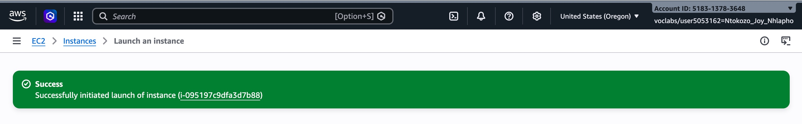

The green success banner confirms that the EC2 instance was successfully initiated. The instance ID `i-095197c9dfa3d7b88` was assigned by AWS at the moment of launch. This is the unique identifier for this virtual server and is used to manage it throughout its lifecycle.

---

### Screenshot 02 - Instance Running with Full Details

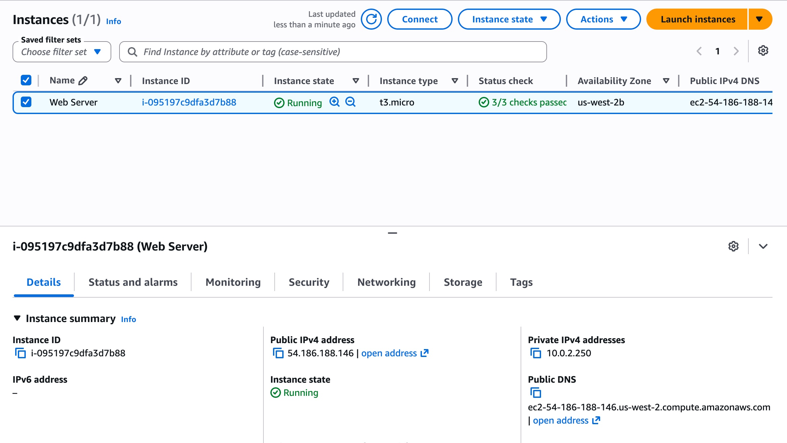

The instance is now in a **Running** state and has passed 3/3 status checks, meaning it is healthy and reachable. Key details visible here:

- **Instance type:** t3.micro (a small, cost-efficient general purpose instance)
- **Availability Zone:** us-west-2b (Oregon region)
- **Public IPv4 address:** 54.186.188.146 (the address used to access the server from the internet)
- **Private IPv4 address:** 10.0.2.250 (the internal address used within the VPC)
- **Public DNS:** ec2-54-186-188-146.us-west-2.compute.amazonaws.com

---

### Screenshot 02b - Instance Boot Console

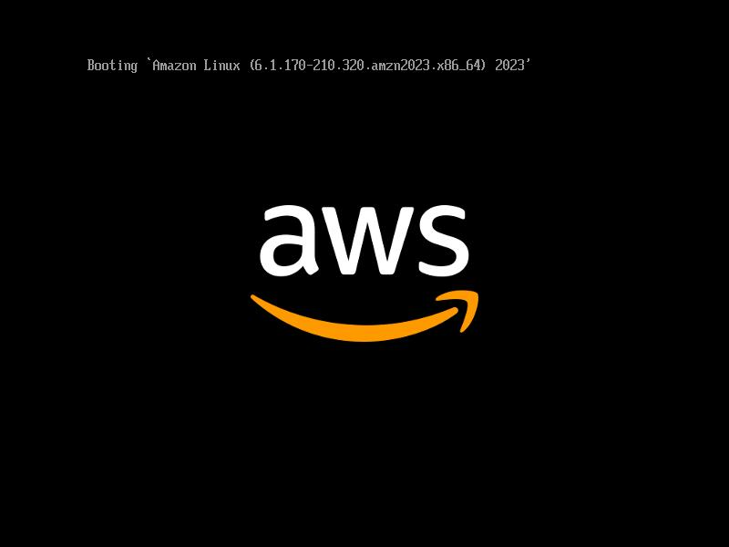

This is the EC2 instance serial console captured during boot, showing Amazon Linux 2023 starting up on the virtual server. The boot message reads:

```
Booting `Amazon Linux (6.1.170-210.320.amzn2023.x86_64) 2023'
```

This confirms that the instance was configured to run **Amazon Linux 2023** as its operating system, which is AWS's own optimised Linux distribution built for cloud environments. Seeing this boot sequence is evidence that the underlying virtual machine was initialising correctly before becoming fully operational.

---

### Screenshot 03 - Status Checks Passed

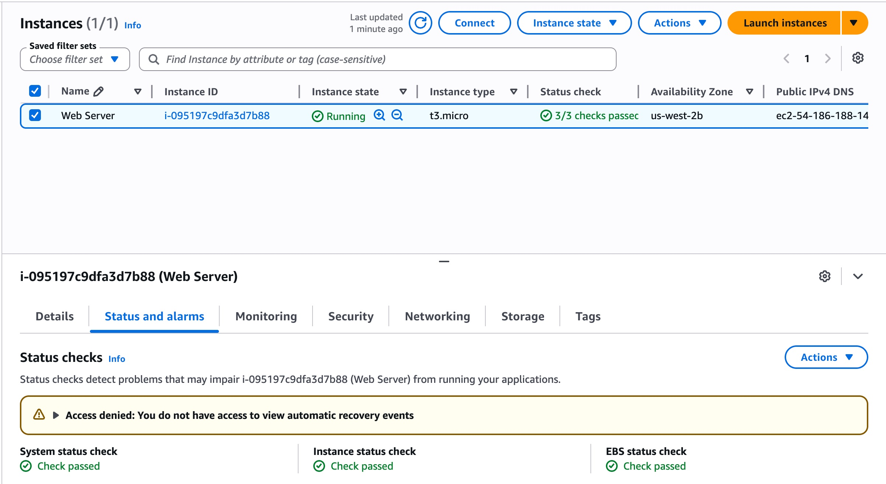

AWS performs two types of automatic status checks on every EC2 instance:

- **System status check** - confirms the underlying AWS hardware and infrastructure the instance runs on is healthy
- **Instance status check** - confirms the instance's own operating system and software are responding correctly
- **EBS status check** - confirms the attached storage volume is reachable and functioning

All three checks passed, confirming the instance was fully operational. The warning about automatic recovery events is a lab environment permission restriction and is expected.

---

### Screenshot 04 - Web Server Live in Browser

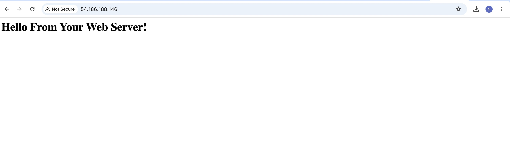

By navigating to the instance's public IP address (`54.186.188.146`) in a browser, the web server running on the EC2 instance responded with **"Hello From Your Web Server!"**. This confirmed that the instance was configured correctly with a web server (Apache HTTP Server) and that the security group allowed inbound HTTP traffic on port 80. This is a fundamental demonstration of how EC2 instances can host and serve web content.

---

### Screenshot 05 - Instance Type Changed to t3.small

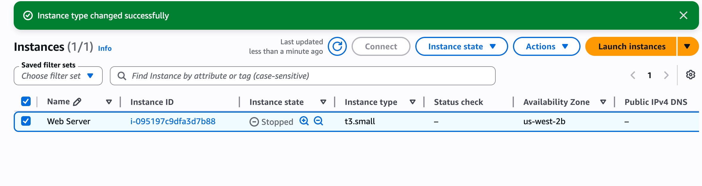

The instance was stopped and its type was changed from **t3.micro** to **t3.small**. This demonstrates one of the key advantages of cloud computing: the ability to **resize resources on demand** without replacing the server entirely. The green banner confirms the change was successful. The instance type determines the amount of CPU and memory available to the server.

---

### Screenshot 06 - EBS Volume Being Modified

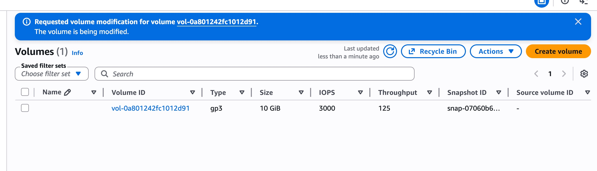

The attached EBS (Elastic Block Store) volume was modified. EBS is the persistent storage attached to an EC2 instance, similar to a hard drive. The volume shown is of type **gp3** (general purpose SSD) with a size of **10 GiB**, **3000 IOPS**, and **125 MB/s throughput**. The blue banner confirms the modification request was submitted and the volume was being updated. This demonstrates that storage can also be scaled independently from the instance itself.

---

### Screenshot 07 - Instance Restarted and Running on t3.small

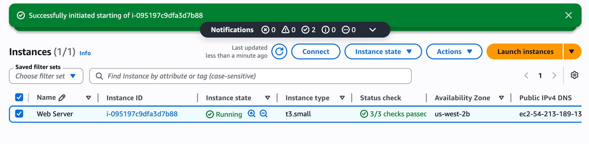

After the instance type change, the instance was successfully started again. It is now running on the upgraded **t3.small** instance type with all 3/3 status checks passing. The instance has been assigned a new public IP address (`ec2-54-213-189-13...`) because public IP addresses are reassigned each time an instance is stopped and started, unless an Elastic IP is used.

---

### Screenshot 08 - Termination Failed Due to Protection

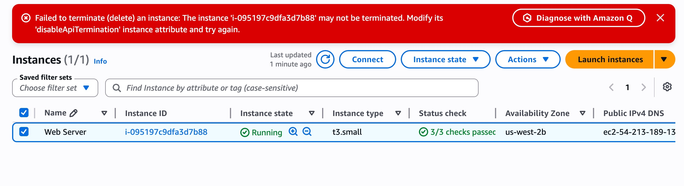

An attempt to terminate (permanently delete) the instance was blocked. The red error message explains that the instance had **termination protection** enabled, a safety feature that prevents accidental deletion of critical instances. To proceed, termination protection needed to be explicitly disabled first. This is an important real-world safeguard when working with production servers.

---

### Screenshot 09 - Termination Protection Removed

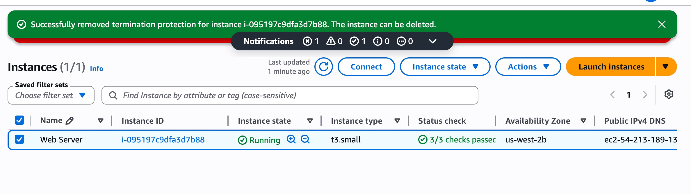

Termination protection was successfully disabled. The green banner confirms this. The instance is now eligible for termination. This step demonstrated how to intentionally override a safety control when deletion is the correct and deliberate action, as it would be at the end of a lab environment or decommissioning process.

---

### Screenshot 10 - Instance Successfully Terminated

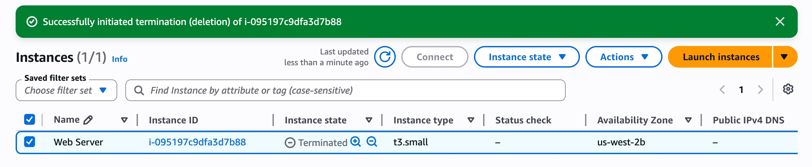

The EC2 instance has been successfully terminated. The instance state shows **Terminated** and the public IP and DNS entries are gone, confirming the instance no longer exists and is no longer incurring compute costs. Termination is permanent and irreversible, which is why termination protection exists as a safeguard.

---

## 💡 What I Learned

This lab gave me hands-on experience with the full lifecycle of an EC2 instance and reinforced several important cloud concepts:

- EC2 instances are virtual servers that can be launched, resized, and terminated on demand
- AWS performs automatic health checks to ensure instances are running correctly
- Security groups control what traffic can reach an instance - in this case, allowing HTTP on port 80 let the web server be accessed publicly
- Instance types determine compute power and can be changed without losing data
- EBS volumes provide persistent storage that can be resized independently of the instance
- Termination protection is a critical safety feature for production environments
- Public IP addresses change on restart unless an Elastic IP address is used

This is a foundational concept that underpins almost everything else in AWS - understanding how compute instances work and how to manage them is essential for any cloud role.

---

*Lab completed by Ntokozo Joy Nhlapo | Praesignis AWS re/Start 2026*
