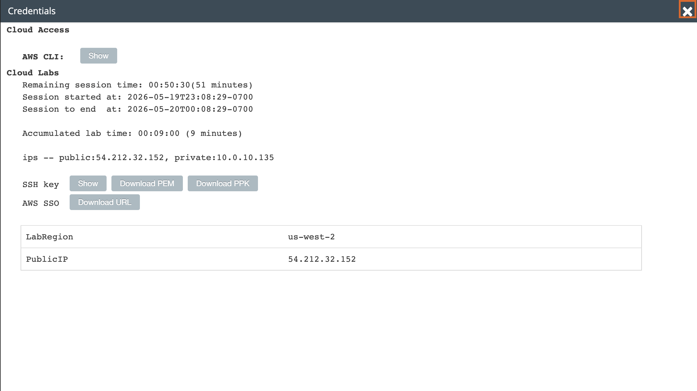
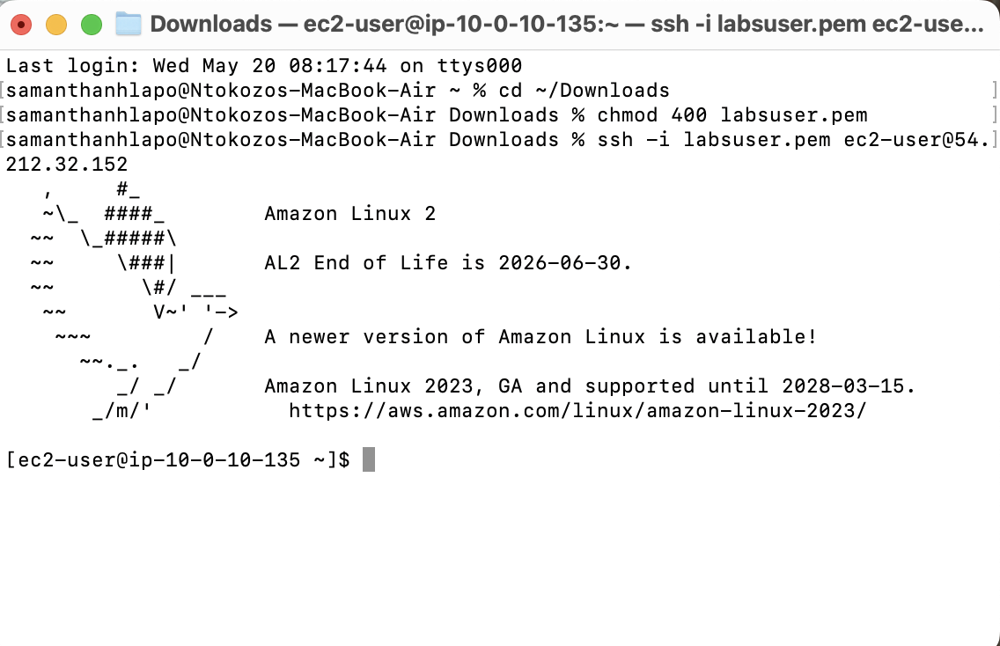
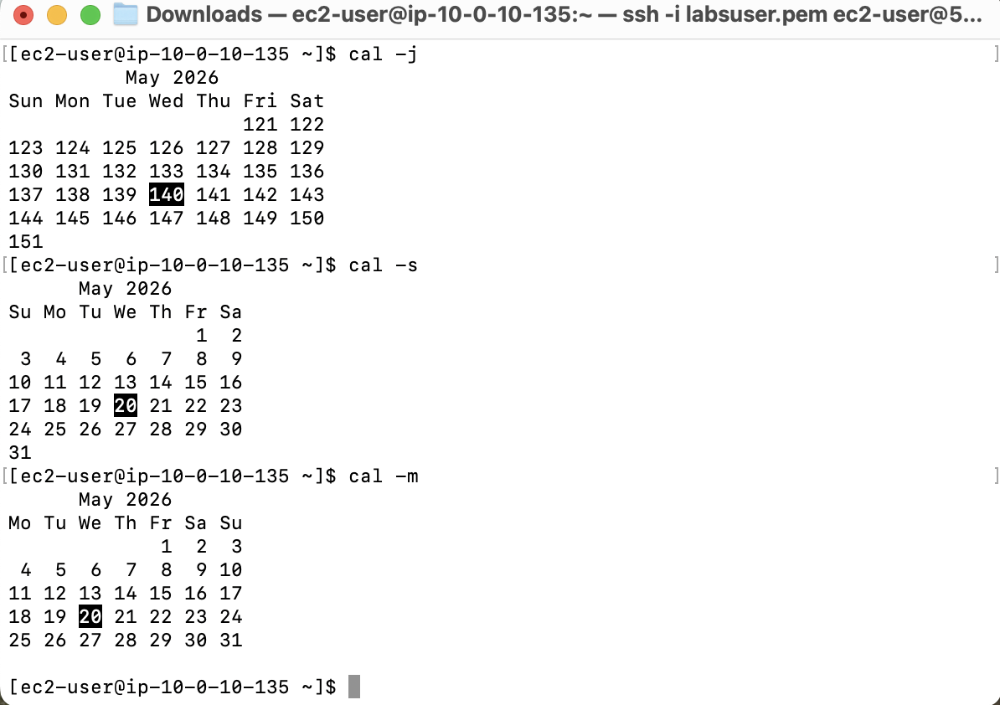
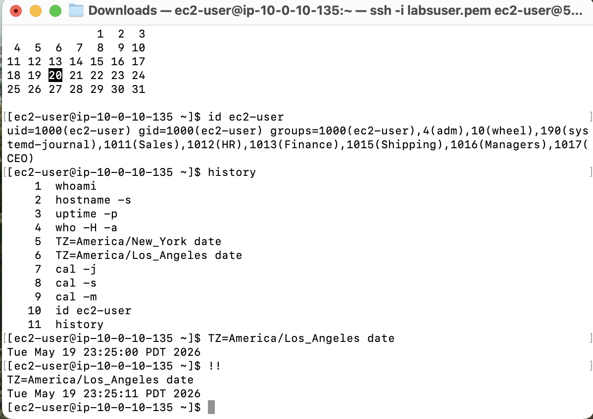
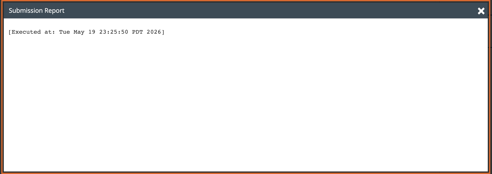

# Lab 03 - Linux Command Line

**Programme:** Praesignis AWS re/Start
**Date completed:** 20 May 2026
**Lab topic:** Linux CLI fundamentals - system information, date/time, calendar, and command history

---

## 📝 What This Lab Covered

This lab focused on using the Linux command line to gather system information and navigate the shell more efficiently. It covered a range of practical commands for identifying the current user, checking system uptime, viewing date and time across different time zones, displaying calendars in different formats, and reusing previous commands from the session history.

Key concepts practised:

- Using `whoami` to identify the current logged-in user
- Using `hostname -s` to retrieve the shortened system hostname
- Using `uptime -p` to check how long the system has been running
- Using `who -H -a` to display active session details with headers
- Using `TZ=` to display the current date and time in different time zones
- Using `cal -j` to display a Julian calendar (day numbers 1-365)
- Using `cal -s` and `cal -m` to display Sunday-first and Monday-first calendar views
- Using `id` to view a user's UID, GID, and all group memberships
- Using `history` to view all commands run in the current session
- Using `Ctrl+R` to search backwards through command history
- Using `!!` to instantly rerun the last command

---

## 📸 Screenshots and Explanations

### Screenshot 01 - SSH Connection Successful

The lab credentials panel shows the PublicIP address `54.212.32.152` and the SSH key used to connect to the EC2 instance for this lab session.

---

### Screenshot 02 - System Information Commands

The terminal shows a successful SSH connection to the EC2 instance at `54.212.32.152` with the Amazon Linux 2 welcome banner confirming access. The following commands were then run:

- `whoami` returned `ec2-user`, confirming the current logged-in user
- `hostname -s` returned `ip-10-0-10-135`, the shortened hostname
- `uptime -p` showed the system had been running for 12 minutes
- `who -H -a` displayed active session details
- `TZ=America/New_York date` returned `Wed May 20 02:22:10 EDT 2026`
- `TZ=America/Los_Angeles date` returned `Tue May 19 23:22:25 PDT 2026`
- `cal -j` displayed May 2026 in Julian format with today highlighted as day **140**

---

### Screenshot 03 - Calendar Views

- `cal -j` displayed the Julian calendar for May 2026, where dates run consecutively through the year rather than restarting each month
- `cal -s` displayed the standard Sunday-first calendar view
- `cal -m` displayed the Monday-first calendar view

Today (20 May 2026) was highlighted as day **140** in the Julian view and as **20** in both the Sunday and Monday views.

---

### Screenshot 04 - History and Command Reuse

- `id ec2-user` displayed the user ID, group ID, and all groups including Sales, HR, Finance, Shipping, Managers, and CEO
- `history` listed all 11 commands run during the session in order
- `TZ=America/Los_Angeles date` was rerun after using `Ctrl+R` reverse search
- `!!` was used to rerun the last command, demonstrating how to quickly repeat previous commands without retyping them

---

### Screenshot 05 - Submission Report

The lab was submitted successfully before ending the session, executed at `Tue May 19 23:25:50 PDT 2026`.

---

## 💡 What I Learned

This lab built practical familiarity with everyday Linux shell commands used in real system administration and cloud environments:

- Basic identity and session commands (`whoami`, `hostname`, `uptime`, `who`) give a quick overview of who is logged in and the state of the system
- Time zone handling with `TZ=` is useful when working with cloud infrastructure spread across multiple regions
- Julian calendars (`cal -j`) are used in scripting and scheduling to reference days by number rather than date
- Command history tools (`history`, `Ctrl+R`, `!!`) save time and reduce errors by allowing previous commands to be reused without retyping
- The `id` command is particularly useful for verifying group memberships when troubleshooting permission issues

---

*Lab completed by Ntokozo Joy Nhlapo | Praesignis AWS re/Start 2026*
