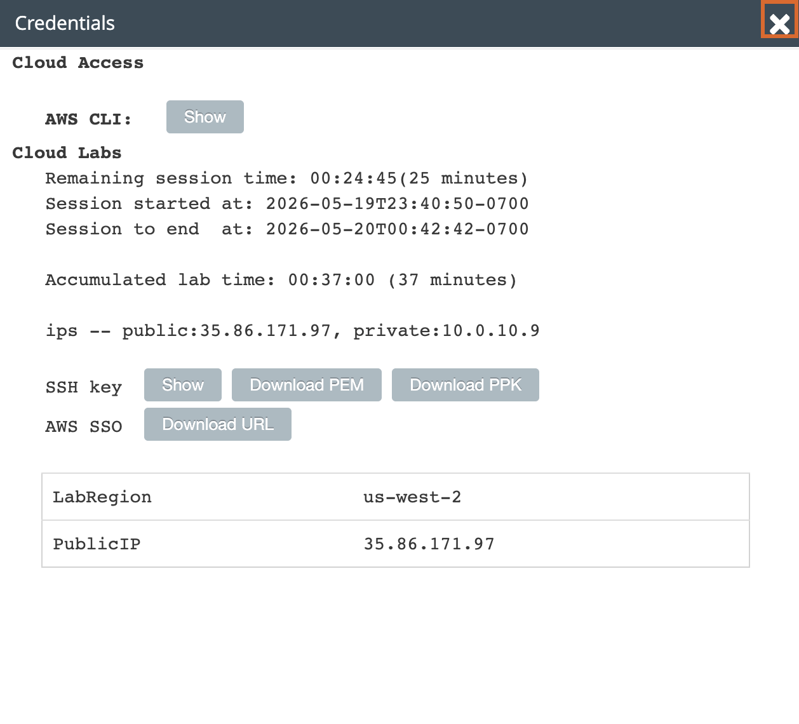
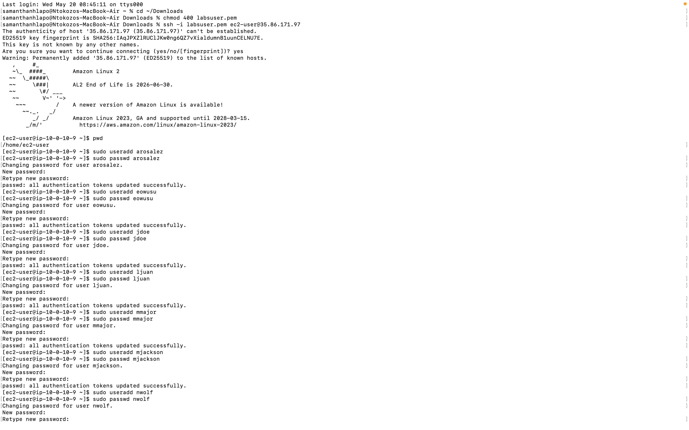
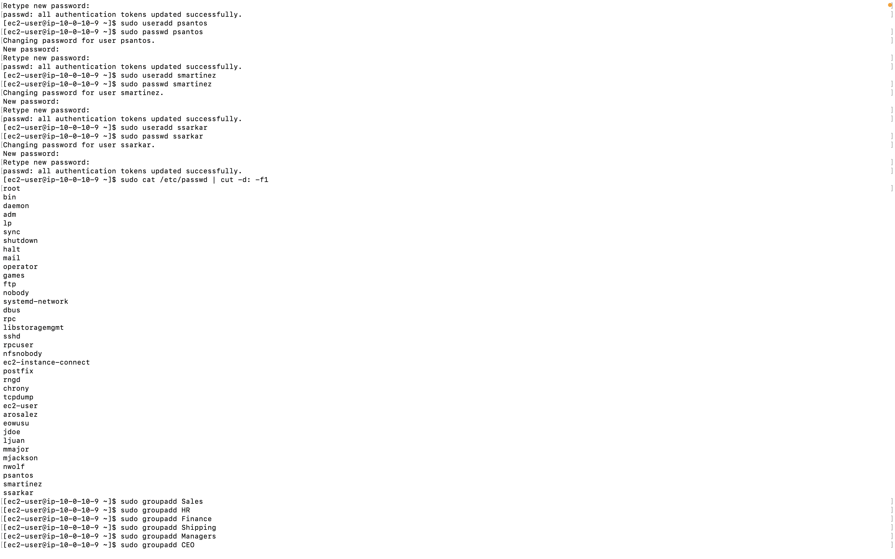
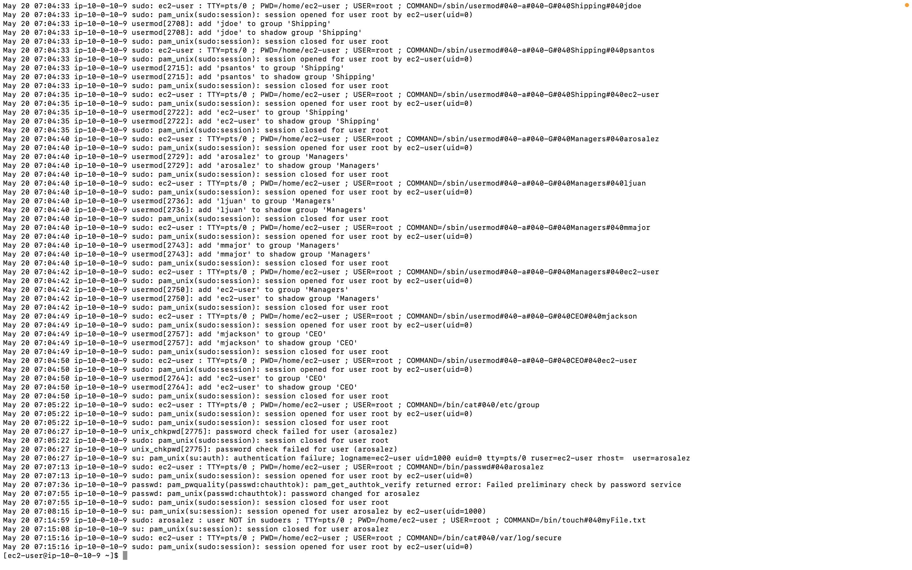
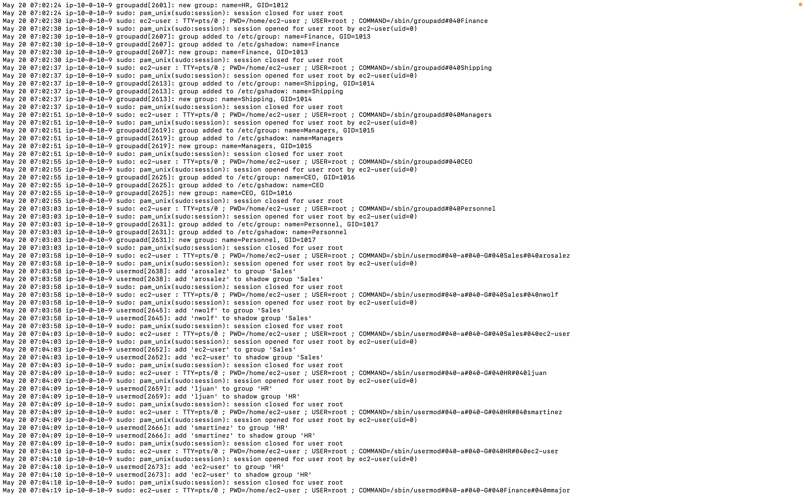
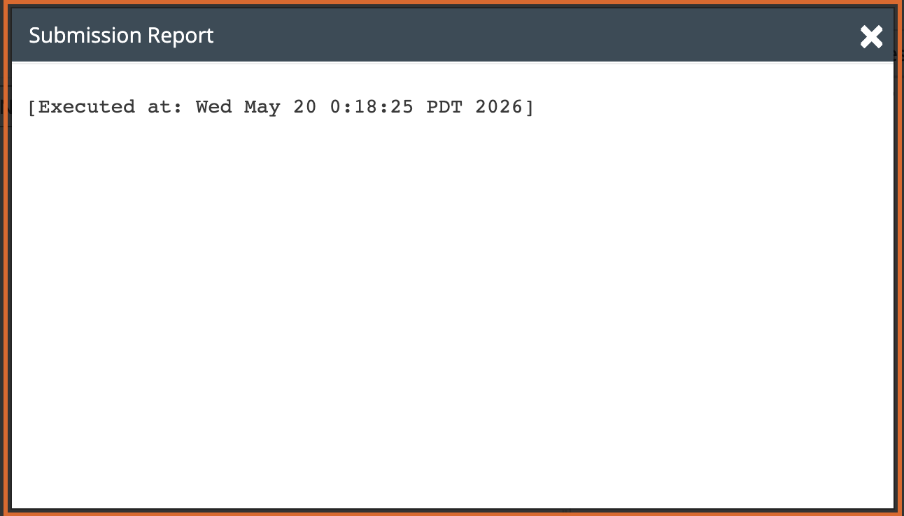

# Lab 04 - Managing Users and Groups

**Programme:** Praesignis AWS re/Start **Date completed:** 20 May 2026 **Lab topic:** Linux user and group management - creating users, groups, and testing permissions

---

## 📝 What This Lab Covered

This lab focused on Linux user and group administration. It covered the full process of creating user accounts with passwords, organising users into groups based on their job roles, and testing the permission boundaries of non-administrative users. It also demonstrated how Linux logs unauthorised sudo attempts for security auditing purposes.

Key concepts practised:

- Using `sudo useradd` to create new user accounts
- Using `sudo passwd` to set passwords for users
- Verifying created users with `sudo cat /etc/passwd | cut -d: -f1`
- Using `sudo groupadd` to create new groups
- Using `sudo usermod -a -G` to add users to groups
- Verifying group memberships with `cat /etc/group`
- Switching between users using the `su` command
- Understanding the difference between regular users and sudoers
- Testing file creation permissions as a non-root user
- Viewing security logs with `sudo cat /var/log/secure`
- Understanding how unauthorised sudo attempts are recorded in the system log

---

## 👥 Users Created

| User ID | Full Name | Job Role |
|---------|-----------|----------|
| arosalez | Alejandro Rosalez | Sales Manager |
| eowusu | Efua Owusu | Shipping |
| jdoe | Jane Doe | Shipping |
| ljuan | Li Juan | HR Manager |
| mmajor | Mary Major | Finance Manager |
| mjackson | Mateo Jackson | CEO |
| nwolf | Nikki Wolf | Sales Representative |
| psantos | Paulo Santos | Shipping |
| smartinez | Sofia Martinez | HR Specialist |
| ssarkar | Saanvi Sarkar | Finance Specialist |

---

## 🗂️ Groups Created and Memberships

| Group | Members |
|-------|---------|
| Sales | arosalez, nwolf, ec2-user |
| HR | ljuan, smartinez, ec2-user |
| Finance | mmajor, ssarkar, ec2-user |
| Shipping | eowusu, jdoe, psantos, ec2-user |
| Managers | arosalez, ljuan, mmajor, ec2-user |
| CEO | mjackson, ec2-user |
| Personnel | ec2-user |

---

## 📸 Screenshots and Explanations

### Screenshot 00 - Lab Credentials

The lab credentials panel showing the PublicIP address (35.86.171.97) 
and SSH key used to connect to the EC2 instance.

---

### Screenshot 01 - SSH Connection and User Creation

A fresh PEM key was downloaded for this lab session. After connecting via SSH, the `pwd` command confirmed the working directory as `/home/ec2-user`. All 10 users were created using `sudo useradd` and assigned the password `P@ssword1234!` using `sudo passwd`. Each password change was confirmed with the message "passwd: all authentication tokens updated successfully."

---

### Screenshot 02 - All Users Verified

Running `sudo cat /etc/passwd | cut -d: -f1` confirmed all 10 users were successfully created and listed in the system password file alongside the default system accounts.

---

### Screenshot 03 - Groups Created and Verified

All 7 groups were created using `sudo groupadd`. Running `cat /etc/group` confirmed each group was added to the system with a unique Group ID (GID).

---

### Screenshot 04 - Users Added to Groups

All users were assigned to their appropriate groups using `sudo usermod -a -G`. Running `sudo cat /etc/group` confirmed the correct group memberships for Sales, HR, Finance, Shipping, Managers, CEO, and Personnel.

---

### Screenshot 05 - Permission Denied and Sudoers Test

After switching to arosalez using `su arosalez`, two permission tests were performed:

- `touch myFile.txt` returned **"Permission denied"** — confirming arosalez cannot write to the ec2-user home directory
- `sudo touch myFile.txt` returned **"arosalez is not in the sudoers file. This incident will be reported."** — confirming arosalez does not have administrative privileges

The user was then switched back to ec2-user using `exit`.

---

### Screenshot 06 - Security Log

Running `sudo cat /var/log/secure` displayed the full system security log. Scrolling through the log showed every user creation, password change, group assignment, and the failed sudo attempt by arosalez — demonstrating how Linux records all privileged activity for auditing purposes.

---

### Screenshot 07 - Submission Report

The lab was submitted successfully before ending the session.

