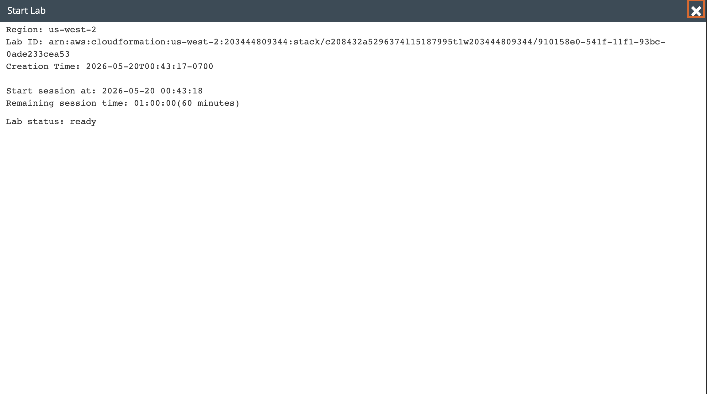
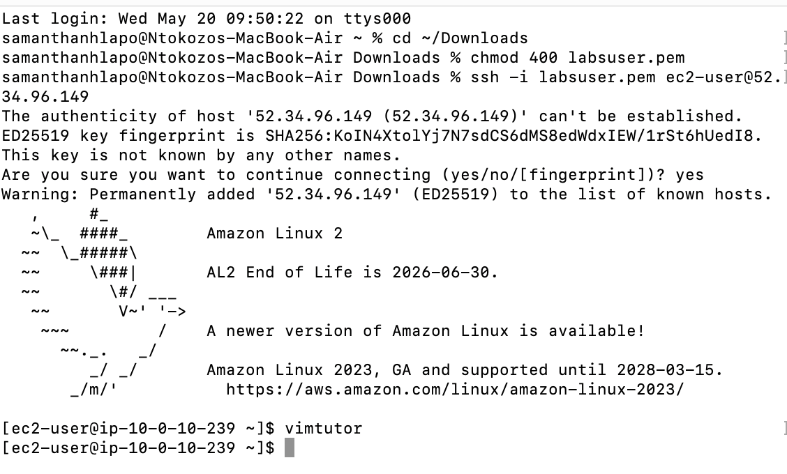
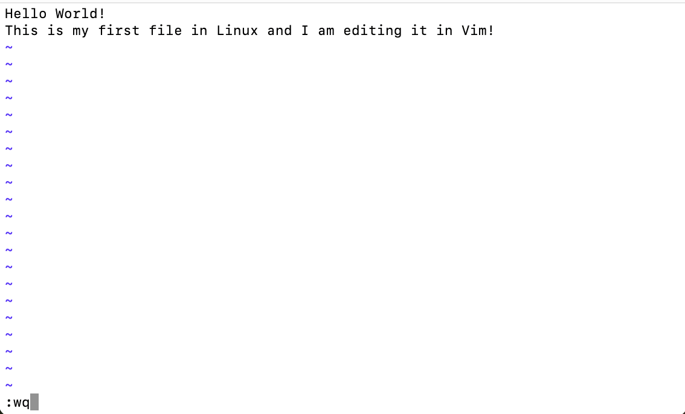
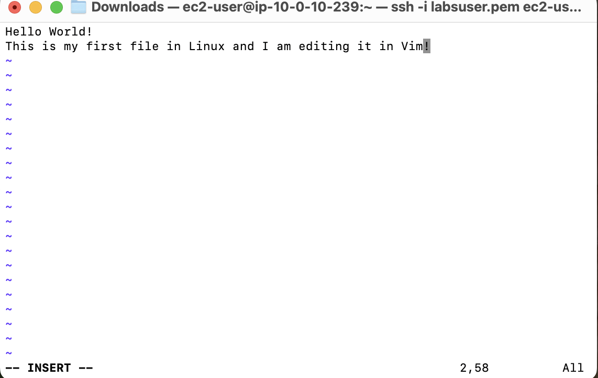
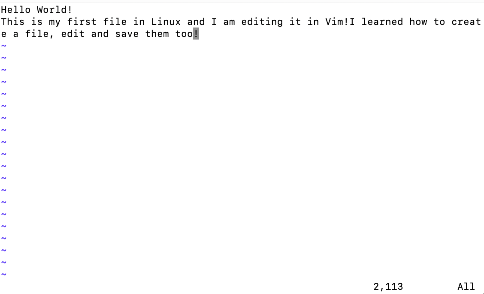
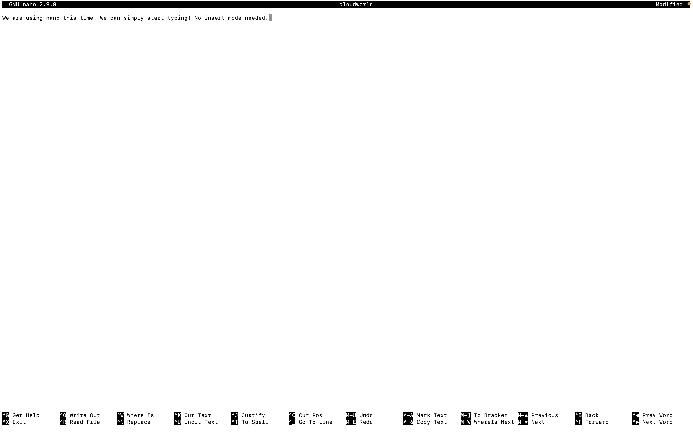
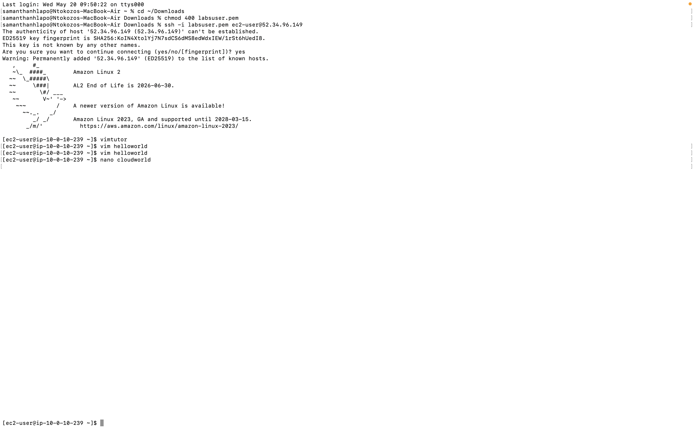
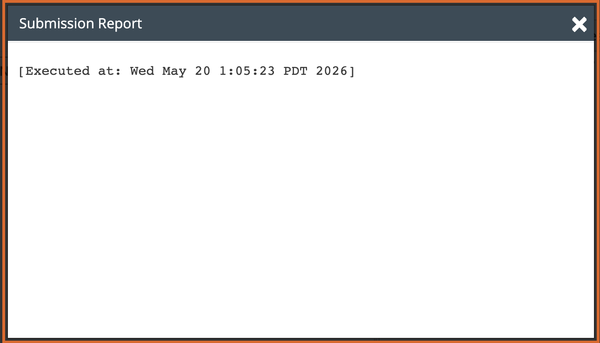

# Lab 05 - Editing Files

**Programme:** Praesignis AWS re/Start **Date completed:** 20 May 2026 **Lab topic:** Linux text editors - Vim and nano

---

## 📝 What This Lab Covered

This lab introduced two of the most commonly used Linux text editors: Vim and nano. It covered the fundamental differences between the two editors, including how to create files, enter and exit editing modes, save changes, and discard changes. The lab also demonstrated the practical difference between saving and quitting versus quitting without saving in Vim.

Key concepts practised:

- Connecting to an EC2 instance using a fresh PEM key via SSH
- Running `vimtutor` to learn Vim basics through the built-in interactive tutorial
- Creating a new file using `vim helloworld`
- Entering insert mode in Vim using `i`
- Saving and quitting Vim using `:wq`
- Quitting Vim without saving using `:q!`
- Understanding the difference between `:wq` and `:q!`
- Creating a new file using `nano cloudworld`
- Typing directly in nano without needing an insert mode
- Saving in nano using `Ctrl+O` and confirming the filename
- Exiting nano using `Ctrl+X`
- Verifying saved file contents by reopening the file

---

## 📸 Screenshots and Explanations

### Screenshot 01 - SSH Connection Successful

A fresh PEM key was downloaded for this lab session. The terminal shows a successful SSH connection to the EC2 instance at `52.34.96.149`. The Amazon Linux 2 welcome banner confirms the connection was established and the instance is accessible at `[ec2-user@ip-10-0-10-239 ~]$`.

---

### Screenshot 02 - Vimtutor Completed

The `vimtutor` command was run to launch the interactive Vim tutorial. Lessons 1 through 3 were completed, covering cursor movement, editing text, and saving files. The command prompt returning confirms the tutorial was exited successfully using `:q!`.

---

### Screenshot 03 - Vim helloworld File Created

The `vim helloworld` command opened a new empty file in Vim. The status bar at the bottom shows `"helloworld" [New]` confirming the file was newly created. The `~` symbols indicate empty lines below the cursor.

---

### Screenshot 04 - Text Entered in Vim Insert Mode

After pressing `i` to enter insert mode, two lines of text were typed into the helloworld file. The `-- INSERT --` indicator at the bottom confirms insert mode was active. The file contains:
- `Hello World!`
- `This is my first file in Linux and I am editing it in Vim!`

---

### Screenshot 05 - Saving with :wq

After pressing `ESC` to exit insert mode, `:wq` was typed to save the file and quit Vim. This command writes the file to disk and exits the editor.

---

### Screenshot 06 - File Reopened and Third Line Added

The helloworld file was reopened using `vim helloworld`. A third line was added in insert mode:
- `I learned how to create a file, edit and save them too!`

This time `:q!` was used to quit without saving, demonstrating that unsaved changes are discarded.

---

### Screenshot 07 - nano cloudworld File Created and Saved

The `nano cloudworld` command opened the nano editor. Unlike Vim, text could be typed immediately without entering insert mode. The following text was entered:

`We are using nano this time! We can simply start typing! No insert mode needed.`

The file was saved using `Ctrl+O` and the editor was exited using `Ctrl+X`.

---

### Screenshot 08 - nano File Verified

The cloudworld file was reopened using `nano cloudworld` to confirm the saved text was preserved correctly. The content matched exactly what was typed, confirming the save was successful.

---

### Screenshot 09 - Submission Report

The lab was submitted successfully before ending the session.

