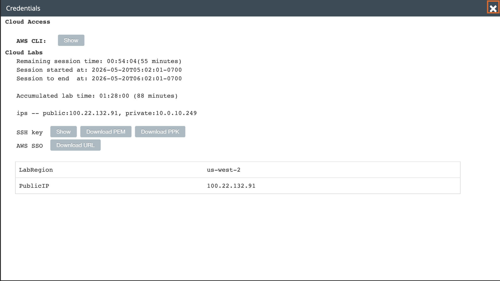
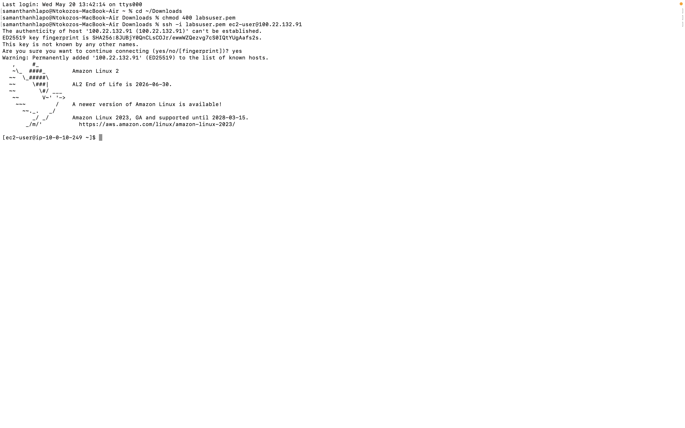
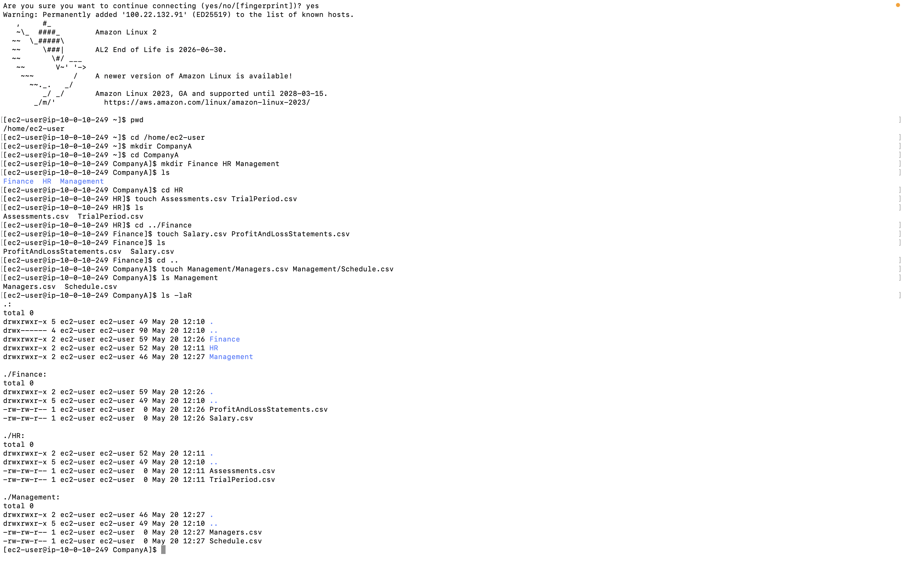
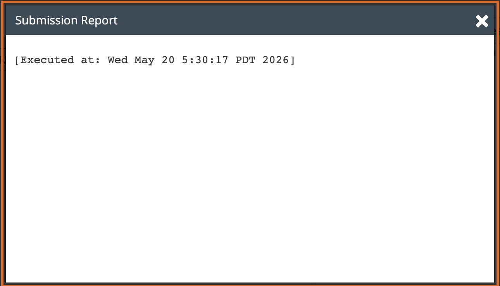

# Lab 06 - Working with the File System

**Programme:** Praesignis AWS re/Start **Date completed:** 20 May 2026 **Lab topic:** Linux file system - creating, copying, moving, and deleting files and directories

---

## 📝 What This Lab Covered

This lab focused on navigating and managing the Linux file system. It covered building a folder structure from scratch, creating empty files, and then reorganising that structure by copying, moving, and deleting files and directories. The lab reinforced the use of relative and absolute paths when working with files.

Key concepts practised:

- Using `pwd` to confirm current working directory
- Using `mkdir` to create single and multiple directories at once
- Using `cd` to navigate between directories including `cd ..` to go up one level
- Using `touch` to create empty files directly and via relative paths
- Using `ls` and `ls -laR` to verify files and folder structures recursively
- Using `cp -r` to copy a folder and all its contents
- Using `rm` to delete specific files
- Using `rmdir` to remove an empty directory
- Using `mv` to move folders and files to new locations
- Understanding the difference between `rmdir` (empty folders only) and `rm -r` (folders with contents)

---

## 📁 Initial Folder Structure Created

```
/home/ec2-user/CompanyA/
├── Finance/
│   ├── ProfitAndLossStatements.csv
│   └── Salary.csv
├── HR/
│   ├── Assessments.csv
│   └── TrialPeriod.csv
└── Management/
    ├── Managers.csv
    └── Schedule.csv
```

## 📁 Reorganised Folder Structure

```
/home/ec2-user/CompanyA/
└── HR/
    ├── Employees/
    │   ├── Assessments.csv
    │   └── TrialPeriod.csv
    ├── Finance/
    │   ├── ProfitAndLossStatements.csv
    │   └── Salary.csv
    └── Management/
        ├── Managers.csv
        └── Schedule.csv
```
---

## 📸 Screenshots and Explanations

### Screenshot 01 - SSH Connection Successful

A fresh PEM key was downloaded for this lab session. The terminal shows a successful SSH connection to the EC2 instance at `100.22.132.91`. The Amazon Linux 2 welcome banner confirms the connection was established successfully.



---

### Screenshot 02 - Initial Folder Structure Created

The following commands were used to build the initial CompanyA folder structure:

- `mkdir CompanyA` created the top level folder
- `mkdir Finance HR Management` created all three subfolders at once
- `touch Assessments.csv TrialPeriod.csv` created files in HR
- `touch Salary.csv ProfitAndLossStatements.csv` created files in Finance
- `touch Management/Managers.csv Management/Schedule.csv` created files in Management using a relative path
- `ls -laR` confirmed the complete structure with all files and permissions



---

### Screenshot 03 - Folder Reorganisation Complete

The following commands were used to reorganise the structure:

- `cp -r Finance HR` copied the Finance folder and its contents into HR
- `rm Finance/ProfitAndLossStatements.csv Finance/Salary.csv` deleted the original Finance files
- `rmdir Finance` removed the now empty Finance folder
- `mv Management HR` moved the Management folder inside HR
- `mkdir Employees` created a new Employees folder inside HR
- `mv Assessments.csv TrialPeriod.csv Employees` moved both HR files into Employees
- `ls . Employees` confirmed the final structure showing Employees, Finance, and Management under HR



---

### Screenshot 04 - Submission Report

The lab was submitted successfully before ending the session.


