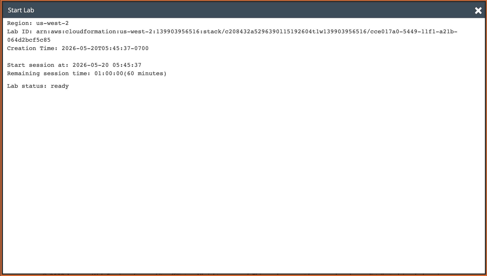
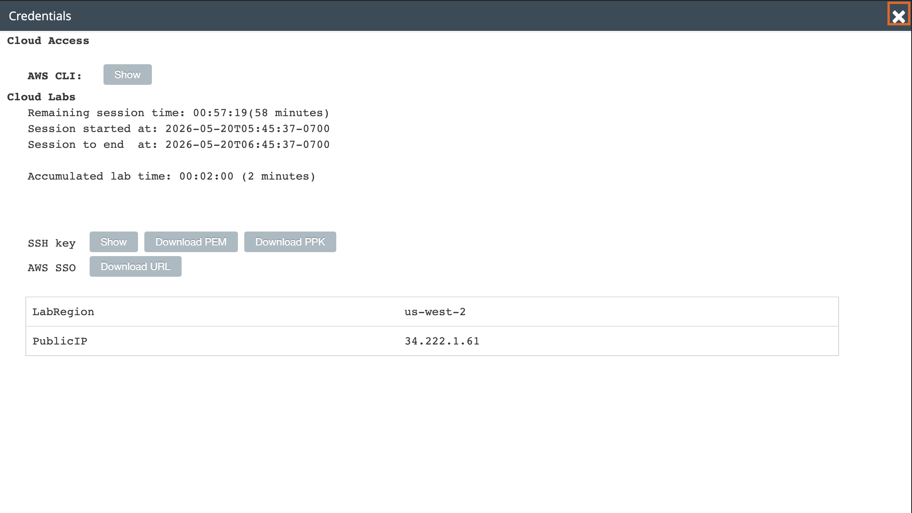
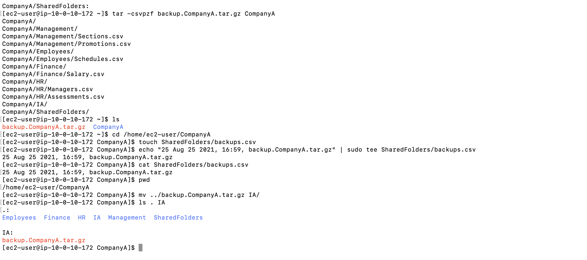
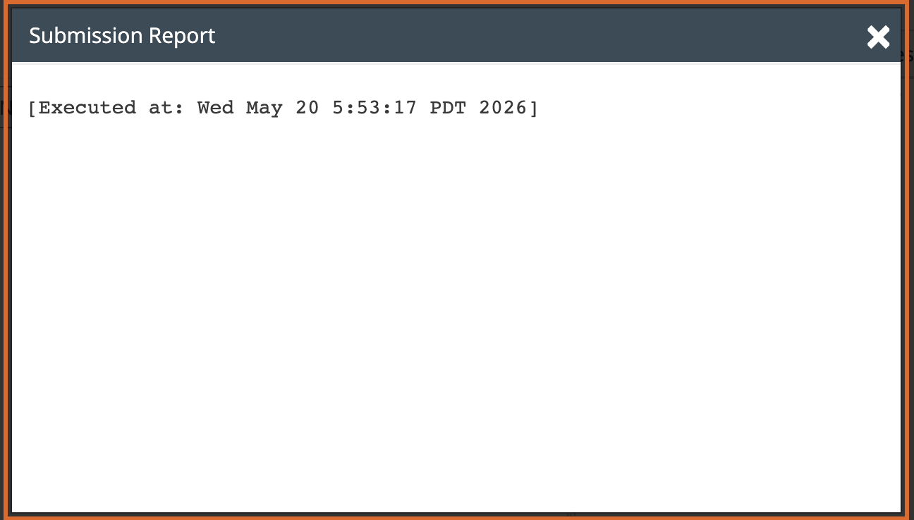

# Lab 07 - Working with Files

**Programme:** Praesignis AWS re/Start **Date completed:** 20 May 2026 **Lab topic:** Linux file operations - creating backups with tar, logging, and transferring files

---

## 📝 What This Lab Covered

This lab focused on working with files in a practical backup scenario. It covered creating a compressed archive of an entire folder structure using the `tar` command, logging the backup details to a CSV file using `echo` and `tee`, and transferring the backup file to another location using `mv`. These are real-world skills used in Linux system administration.

Key concepts practised:

- Using `pwd` and `ls -R` to verify the working environment
- Using `tar -csvpzf` to create a compressed `.tar.gz` backup of an entire folder structure
- Understanding the tar flags: `-c` (create), `-s` (special files), `-v` (verbose), `-p` (preserve permissions), `-z` (gzip compression), `-f` (filename)
- Using `touch` to create an empty log file
- Using `echo` with the `|` pipe and `sudo tee` to write text to both the terminal and a file simultaneously
- Using `cat` to verify the contents of the log file
- Using `mv` with a relative path (`../`) to move a file from a parent directory into a subfolder
- Using `ls . IA` to verify the file was moved successfully

---

## 📁 Folder Structure Being Backed Up

```
/home/ec2-user/CompanyA/
├── Employees/
│   └── Schedules.csv
├── Finance/
│   └── Salary.csv
├── HR/
│   ├── Assessments.csv
│   └── Managers.csv
├── IA/
├── Management/
│   ├── Promotions.csv
│   └── Sections.csv
└── SharedFolders/
    └── backups.csv
```
---

## 📸 Screenshots and Explanations

### Screenshot 01 - SSH Connection Successful

A fresh PEM key was downloaded for this lab session. The terminal shows a successful SSH connection to the EC2 instance at `34.222.1.61`. The Amazon Linux 2 welcome banner confirms the connection was established successfully at `[ec2-user@ip-10-0-10-172 ~]$`.



---

### Screenshot 02 - Folder Structure Verified and Backup Created

The following steps were completed:

- `pwd` confirmed the working directory as `/home/ec2-user`
- `ls -R CompanyA` listed the full CompanyA folder structure confirming all folders and files were present
- `tar -csvpzf backup.CompanyA.tar.gz CompanyA` created a compressed backup archive, with each file listed as it was added
- `ls` confirmed both `backup.CompanyA.tar.gz` and `CompanyA` were present in the home directory



---

### Screenshot 03 - Backup Logged and File Transferred

The following steps were completed:

- `cd /home/ec2-user/CompanyA` navigated into CompanyA
- `touch SharedFolders/backups.csv` created an empty log file
- `echo "25 Aug 25 2021, 16:59, backup.CompanyA.tar.gz" | sudo tee SharedFolders/backups.csv` wrote the backup details to the log file and printed it to the terminal simultaneously
- `cat SharedFolders/backups.csv` confirmed the log entry was saved correctly
- `pwd` confirmed the location as `/home/ec2-user/CompanyA`
- `mv ../backup.CompanyA.tar.gz IA/` moved the backup file from the home directory into the IA folder
- `ls . IA` confirmed the backup file was no longer in the root and was now inside the IA folder



---

### Screenshot 04 - Submission Report

The lab was submitted successfully before ending the session.


