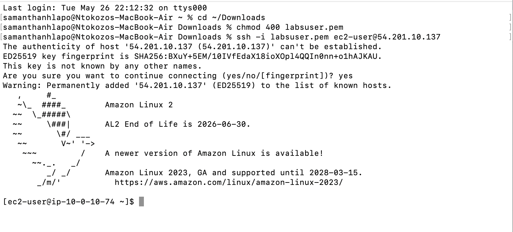
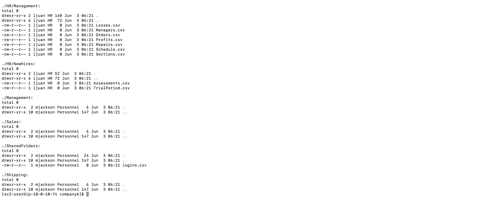
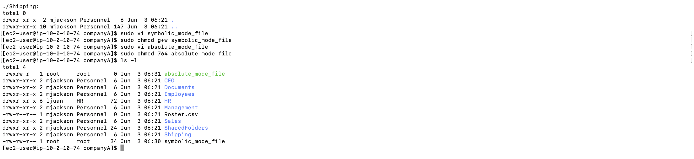
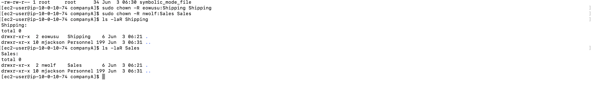
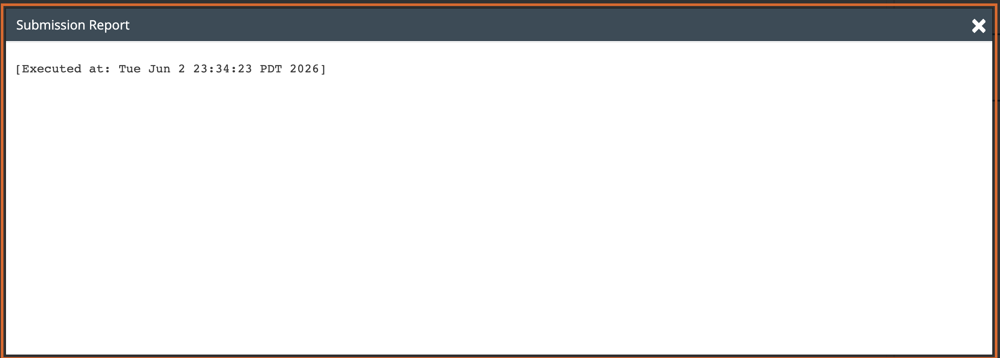

# Lab 08 - Managing File Permissions

**Programme:** Praesignis AWS re/Start **Date completed:** 03 June 2026 **Lab topic:** Linux file permissions - ownership, chmod symbolic and absolute modes

---

## ✏️ What This Lab Covered

This lab focused on managing file and folder permissions on a Linux EC2 instance. It covered how to assign ownership of directories to specific users and groups using `chown`, and how to control access permissions using `chmod` in both symbolic and absolute modes. The lab used a simulated company folder structure to apply real-world permission management scenarios.

Key concepts practised:

- Using `chown -R` to recursively change file and folder ownership
- Assigning group ownership to match a company's department structure
- Using symbolic mode (`g+w`) to add permissions to a specific class
- Using absolute mode (`764`) to set precise read, write, and execute permissions
- Using `ls -l` and `ls -laR` to verify ownership and permission changes
- Understanding the three permission classes: user, group, and others

---

## 📸 Screenshots and Explanations

### Screenshot 01 - SSH Connection to EC2 Instance

The terminal shows a successful SSH connection to the EC2 instance at `54.201.10.137` using the `labsuser.pem` key file. The Amazon Linux 2 welcome banner confirms the connection was established successfully.

---

### Screenshot 02 - Task 2: Changing Ownership with chown

The terminal shows the `chown` commands being run to assign ownership of the `companyA` folder to `mjackson:Personnel`, the `HR` folder to `ljuan:HR`, and the `HR/Finance` folder to `mmajor:Finance`. The `ls -laR` command confirms the ownership changes across the full folder structure.

---

### Screenshot 03 - Task 3: Creating Files and Applying chmod

The terminal shows the creation of `symbolic_mode_file` and `absolute_mode_file` using `vim`. The `chmod g+w` command adds group write permission in symbolic mode, and `chmod 764` sets user, group, and others permissions in absolute mode. The `ls -l` output confirms the correct permissions were applied.

---

### Screenshot 04 - Task 3: Permission Verification with ls -l

The `ls -l` output shows the full file listing inside the `companyA` directory, confirming the permission and ownership changes applied across all folders and files including `HR`, `Sales`, `Shipping`, and the two newly created files.

---

### Screenshot 05 - Task 4: Assigning Shipping and Sales Permissions

The terminal shows the `chown` commands assigning ownership of the `Shipping` folder to `eowusu:Shipping` and the `Sales` folder to `nwolf:Sales`. The `ls -laR` commands confirm the correct ownership is applied to both folders.

---

### Screenshot 06 - Submission Report

The lab submission report confirms successful completion, executed on Tue Jun 2 23:34:23 PDT 2026.

---

## Key Concepts

| Mode | Example | Meaning |
|------|---------|---------|
| Symbolic | `g+w` | Add write permission for group |
| Absolute | `764` | User=rwx, Group=rw, Others=r |

## AWS Service Used
- **Amazon EC2** – t3.micro instance (Amazon Linux 2)
