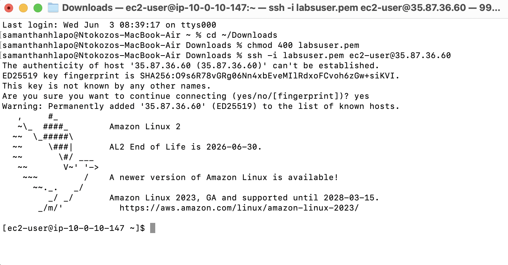
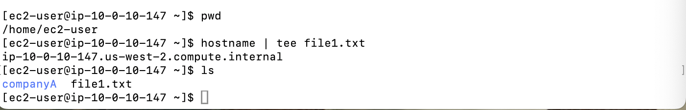
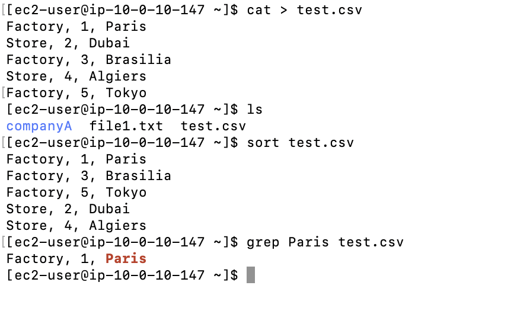
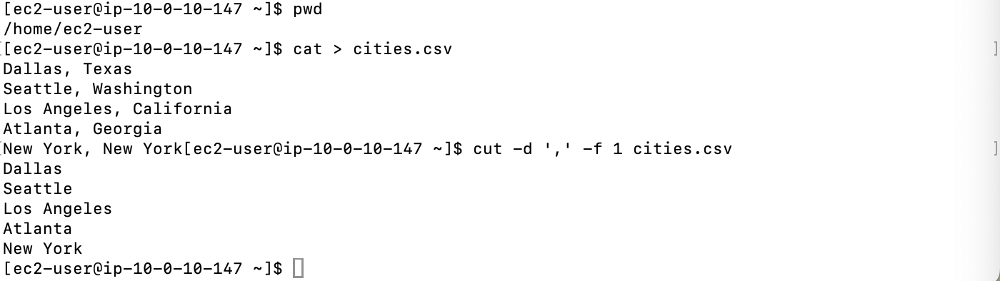
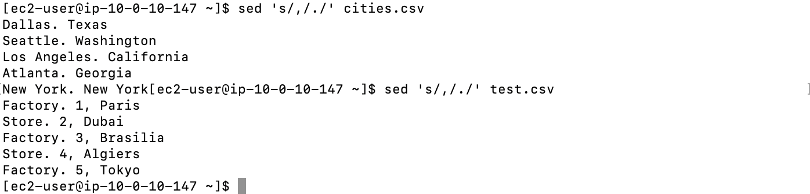

# Lab 09 - Working with Commands

**Programme:** Praesignis AWS re/Start **Date completed:** 03 June 2026 **Lab topic:** Linux commands - tee, sort, cut, sed, and pipe operator

---

## ✏️ What This Lab Covered

This lab focused on using essential Linux text-processing commands on an EC2 instance. It covered how to direct command output to both the screen and a file using `tee`, how to reorder file contents using `sort`, how to extract specific fields from delimited files using `cut`, how to find and replace text using `sed`, and how to chain commands together using the pipe operator `|`.

Key concepts practised:

- Using `tee` to write output to both the terminal and a file simultaneously
- Using `sort` to reorder the contents of a `.csv` file alphabetically and numerically
- Using the pipe operator `|` to chain commands and filter results with `grep`
- Using `cut -d ',' -f 1` to extract the first field from a comma-delimited file
- Using `sed 's/,/./'` to replace the first comma with a period in a file

---

## 📸 Screenshots and Explanations

### Screenshot 01 - SSH Connection to EC2 Instance

The terminal shows a successful SSH connection to the EC2 instance at `35.87.36.60` using the `labsuser.pem` key file. The Amazon Linux 2 welcome banner confirms the connection was established successfully.

---

### Screenshot 02 - Task 2: tee Command

The `hostname | tee file1.txt` command outputs the hostname `ip-10-0-10-147.us-west-2.compute.internal` to both the screen and `file1.txt`. The `ls` command confirms `file1.txt` was created alongside the `companyA` folder.

---

### Screenshot 03 - Task 3: sort and grep with pipe operator

The `cat > test.csv` command creates the file with factory and store entries. The `sort test.csv` command reorders the list alphabetically, grouping Factories before Stores. The `grep Paris test.csv` command uses pattern matching to return only the Paris entry.

---

### Screenshot 04 - Task 4: cut Command

The `cat > cities.csv` command creates a file with city and state pairs. The `cut -d ',' -f 1 cities.csv` command extracts only the city names by cutting everything after the comma delimiter.

---

### Screenshot 05 - Additional Challenge: sed Command

The `sed 's/,/./'` command replaces the first comma with a period in both `cities.csv` and `test.csv`. The output confirms the substitution worked correctly on all lines in both files.

---

## Key Concepts

| Command | Example | Purpose |
|---------|---------|---------|
| `tee` | `hostname \| tee file1.txt` | Output to screen and file simultaneously |
| `sort` | `sort test.csv` | Reorder file contents alphabetically |
| `grep` | `grep Paris test.csv` | Search for a pattern in a file |
| `cut` | `cut -d ',' -f 1 cities.csv` | Extract fields from delimited text |
| `sed` | `sed 's/,/./' cities.csv` | Find and replace text in a file |

## AWS Service Used
- **Amazon EC2** – t3.micro instance (Amazon Linux 2)
