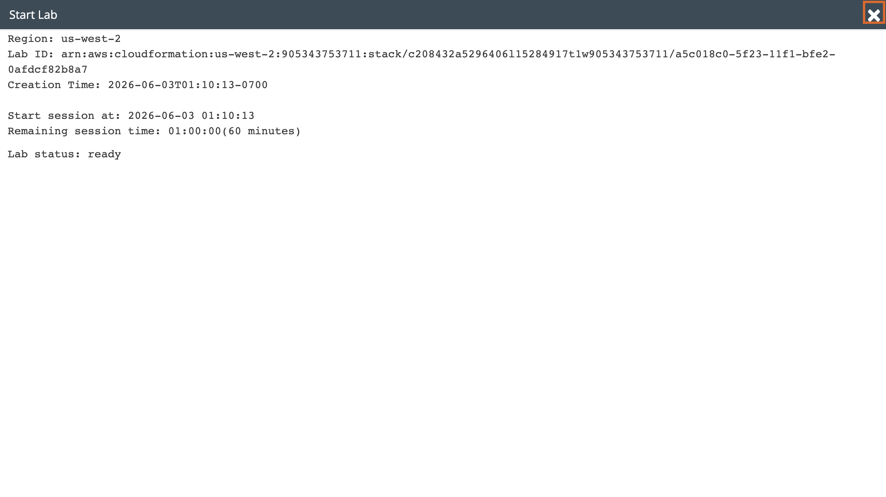
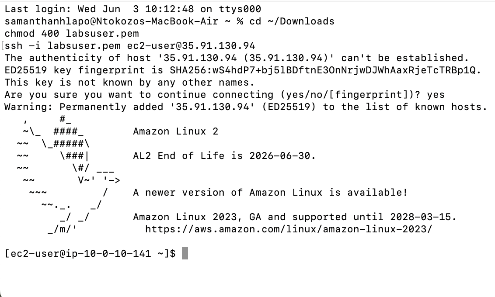
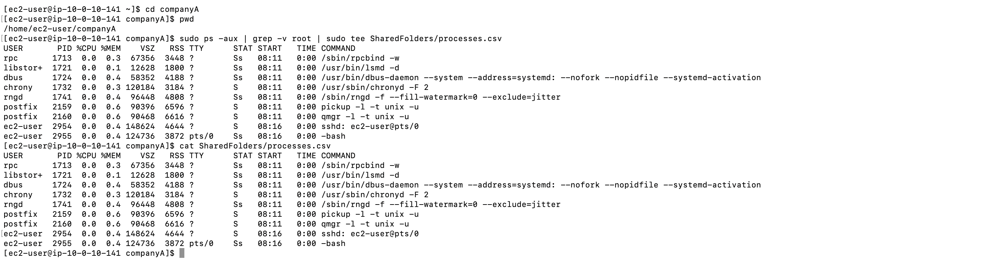
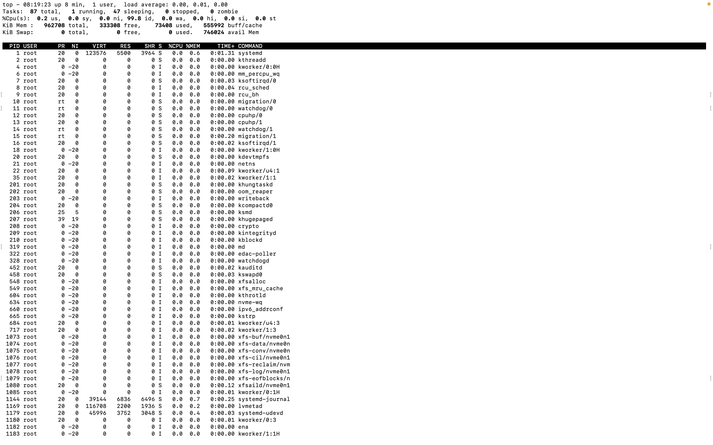
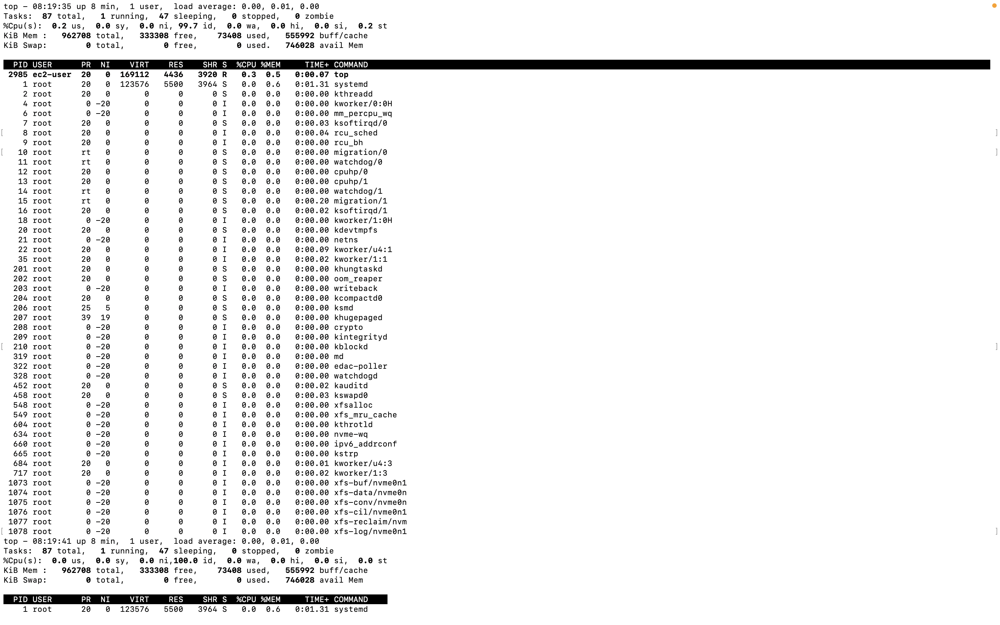
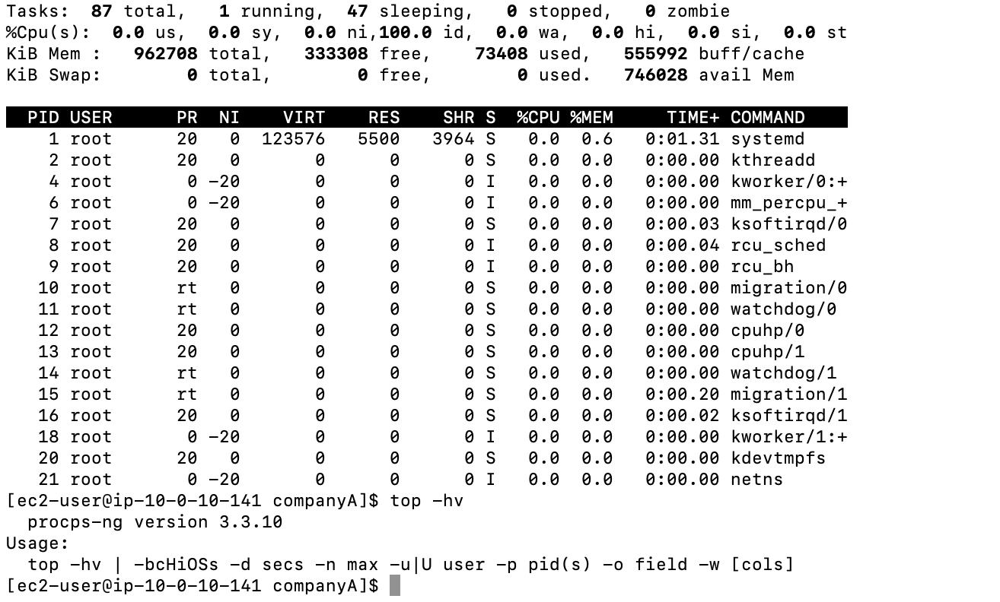
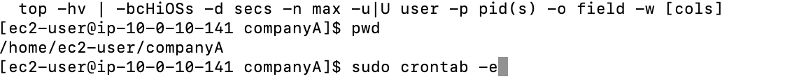
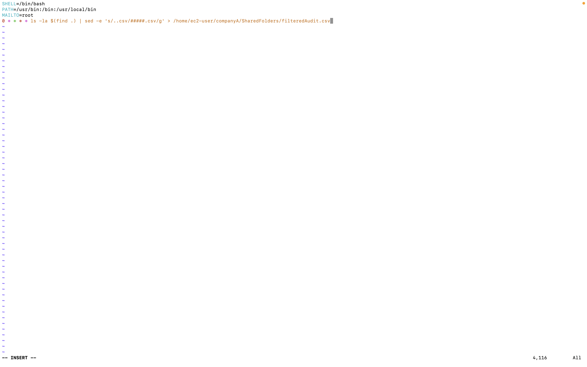
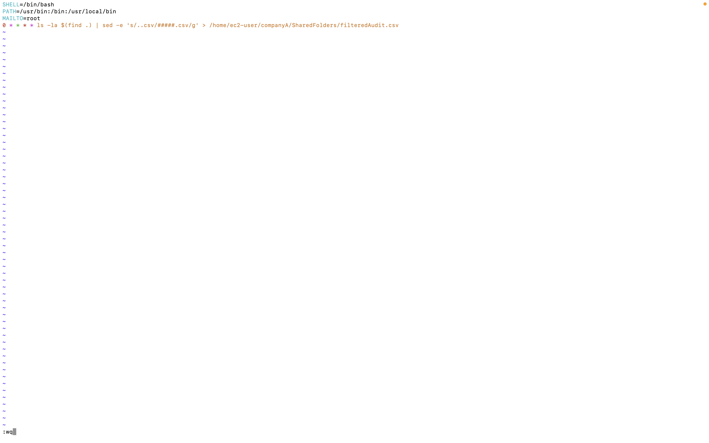
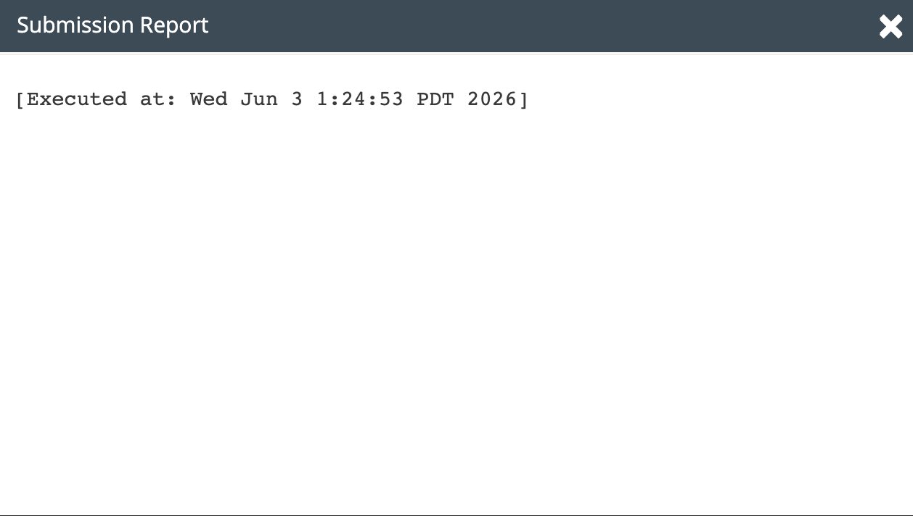

# Lab 10 - Managing Processes

**Programme:** Praesignis AWS re/Start **Date completed:** 03 June 2026 **Lab topic:** Linux process management - ps, top, and cron jobs

---

## ✏️ What This Lab Covered

This lab focused on managing and monitoring processes on a Linux EC2 instance. It covered how to capture a snapshot of running processes using `ps` and redirect the output to a log file, how to monitor system performance in real time using the `top` command, and how to automate recurring tasks by creating a cron job using `crontab`.

Key concepts practised:

- Using `ps -aux` to list all running processes on the system
- Using `grep -v root` to filter out root-owned processes from output
- Using `tee` to write process output to a file in `SharedFolders`
- Using the `top` command to monitor live system performance including CPU, memory, and task states
- Using `top -hv` to view version and usage information
- Creating a cron job with `crontab -e` to run an automated audit task hourly
- Using `sed` inside a cron job to mask `.csv` filenames with `#####`
- Verifying a cron job with `crontab -l`

---

## 📸 Screenshots and Explanations

### Screenshot 01 - Lab Ready Status

The Start Lab panel confirms the lab environment is ready, showing the region as `us-west-2` and a session time of 60 minutes.

---

### Screenshot 02 - SSH Connection to EC2 Instance

The terminal shows a successful SSH connection to the EC2 instance at `35.91.130.94` using the `labsuser.pem` key file. The Amazon Linux 2 welcome banner confirms the connection was established successfully.

---

### Screenshot 03 - Task 2: Creating the processes.csv Log File

The `sudo ps -aux | grep -v root | sudo tee SharedFolders/processes.csv` command lists all non-root processes and writes them to `processes.csv`. The `cat SharedFolders/processes.csv` command confirms the file was created with the correct contents, showing processes owned by `rpc`, `libstor+`, `dbus`, `chrony`, `rngd`, `postfix`, and `ec2-user`.

---

### Screenshot 04 - Task 3: top Command Output

The `top` command displays real-time system performance. The output shows 87 total tasks: 1 running, 47 sleeping, 0 stopped, and 0 zombie. Memory usage shows 962708 KiB total with 333308 KiB free.

---

### Screenshot 05 - Task 3: top Command Full Process List

The full process list from `top` shows all active processes sorted by CPU usage, with the `top` command itself at the top as the only running task (`ec2-user`, PID 2985).

---

### Screenshot 06 - Task 3: top -hv Output

The `top -hv` command returns version information showing `procps-ng version 3.3.10` along with a usage summary of available options.

---

### Screenshot 07 - Task 4: Entering the Cron Job Editor

The `sudo crontab -e` command opens the vim editor. The cron job is entered in INSERT mode with the SHELL, PATH, MAILTO variables and the hourly audit command targeting `SharedFolders/filteredAudit.csv`.

---

### Screenshot 08 - Task 4: Saving the Cron Job

The vim editor shows the completed cron job with `:wq` entered at the bottom, saving and closing the file.

---

### Screenshot 09 - Task 4: Verifying the Cron Job

The `sudo crontab -l` command confirms the cron job was saved correctly, displaying the SHELL, PATH, MAILTO settings and the full hourly audit command.

---

### Screenshot 10 - Submission Report

The lab submission report confirms successful completion, executed on Wed Jun 3 1:24:53 PDT 2026.

---

## Key Concepts

| Command | Purpose |
|---------|---------|
| `ps -aux` | List all running processes |
| `grep -v root` | Exclude lines containing "root" |
| `tee` | Write output to screen and file simultaneously |
| `top` | Monitor live system performance and processes |
| `top -hv` | Display top version and usage info |
| `crontab -e` | Open cron job editor |
| `crontab -l` | List current cron jobs |

## AWS Service Used
- **Amazon EC2** – t3.micro instance (Amazon Linux 2)
