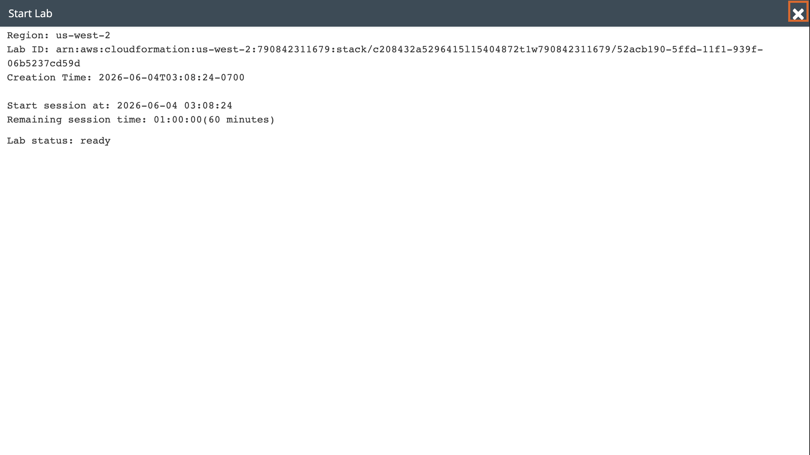
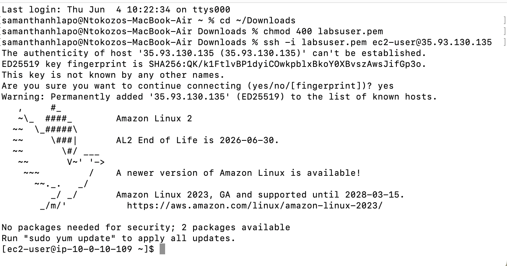
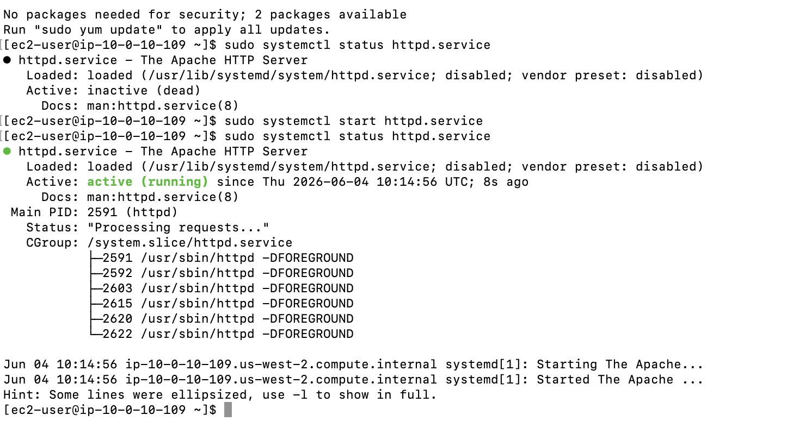
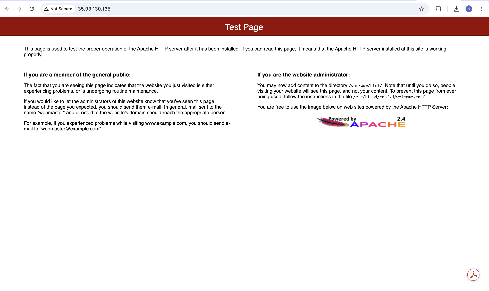
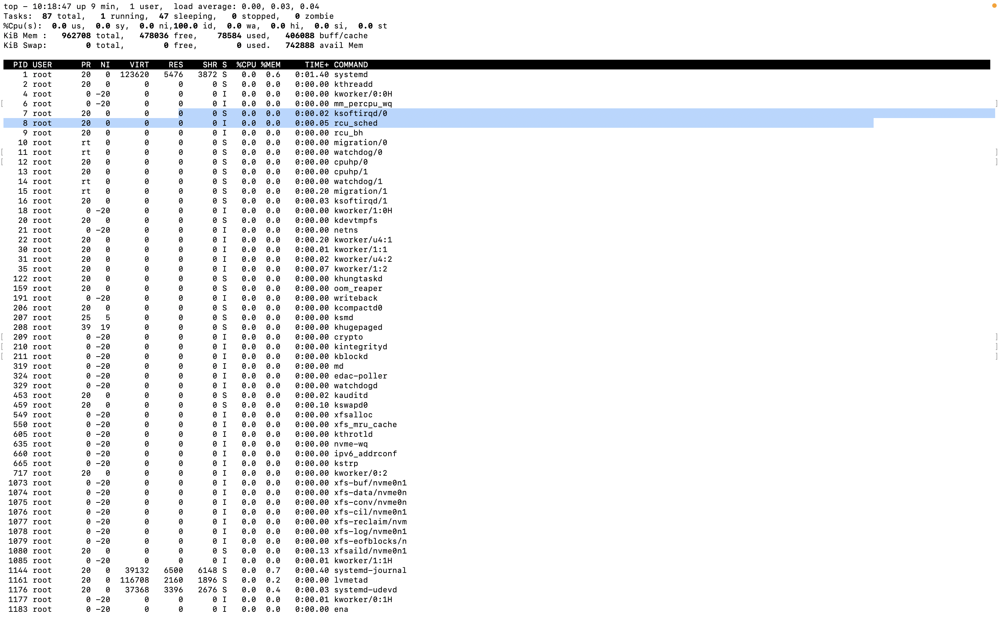
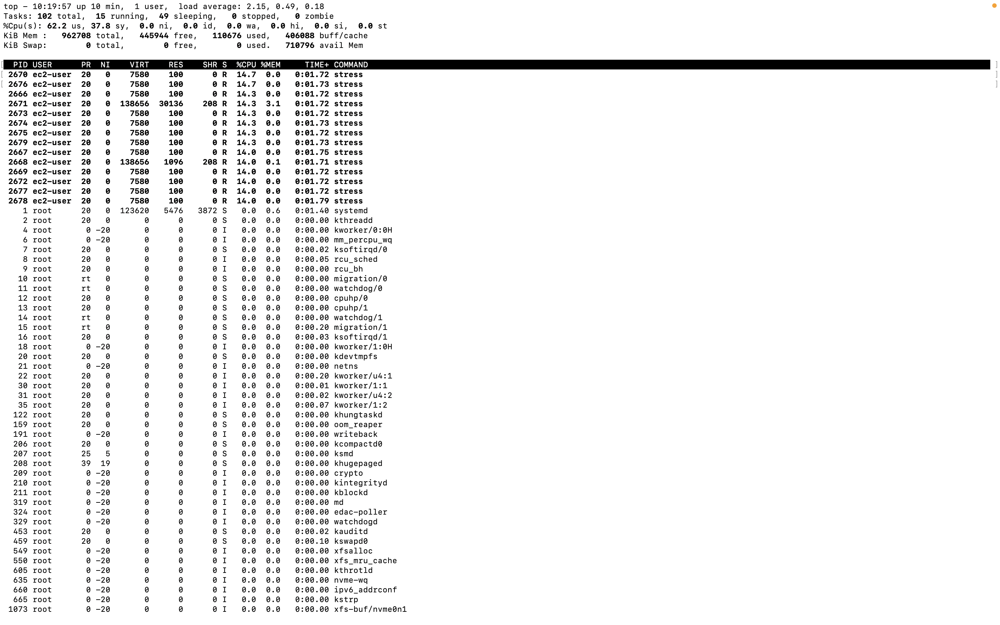
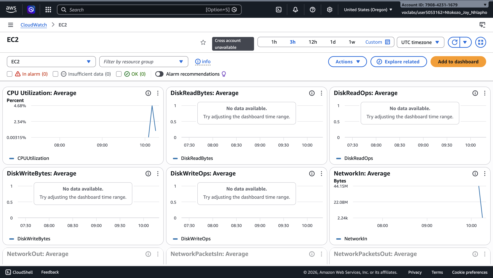
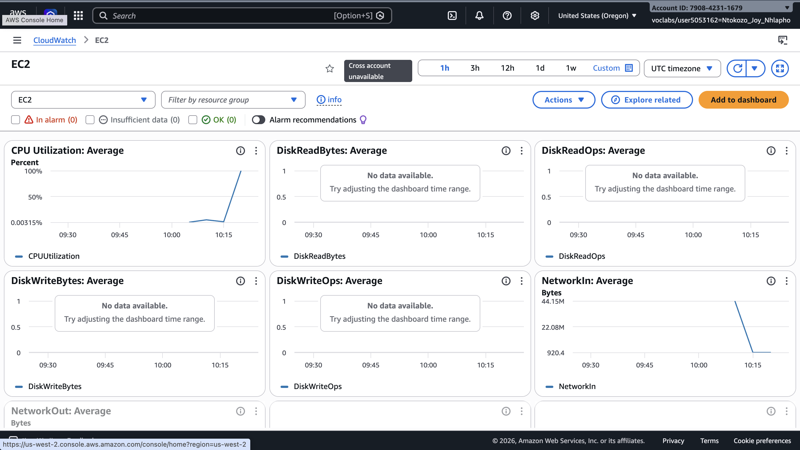

# Lab 11 - Managing Services: Monitoring

**Programme:** Praesignis AWS re/Start **Date completed:** 04 June 2026 **Lab topic:** Linux service management and monitoring - httpd, top, stress testing, and AWS CloudWatch

---

## ✏️ What This Lab Covered

This lab focused on managing and monitoring services on an Amazon Linux 2 EC2 instance. It covered how to check, start, and stop the Apache HTTP server (`httpd`) using `systemctl`, how to verify the web server is working via a browser, how to monitor live system performance using the `top` command, and how to simulate a CPU workload using a stress script. The lab also introduced AWS CloudWatch as a tool for visualising EC2 instance metrics such as CPU utilisation over time.

Key concepts practised:

- Using `systemctl status` to check whether a service is active or inactive
- Using `systemctl start` and `systemctl stop` to manage the httpd service
- Verifying the Apache HTTP server by accessing the public IP in a browser
- Using `top` to monitor running processes and resource usage in real time
- Running a stress script (`./stress.sh`) to simulate heavy CPU load
- Observing the CPU spike in the `top` output during the stress test
- Opening AWS CloudWatch and navigating to the EC2 automatic dashboard
- Observing CPU utilisation spikes and drops on the CloudWatch graphs

---

## 📸 Screenshots and Explanations

### Screenshot 01 - Lab Ready Status

The Start Lab panel confirms the lab environment is ready in `us-west-2` with a 60 minute session.

---

### Screenshot 02 - SSH Connection to EC2 Instance

The terminal shows a successful SSH connection to the EC2 instance at `35.93.130.135` using the `labsuser.pem` key file. The Amazon Linux 2 welcome banner confirms the connection was established successfully.

---

### Screenshot 03 - Task 2: httpd Service Status (Inactive then Active)

The `sudo systemctl status httpd.service` command first shows the service as **inactive (dead)**. After running `sudo systemctl start httpd.service`, the status changes to **active (running)** since Thu 2026-06-04 10:14:56 UTC, with multiple `httpd` worker processes listed under CGroup.

---

### Screenshot 04 - Task 2: Apache HTTP Server Test Page

Navigating to `http://35.93.130.135` in the browser confirms the Apache HTTP server is running correctly. The Apache 2.4 Test Page is displayed, confirming the web server is active and serving requests.

---

### Screenshot 05 - Task 3: top Command - Normal CPU Usage

The `top` command shows the system running normally with 87 total tasks: 1 running, 47 sleeping, 0 stopped, 0 zombie. CPU usage is at nearly 100% idle, confirming no heavy workload is running.

---

### Screenshot 06 - Task 3: top Command - High CPU Under Stress

After running `./stress.sh & top`, the output shows 102 total tasks with 15 running. CPU usage jumps to 62.2% user and 37.8% system. Multiple `stress` processes owned by `ec2-user` appear at the top of the list, each consuming around 14% CPU.

---

### Screenshot 07 - Task 3: CloudWatch EC2 Dashboard - CPU Spike

The AWS CloudWatch EC2 automatic dashboard shows a sharp CPU utilisation spike reaching close to 100% at around 10:15, corresponding to when the stress script was run. Other metrics such as DiskReadBytes and DiskWriteOps show no data, as the workload was CPU-bound.

---

### Screenshot 08 - Task 3: CloudWatch EC2 Dashboard - CPU Drop After Stress

After the stress script completed (6 minutes), the CloudWatch CPU Utilisation graph shows the spike peaking at 4.68% average and then dropping back to baseline, confirming the stress test ended successfully.

---

### Screenshot 09 - Task 3: CloudWatch 3-Hour View

The 3-hour CloudWatch view shows the full picture of CPU activity during the lab session, with the stress spike clearly visible against the otherwise idle baseline.

---

## Key Concepts

| Command | Purpose |
|---------|---------|
| `sudo systemctl status httpd.service` | Check if Apache HTTP service is running |
| `sudo systemctl start httpd.service` | Start the Apache HTTP service |
| `sudo systemctl stop httpd.service` | Stop the Apache HTTP service |
| `top` | Monitor live processes and CPU/memory usage |
| `./stress.sh &` | Run stress script in background |
| CloudWatch EC2 Dashboard | Visualise CPU, disk, and network metrics over time |

## AWS Services Used
- **Amazon EC2** – t3.micro instance (Amazon Linux 2)
- **AWS CloudWatch** – EC2 automatic dashboard for monitoring CPU utilisation
