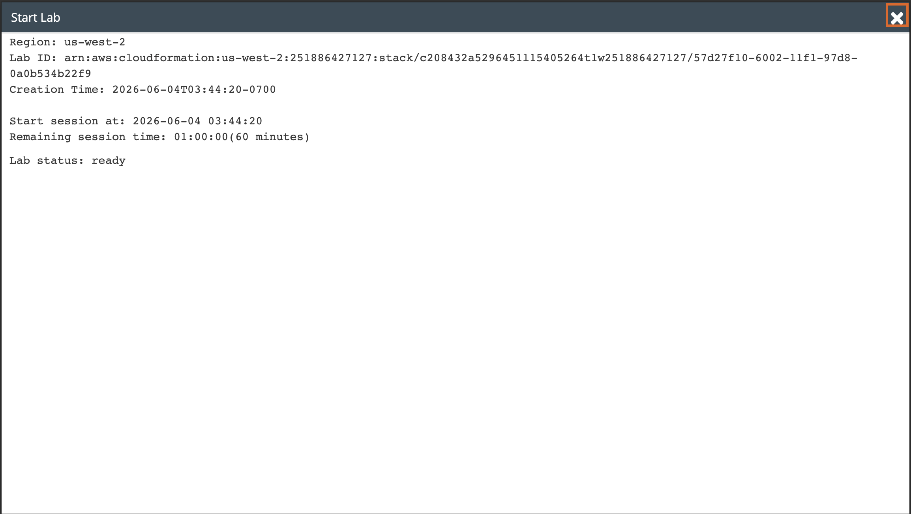
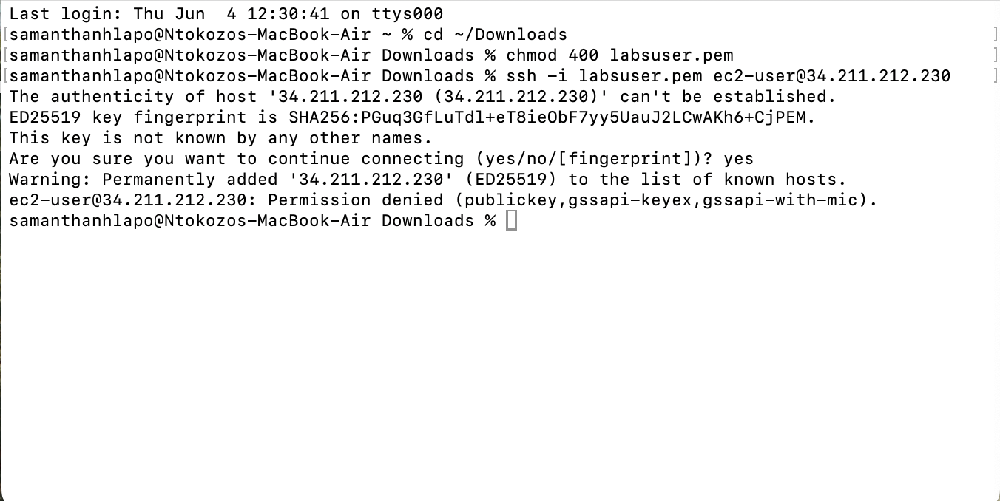
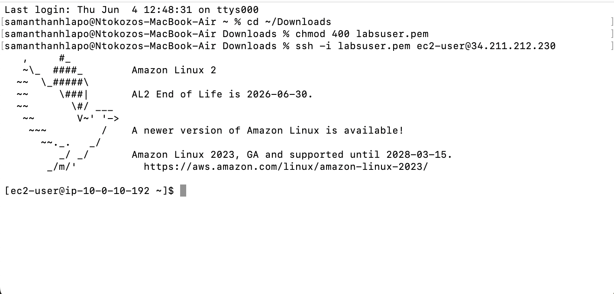
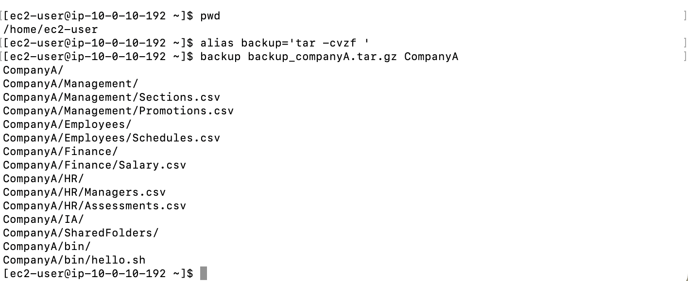
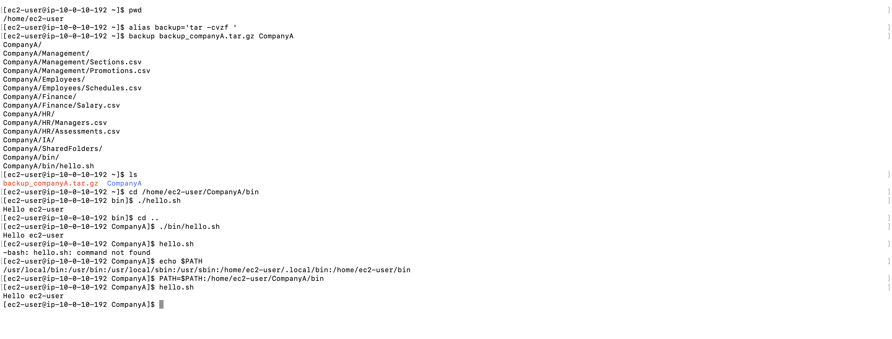
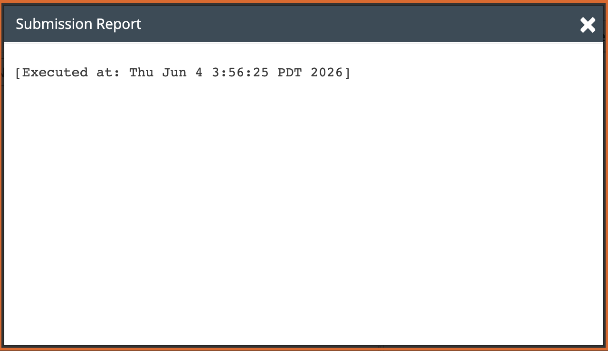

# Lab 12 - The Bash Shell

**Programme:** Praesignis AWS re/Start **Date completed:** 04 June 2026 **Lab topic:** Bash shell - aliases, tar backups, and the PATH environment variable

---

## ✏️ What This Lab Covered

This lab focused on working with the Bash shell on an Amazon Linux 2 EC2 instance. It covered how to create a custom alias to simplify a backup command using `tar`, how to use that alias to archive an entire folder structure, and how to explore and update the `PATH` environment variable to make scripts executable from any directory.

Key concepts practised:

- Creating a shell alias using the `alias` command
- Using `tar -cvzf` to create a compressed `.tar.gz` archive of a folder
- Verifying the archive was created using `ls`
- Running a shell script using `./hello.sh` from its directory
- Running a shell script using a relative path `./bin/hello.sh`
- Understanding why `hello.sh` fails without a full or relative path
- Displaying the current PATH variable using `echo $PATH`
- Adding a new directory to PATH using `PATH=$PATH:/path/to/dir`
- Confirming the script runs successfully after updating PATH

---

## 📸 Screenshots and Explanations

### Screenshot 01 - Lab Ready Status

The Start Lab panel confirms the lab environment is ready in `us-west-2` with a 60 minute session starting at 2026-06-04 03:44:20.

---

### Screenshot 02 - SSH Connection Error (Stale Key)

The first SSH attempt fails with `Permission denied (publickey)` because the `labsuser.pem` file was from a previous lab session. A fresh PEM file was downloaded from the lab credentials panel to resolve this.

---

### Screenshot 03 - SSH Connection Successful (After Fresh PEM)

After downloading the new `labsuser.pem`, the SSH connection to `34.211.212.230` succeeds and the Amazon Linux 2 welcome banner is displayed.

---

### Screenshot 04 - Task 2: Backup Alias and tar Archive

The `alias backup='tar -cvzf '` command creates the backup alias. Running `backup backup_companyA.tar.gz CompanyA` archives the entire CompanyA folder structure including Management, Employees, Finance, HR, IA, SharedFolders, and bin. The `ls` command confirms `backup_companyA.tar.gz` was created successfully.

---

### Screenshot 05 - Task 3: PATH Variable and hello.sh

The full Task 3 workflow is shown: running `./hello.sh` from the bin directory succeeds, running `./bin/hello.sh` from the parent directory succeeds, but running `hello.sh` alone fails with `command not found`. After displaying `echo $PATH` and adding the bin directory with `PATH=$PATH:/home/ec2-user/CompanyA/bin`, running `hello.sh` succeeds and prints `Hello ec2-user`.

---

### Screenshot 06 - Submission Report

The lab submission report confirms successful completion, executed on Thu Jun 4 3:56:25 PDT 2026.

---

## Key Concepts

| Command | Purpose |
|---------|---------|
| `alias backup='tar -cvzf '` | Create a shortcut alias for the tar backup command |
| `backup file.tar.gz folder/` | Use the alias to archive a folder |
| `./hello.sh` | Run a script from its own directory |
| `./bin/hello.sh` | Run a script using a relative path |
| `echo $PATH` | Display the current PATH variable |
| `PATH=$PATH:/new/dir` | Add a new directory to the PATH variable |

## AWS Service Used
- **Amazon EC2** – t3.micro instance (Amazon Linux 2)
