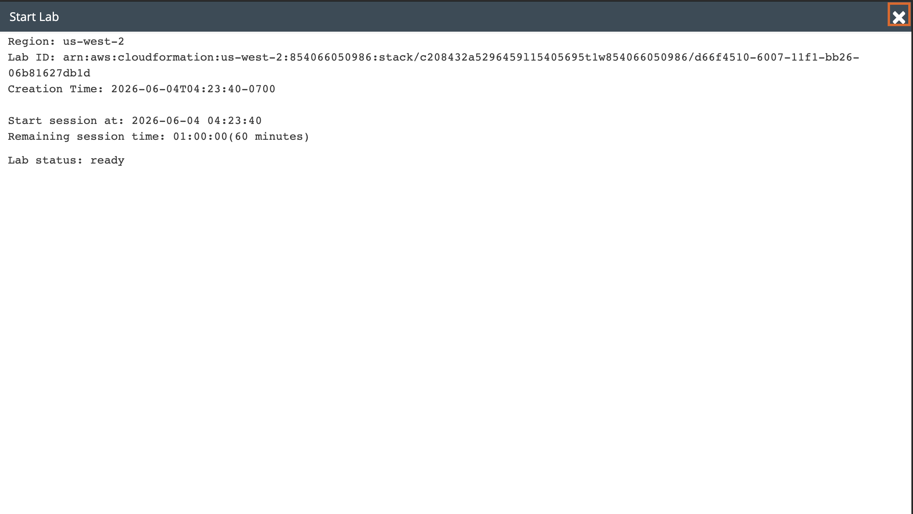
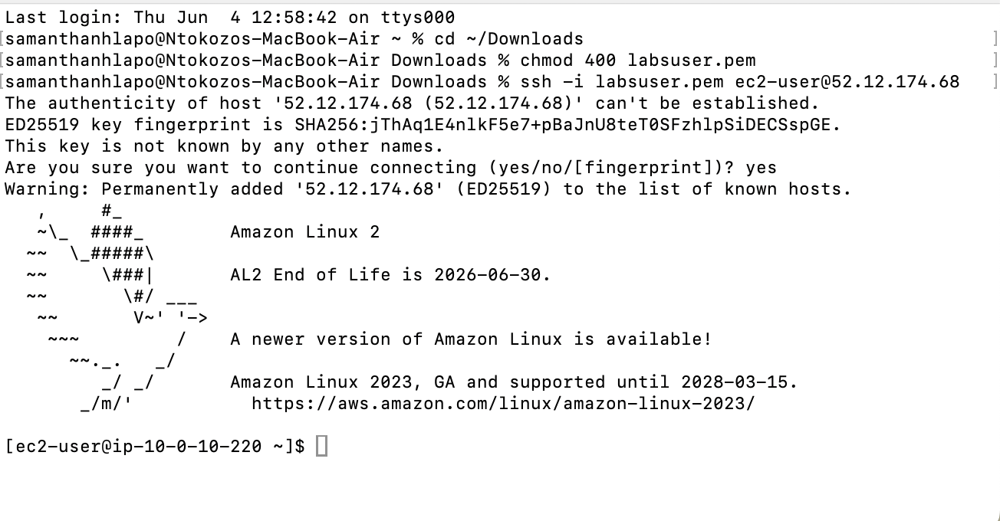
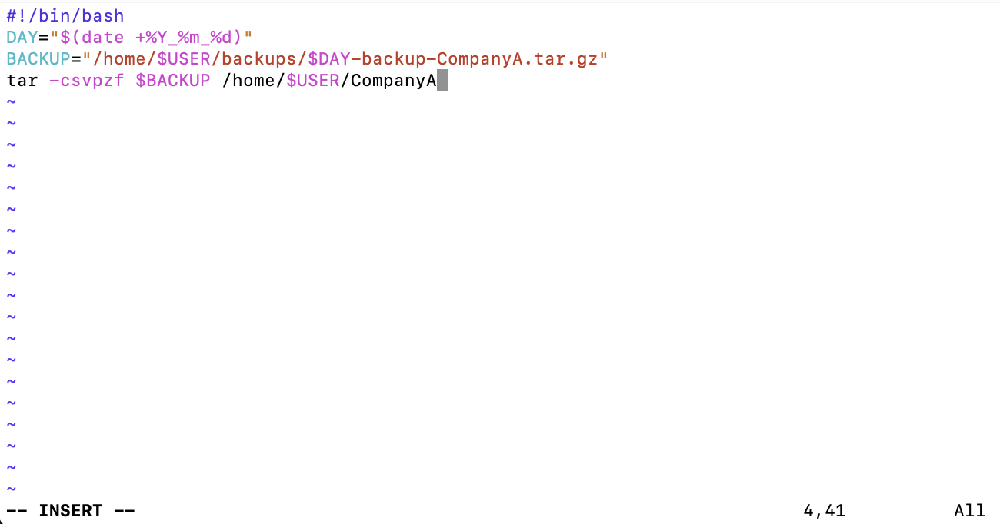
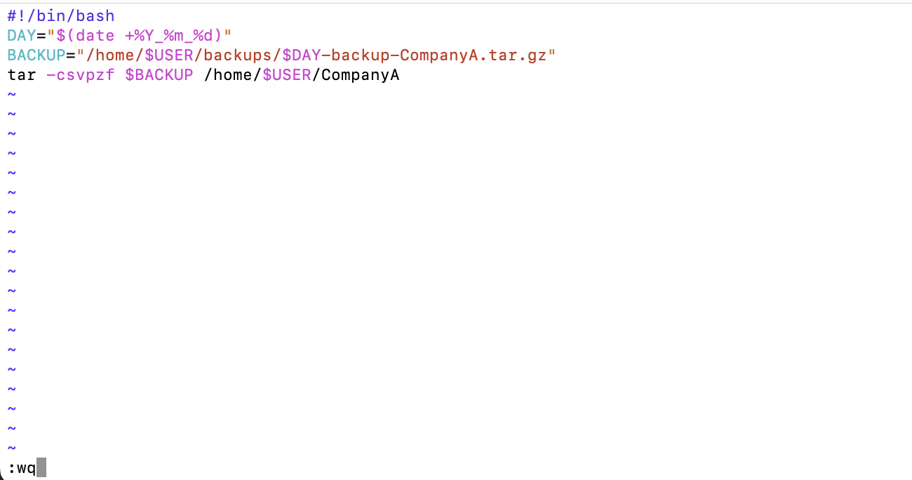
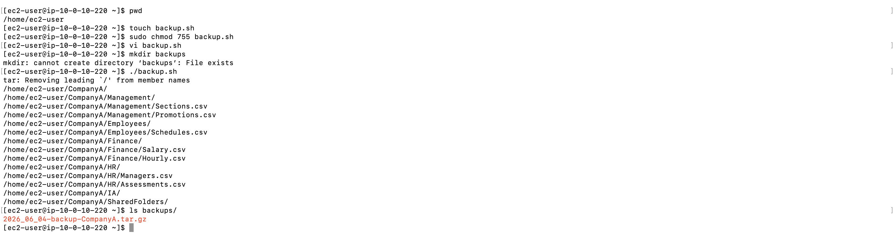

# Lab 13 - Bash Shell Scripts

**Programme:** Praesignis AWS re/Start **Date completed:** 04 June 2026 **Lab topic:** Bash scripting - automating folder backups with tar and date variables

---

## ✏️ What This Lab Covered

This lab focused on writing a Bash shell script to automate the backup of a folder on an Amazon Linux 2 EC2 instance. It covered how to create and make a script executable, how to use variables to store dynamic values like the current date and the backup file path, and how to use `tar` inside a script to create a compressed archive of the CompanyA folder. The backup file is automatically named using the current date, making it easy to track daily backups.

Key concepts practised:

- Creating a shell script file using `touch` and making it executable with `chmod 755`
- Adding a shebang line `#!/bin/bash` to define the script interpreter
- Using `$(date +%Y_%m_%d)` to capture the current date as a variable
- Using `$USER` to dynamically reference the current logged-in user
- Constructing a dynamic backup file path using variables
- Using `tar -csvpzf` to create a compressed, verbose archive
- Running the script with `./backup.sh`
- Verifying the backup was created in the `backups/` folder using `ls`

---

## 📸 Screenshots and Explanations

### Screenshot 01 - Lab Ready Status

The Start Lab panel confirms the lab environment is ready in `us-west-2` with a 60 minute session starting at 2026-06-04 04:23:40.

---

### Screenshot 02 - SSH Connection to EC2 Instance

The terminal shows a successful SSH connection to the EC2 instance at `52.12.174.68` using the `labsuser.pem` key file. The Amazon Linux 2 welcome banner confirms the connection was established successfully.

---

### Screenshot 03 - backup.sh Script in vim (INSERT mode)

The `backup.sh` script is open in vim in INSERT mode, showing the four lines of the script: the shebang line, the DAY variable using `date +%Y_%m_%d`, the BACKUP variable constructing the archive path, and the `tar -csvpzf` command to create the archive.

---

### Screenshot 04 - backup.sh Script Being Saved (:wq)

The vim editor shows the completed `backup.sh` script with `:wq` entered at the bottom, saving and closing the file.

---

### Screenshot 05 - Running the Script and Verifying the Backup

The `./backup.sh` command runs the script, outputting the full list of files archived from the CompanyA folder. The `ls backups/` command confirms the archive `2026_06_04-backup-CompanyA.tar.gz` was created successfully in the backups directory.

---

## Key Concepts

| Concept | Example | Purpose |
|---------|---------|---------|
| Shebang | `#!/bin/bash` | Tells the system to use Bash to run the script |
| Date variable | `$(date +%Y_%m_%d)` | Captures today's date dynamically |
| User variable | `$USER` | Returns the current logged-in username |
| tar flags | `-csvpzf` | Create, verbose, preserve permissions, compress, file |
| Make executable | `chmod 755 backup.sh` | Allows the script to be run directly |

## AWS Service Used
- **Amazon EC2** – t3.micro instance (Amazon Linux 2)
