# Lab 14 - Software Management

**Programme:** Praesignis AWS re/Start **Date completed:** 04 June 2026 **Lab topic:** Linux software management - yum package manager, package rollback, and AWS CLI installation

---

## ✏️ What This Lab Covered

This lab focused on managing software on an Amazon Linux 2 EC2 instance. It covered how to use the `yum` package manager to check for updates, apply security patches, upgrade packages, and install software. It also covered how to roll back a previously installed package using `yum history`, and how to install and configure the AWS CLI v2 to interact with AWS services from the command line.

Key concepts practised:

- Using `yum check-update` to query available package updates
- Using `yum update --security` to apply only security-related patches
- Using `yum upgrade` to upgrade all installed packages
- Installing `httpd` (Apache) using `yum install`
- Using `yum history list` to view the transaction history
- Using `yum history info <id>` to inspect a specific transaction
- Using `yum history undo <id>` to roll back a package installation
- Installing AWS CLI v2 using `curl`, `unzip`, and `./aws/install`
- Configuring the AWS CLI using `aws configure`
- Pasting credentials into `~/.aws/credentials` using `nano`
- Using `aws ec2 describe-instance-attribute` to query instance details

---

## 📸 Screenshots and Explanations

### Screenshot 01 - Lab Ready Status

The Start Lab panel confirms the lab environment is ready in `us-west-2` with a 60 minute session starting at 2026-06-04 04:38:39.

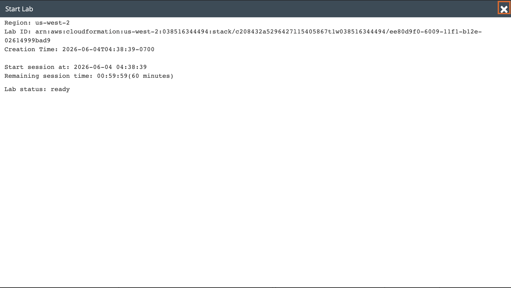

---

### Screenshot 02 - SSH Connection to EC2 Instance

The terminal shows a successful SSH connection to the EC2 instance at `54.184.6.208` using the `labsuser.pem` key file. The Amazon Linux 2 welcome banner confirms the connection was established successfully.

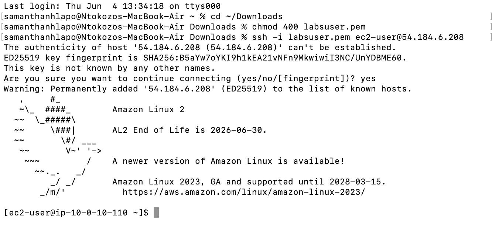

---

### Screenshot 03 - Task 2: yum check-update, update --security, upgrade, and httpd install

The terminal shows `sudo yum -y check-update` confirming the instance is up to date, `sudo yum update --security` showing no security packages needed, `sudo yum -y upgrade` showing no packages marked for update, and `sudo yum install httpd -y` resolving and installing httpd with all its dependencies.

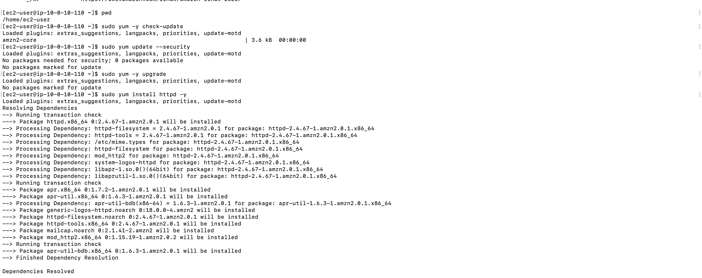

---

### Screenshot 04 - Task 2: httpd Installation Complete

The transaction summary shows httpd version `2.4.67-1.amzn2.0.1` being installed along with 8 dependent packages including `apr`, `apr-util`, `mod_http2`, and `mailcap`. The installation completes successfully.

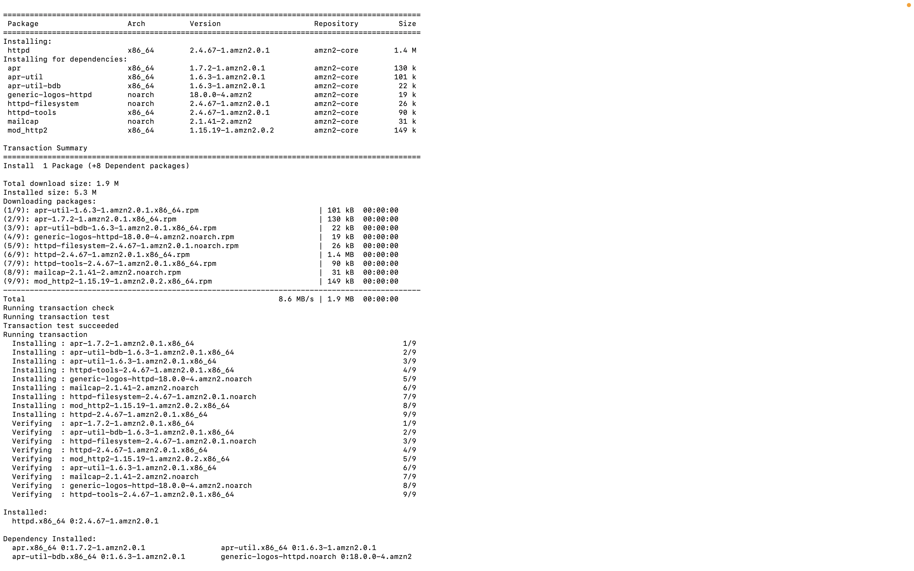

---

### Screenshot 05 - Task 3: yum history list and history info

The `sudo yum history list` command shows transaction ID 1 — the httpd installation on 2026-06-04. The `sudo yum history info 1` command shows the full transaction details including begin time, end time, user, return code, and all 9 packages altered.

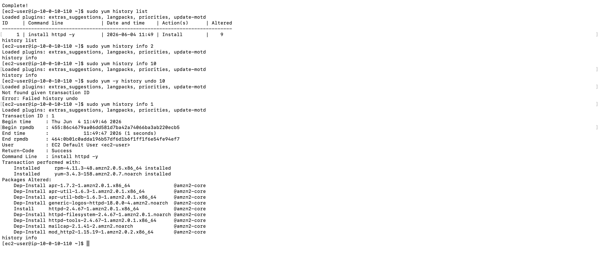

---

### Screenshot 06 - Task 3: yum history undo

The `sudo yum -y history undo 1` command rolls back the httpd installation, removing all 9 packages that were installed. The transaction completes with `Complete!` confirming the rollback was successful.

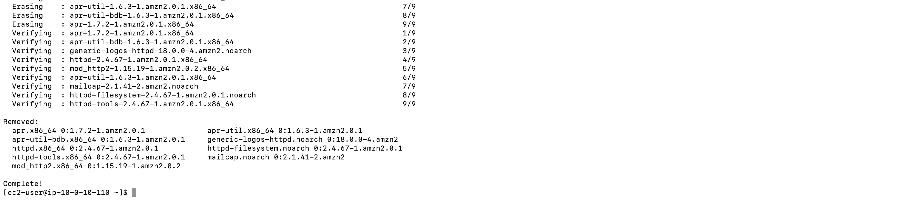

---

### Screenshot 07 - Task 4: AWS CLI Installation

The terminal shows `python3 --version` returning Python 3.7.16 and `pip3 --version` returning pip 20.2.2. The `curl` command downloads the AWS CLI v2 zip file at 315M/s, `unzip` extracts the installer, and `sudo ./aws/install` installs the AWS CLI successfully.

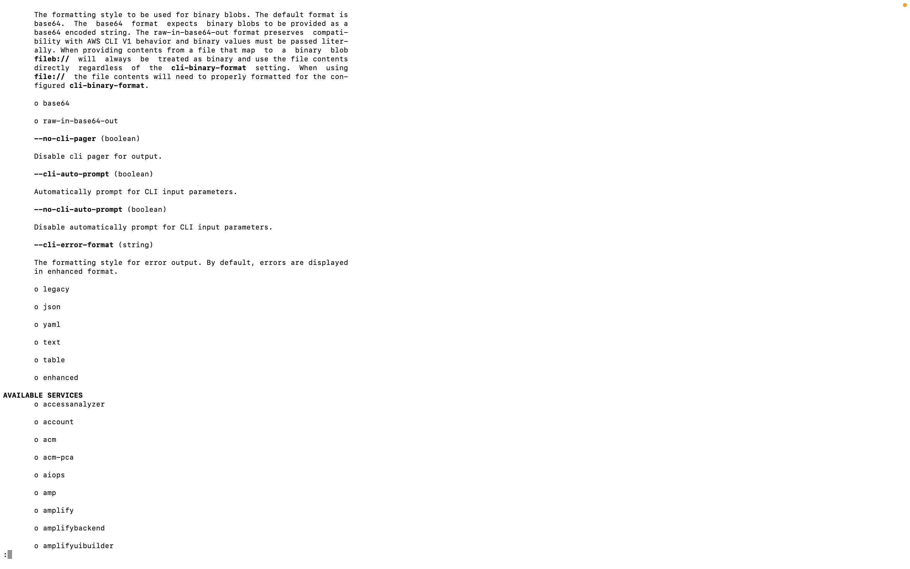

---

### Screenshot 08 - Task 5: aws configure and Credentials File

The `aws configure` command sets the region to `us-west-2` and output format to `json`. The nano editor shows the credentials file open at `~/.aws/credentials` with the `[default]` block containing the access key, secret key, and session token.

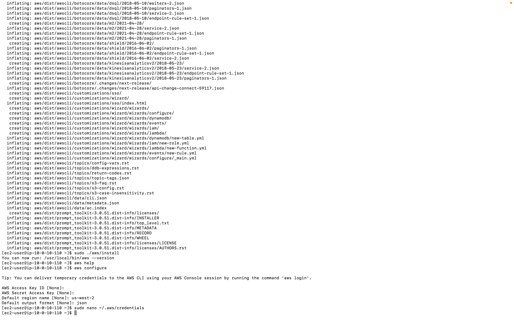

---

### Screenshot 09 - Task 5: EC2 Console - Command Host Instance

The AWS EC2 console shows the `Command Host` instance running as a `t3.micro` in `us-west-2a` with instance ID `i-0b944f364f4d8ab2b` and 3/3 status checks passed.

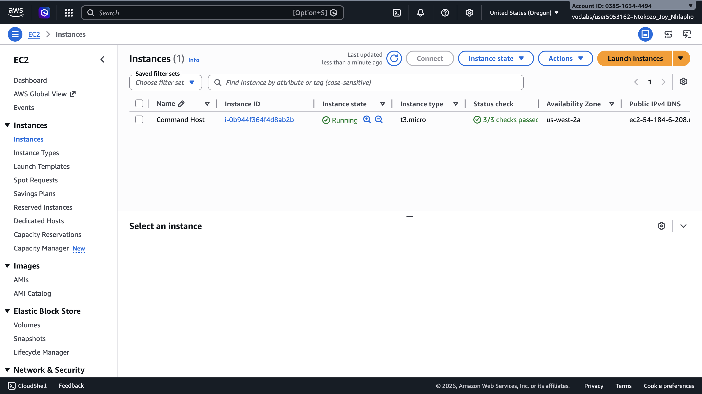

---

### Screenshot 10 - Task 5: aws ec2 describe-instance-attribute Output

After fixing the credentials and spacing in the command, the `aws ec2 describe-instance-attribute` command returns a successful JSON response confirming the instance ID `i-0b944f364f4d8ab2b` and instance type `t3.micro`.

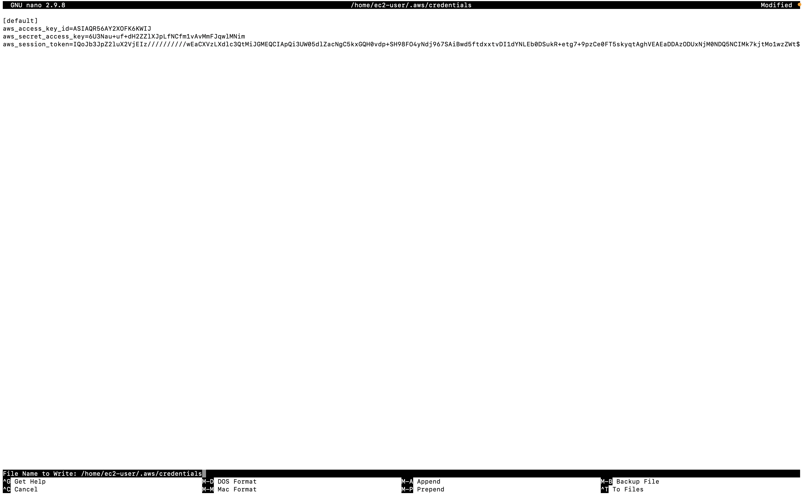

---

### Screenshot 11 - Submission Report

The lab submission report confirms successful completion, executed on Thu Jun 4 5:14:51 PDT 2026.

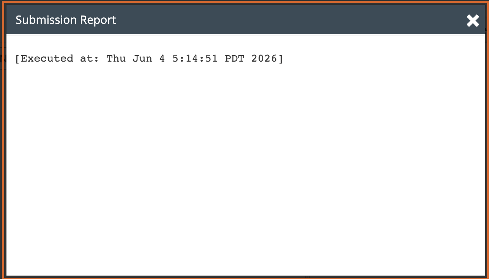

---

## Key Concepts

| Command | Purpose |
|---------|---------|
| `sudo yum -y check-update` | Check for available package updates |
| `sudo yum update --security` | Apply only security-related updates |
| `sudo yum -y upgrade` | Upgrade all installed packages |
| `sudo yum install httpd -y` | Install the Apache HTTP server |
| `sudo yum history list` | View yum transaction history |
| `sudo yum history info <id>` | View details of a specific transaction |
| `sudo yum -y history undo <id>` | Roll back a specific transaction |
| `curl ... -o awscliv2.zip` | Download the AWS CLI v2 installer |
| `sudo ./aws/install` | Install the AWS CLI v2 |
| `aws configure` | Configure AWS CLI with region and output format |
| `aws ec2 describe-instance-attribute` | Query EC2 instance attributes via CLI |

## AWS Services Used
- **Amazon EC2** – t3.micro instance (Amazon Linux 2)
- **AWS CLI v2** – installed and configured to interact with AWS services
