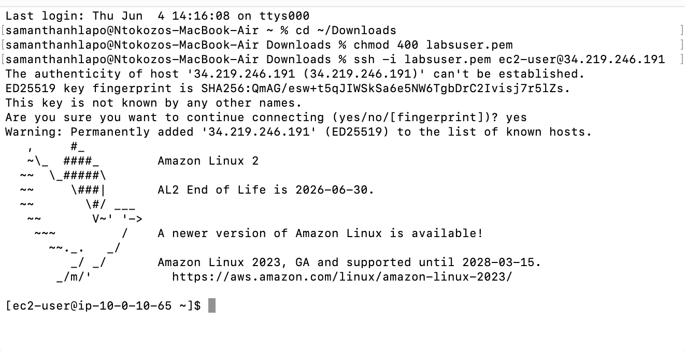
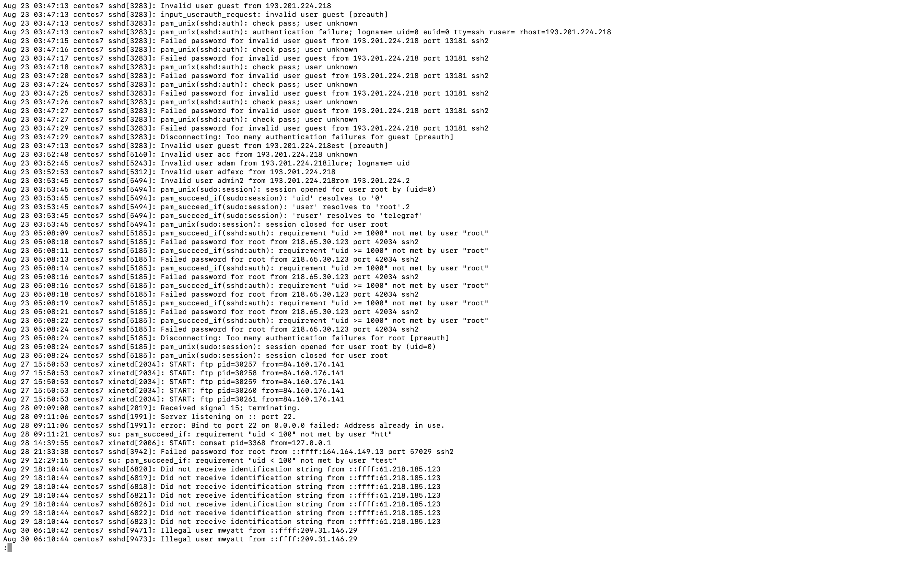
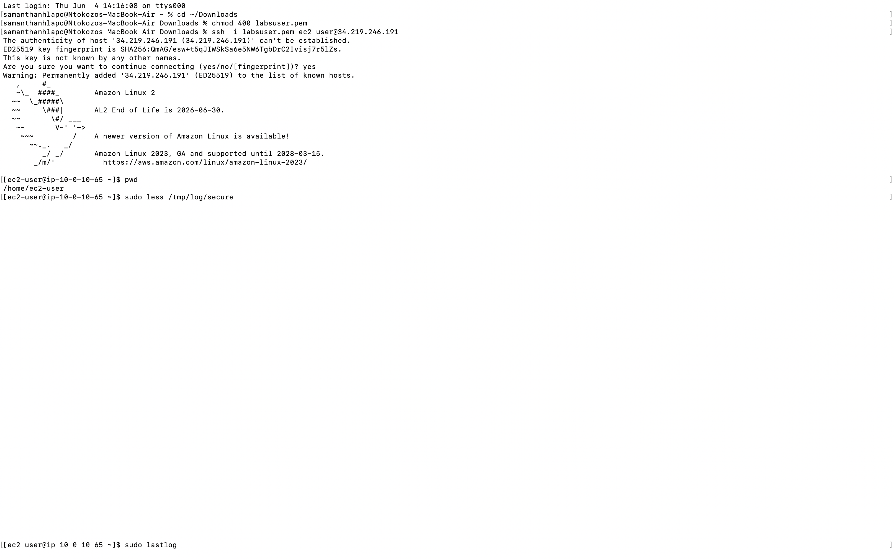
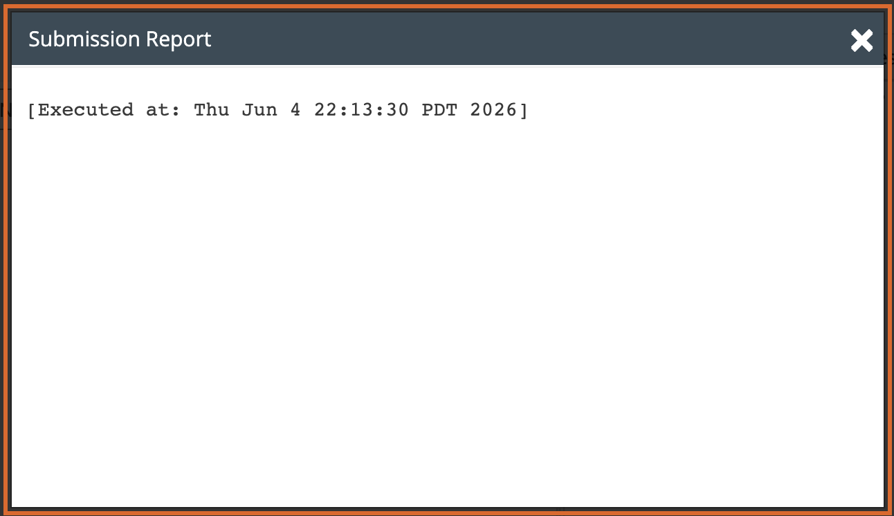

# Lab 15 - Managing Log Files

**Programme:** Praesignis AWS re/Start **Date completed:** 05 June 2026 **Lab topic:** Linux log file management - secure logs and lastlog

---

## ✏️ What This Lab Covered

This lab focused on reviewing and interpreting Linux log files on an Amazon Linux 2 EC2 instance. It covered how to read the secure log file to identify authentication failures and suspicious login attempts, and how to use the `lastlog` command to view the most recent login times for all users on the system. These skills are essential for security auditing and monitoring access to Linux systems.

Key concepts practised:

- Using `sudo less /tmp/log/secure` to review a sample secure log file
- Identifying authentication failures, invalid users, and failed password attempts in the log
- Reading log entries including timestamps, source IP addresses, and port numbers
- Using `sudo lastlog` to display the last login time for every user on the system
- Identifying which users have never logged in vs those with active sessions
- Understanding the difference between system accounts and regular user accounts

---

## 📸 Screenshots and Explanations

### Screenshot 01 - SSH Connection to EC2 Instance

The terminal shows a successful SSH connection to the EC2 instance at `34.219.246.191` using the `labsuser.pem` key file. The Amazon Linux 2 welcome banner confirms the connection was established successfully.

---

### Screenshot 02 - Task 2: sudo less /tmp/log/secure

The terminal shows the `pwd` command confirming the home directory, followed by `sudo less /tmp/log/secure` being run. The secure log file viewer opens in the next screenshot.

---

### Screenshot 03 - Task 2: Secure Log File Contents

The secure log file shows a series of authentication failures and invalid user attempts originating from external IP addresses such as `193.201.224.218` and `218.65.30.123`. Entries include failed SSH password attempts, invalid usernames, disconnections due to too many authentication failures, and FTP session starts. This is typical of brute-force login attempts against a publicly accessible server.

---

### Screenshot 04 - Task 2: sudo lastlog Output

The `sudo lastlog` command displays the last login record for every user on the system. Most system accounts such as `root`, `bin`, `daemon`, `adm`, and service accounts show as **Never logged in**. The only active login shown is `ec2-user` who logged in via `pts/0` from `vc-vb-41-10-51-9` on Fri Jun 5 05:11:19 +0000 2026. Company users such as `ljuan`, `mmajor`, `mjackson`, `eowusu`, and `nwolf` all show as never logged in.

---

### Screenshot 05 - Submission Report

The lab submission report confirms successful completion, executed on Thu Jun 4 22:13:30 PDT 2026.

---

## Key Concepts

| Command | Purpose |
|---------|---------|
| `sudo less /tmp/log/secure` | View the secure log file for authentication events |
| `sudo lastlog` | Display last login time for all system users |
| `q` | Exit the `less` viewer |

## Business Use Cases for Log Data
- **Security auditing** — identify brute-force attempts and unauthorized access
- **Compliance** — track who logged in and when for audit trails
- **Incident response** — investigate suspicious IP addresses and failed logins
- **User management** — identify inactive accounts that have never logged in

## AWS Service Used
- **Amazon EC2** – t3.micro instance (Amazon Linux 2)
