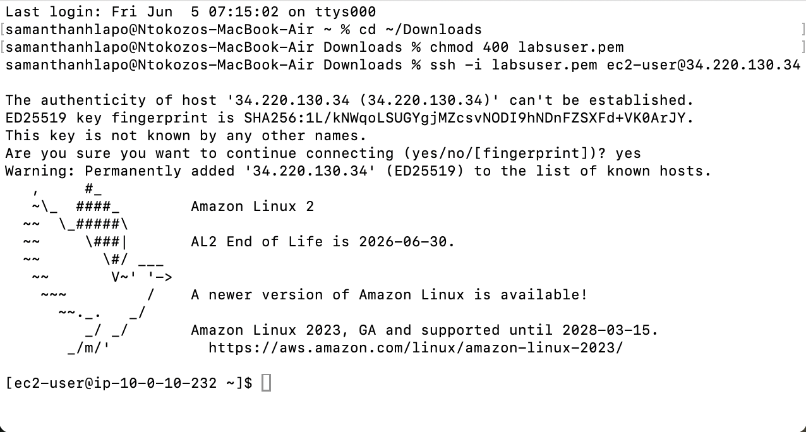
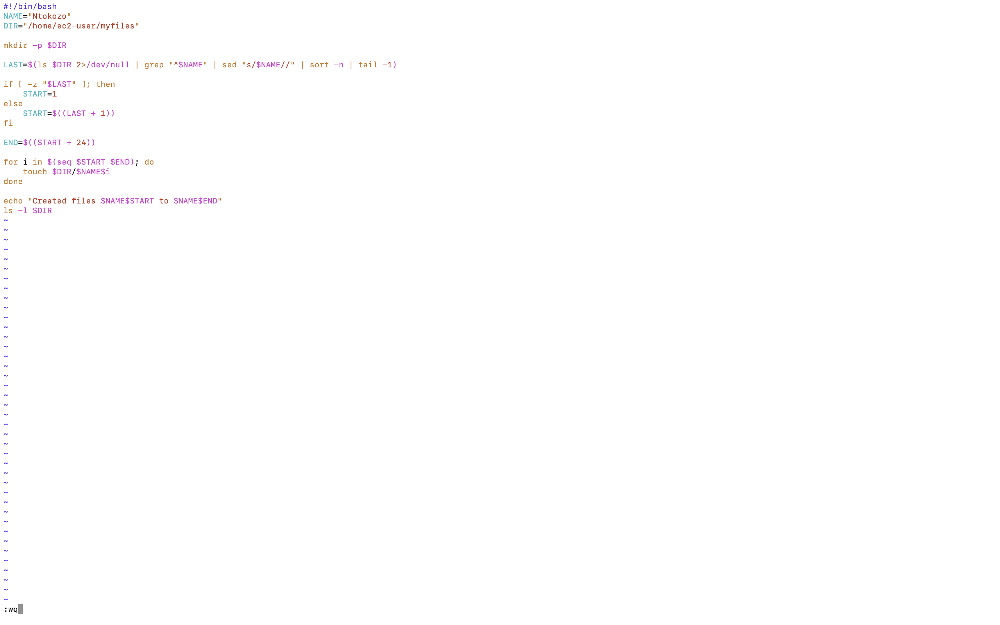
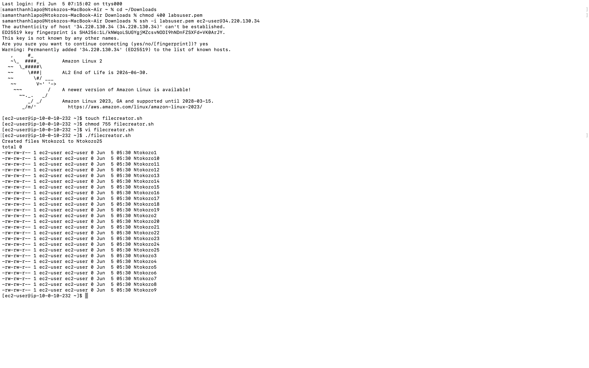
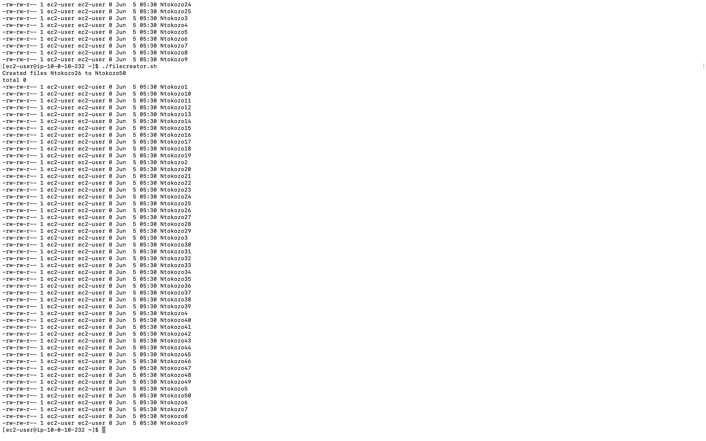
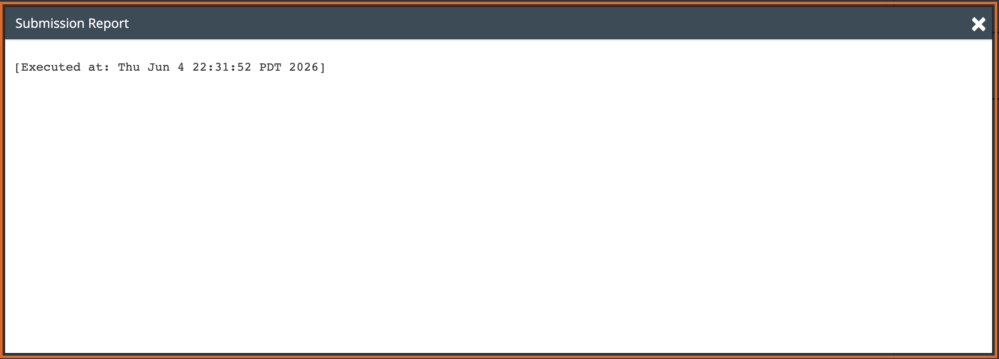

# Lab 16 - Challenge Lab: Bash Shell Scripting

**Programme:** Praesignis AWS re/Start **Date completed:** 05 June 2026 **Lab topic:** Bash scripting challenge - dynamic file creation with auto-incrementing names

---

## ✏️ What This Lab Covered

This was a challenge lab requiring an original Bash script to be written without step-by-step instructions. The script had to create 25 empty files named after the user with incrementing numbers, and intelligently detect the highest existing file number each time it runs so the next batch always continues from where the last one left off — with no hardcoded numbers.

Key concepts practised:

- Writing a Bash script from scratch to meet specific requirements
- Using `touch` to create multiple empty files in a loop
- Using `ls`, `grep`, `sed`, `sort -n`, and `tail -1` to dynamically detect the last file number
- Using an `if/else` conditional to handle the first run (no files yet) vs subsequent runs
- Using `seq` and a `for` loop to generate a range of file numbers
- Using `mkdir -p` to safely create a directory only if it doesn't already exist
- Using `$((arithmetic))` for integer calculations in Bash
- Testing the script twice to confirm it picks up from the correct number each time

---

## 📸 Screenshots and Explanations

### Screenshot 01 - SSH Connection to EC2 Instance

The terminal shows a successful SSH connection to the EC2 instance at `34.220.130.34` using the `labsuser.pem` key file. The Amazon Linux 2 welcome banner confirms the connection was established.



---

### Screenshot 02 - The filecreator.sh Script in vim

The completed `filecreator.sh` script is shown in vim with `:wq` at the bottom ready to save. The script sets `NAME="Ntokozo"` and `DIR="/home/ec2-user/myfiles"`, detects the last file number using `ls | grep | sed | sort | tail`, calculates the start and end numbers, and loops through `seq` to create 25 files using `touch`.



---

### Screenshot 03 - First Run: Files Ntokozo1 to Ntokozo25 Created

The first run of `./filecreator.sh` prints `Created files Ntokozo1 to Ntokozo25` and lists all 25 files in the `myfiles` directory, each 0 bytes in size and owned by `ec2-user`.



---

### Screenshot 04 - Second Run: Files Ntokozo26 to Ntokozo50 Created

The second run of `./filecreator.sh` correctly detects that the last file was `Ntokozo25` and prints `Created files Ntokozo26 to Ntokozo50`. The full directory listing now shows all 50 files from Ntokozo1 through Ntokozo50, confirming the auto-increment logic works correctly.



---

### Screenshot 05 - Submission Report

The lab submission report confirms successful completion, executed on Thu Jun 4 22:31:52 PDT 2026.



---

## The Script

```bash
#!/bin/bash
NAME="Ntokozo"
DIR="/home/ec2-user/myfiles"

mkdir -p $DIR

LAST=$(ls $DIR 2>/dev/null | grep "^$NAME" | sed "s/$NAME//" | sort -n | tail -1)

if [ -z "$LAST" ]; then
    START=1
else
    START=$((LAST + 1))
fi

END=$((START + 24))

for i in $(seq $START $END); do
    touch $DIR/$NAME$i
done

echo "Created files $NAME$START to $NAME$END"
ls -l $DIR
```

## Key Concepts

| Concept | Detail |
|---------|--------|
| `touch` | Creates empty 0KB files |
| `ls \| grep \| sed \| sort -n \| tail -1` | Finds the highest existing file number |
| `if [ -z "$LAST" ]` | Checks if no files exist yet |
| `seq $START $END` | Generates a numeric range for the loop |
| `$((LAST + 1))` | Bash arithmetic to increment the start number |
| `mkdir -p` | Creates directory safely without error if it exists |

## AWS Service Used
- **Amazon EC2** – t3.micro instance (Amazon Linux 2)
