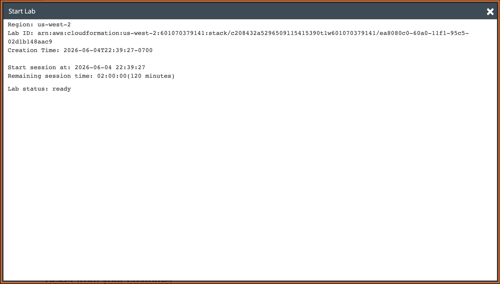
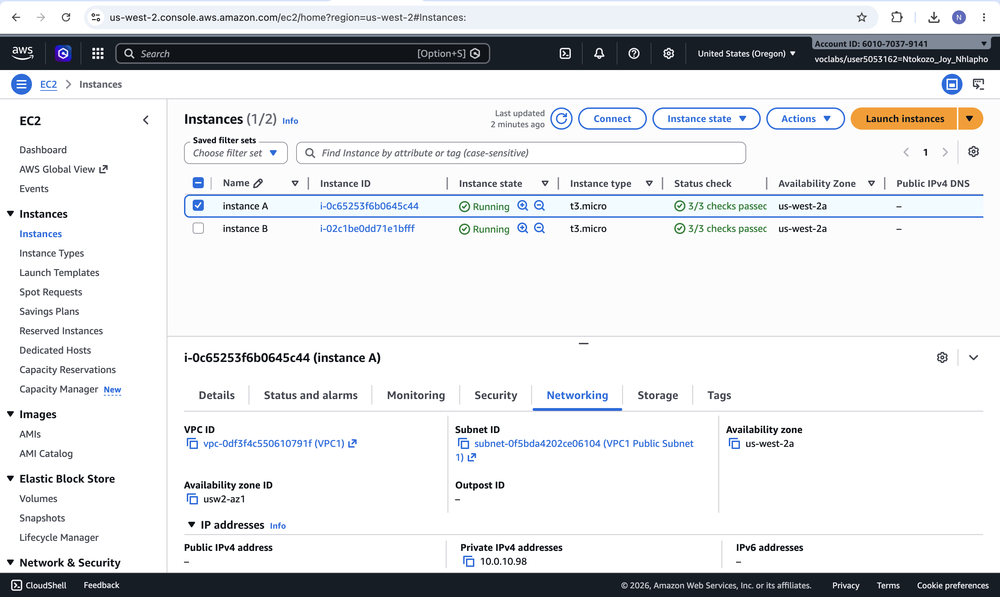
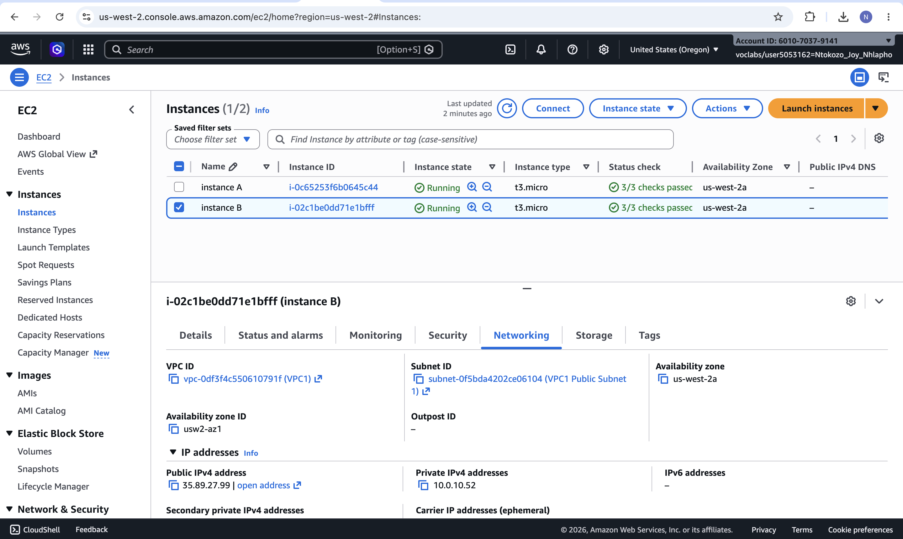
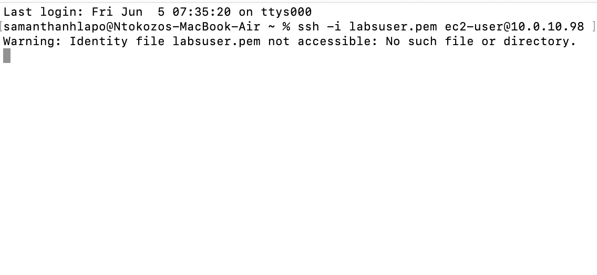
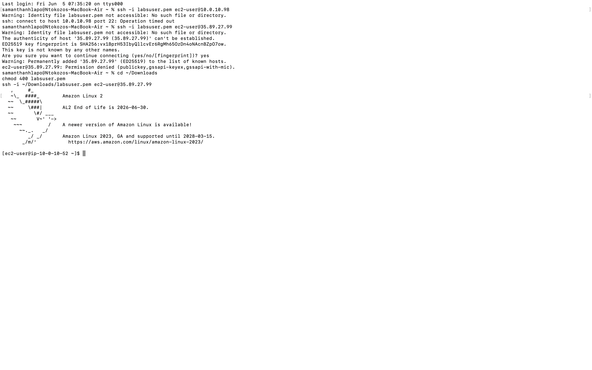

# Lab 17 - Internet Protocols: Public and Private IP Addresses

**Programme:** Praesignis AWS re/Start **Date completed:** 05 June 2026 **Lab topic:** Networking - public vs private IP addresses, VPC CIDR ranges, and internet connectivity troubleshooting

---

## ✏️ What This Lab Covered

This lab was a networking investigation scenario where a customer reported that one of their two EC2 instances could not reach the internet, even though both were in the same VPC and subnet with identical AWS configurations. The task was to identify the root cause, demonstrate the issue, and advise the customer on a second question about using public IP ranges for a VPC CIDR.

Key concepts practised:

- Understanding the difference between public and private IPv4 addresses
- Identifying why an EC2 instance without a public IP cannot be reached from outside the VPC
- Using the EC2 console Networking tab to inspect IP address assignments
- Demonstrating that SSH to a private IP times out from outside the VPC
- Demonstrating that SSH to a public IP succeeds from outside the VPC
- Understanding why using a public IP range (e.g. `12.0.0.0/16`) for a VPC CIDR is not recommended
- Applying OSI model thinking to troubleshoot AWS networking issues from the instance layer upward

---

## 📸 Screenshots and Explanations

### Screenshot 01 - Lab Ready Status

The Start Lab panel confirms the lab environment is ready in `us-west-2` with a 120 minute session starting at 2026-06-04 22:39:27.

---

### Screenshot 02 - Instance A Networking Tab (Private IP Only)

The EC2 console shows Instance A (`i-0c65253f6b0645c44`) selected with the Networking tab open. The **Public IPv4 address field shows a dash (–)** meaning no public IP has been assigned. The only IP address is the private IPv4 address `10.0.10.98`. This is the root cause of the customer's issue — without a public IP, Instance A cannot be reached from the internet.

---

### Screenshot 03 - Instance B Networking Tab (Public and Private IP)

The EC2 console shows Instance B (`i-02c1be0dd71e1bfff`) selected with the Networking tab open. Instance B has both a **Public IPv4 address of `35.89.27.99`** and a **Private IPv4 address of `10.0.10.52`**. This is why Instance B can reach the internet while Instance A cannot.

---

### Screenshot 04 - SSH Attempt to Instance A (Timeout) and Instance B (Success)

The terminal shows two SSH attempts. The first attempt to Instance A at `10.0.10.98` results in **Operation timed out** — confirming that a private IP cannot be reached from outside the VPC. The second attempt to Instance B at `35.89.27.99` eventually succeeds after downloading the correct PEM file, connecting to `ec2-user@ip-10-0-10-52` and displaying the Amazon Linux 2 welcome banner.

---

### Screenshot 05 - Successful SSH to Instance B

The terminal confirms a successful SSH connection to Instance B via its public IP `35.89.27.99`, landing at the `[ec2-user@ip-10-0-10-52 ~]$` prompt. This confirms that a public IP is required for SSH access from outside the VPC.

---

## Findings and Customer Response

### Root Cause
Instance A only has a private IP address (`10.0.10.98`) and no public IP assigned. Private IP addresses are only routable within the VPC and cannot be accessed from the internet. Instance B has both a public IP (`35.89.27.99`) and private IP (`10.0.10.52`), which allows it to communicate with the internet through the VPC's Internet Gateway.

### Solution for Jess
To fix Instance A, a public IP address needs to be assigned. This can be done by allocating and associating an **Elastic IP address** to Instance A, or by enabling auto-assign public IP on the subnet or instance settings.

### Advice on Using a Public CIDR (12.0.0.0/16) for a VPC
Using a publicly routable IP range such as `12.0.0.0/16` for a VPC CIDR is **not recommended**. AWS VPCs should use private IP ranges as defined by RFC 1918 (`10.0.0.0/8`, `172.16.0.0/12`, `192.168.0.0/16`). Using a public range can cause routing conflicts — if any resource inside the VPC tries to communicate with a legitimate public host that owns that IP range, the traffic may be incorrectly routed internally instead of reaching the correct destination on the internet.

---

## Key Concepts

| Concept | Detail |
|---------|--------|
| Private IP | Only routable within the VPC — cannot reach the internet directly |
| Public IP | Routable from the internet — required for inbound SSH and internet access |
| Elastic IP | A static public IP that can be assigned to an EC2 instance |
| RFC 1918 | Defines private IP ranges: `10.0.0.0/8`, `172.16.0.0/12`, `192.168.0.0/16` |
| VPC CIDR | Should use private ranges to avoid routing conflicts with public internet |

## AWS Services Used
- **Amazon EC2** – t3.micro instances (Amazon Linux 2)
- **Amazon VPC** – `10.0.0.0/16` with Internet Gateway and public subnet
