# Lab 18 — Internet Protocols: Static and Dynamic Addresses

| | |
|---|---|
| **Programme** | Praesignis AWS re/Start |
| **Date Completed** | 2026-06-05 |
| **Lab Topic** | EC2 Public IP Behaviour — Ephemeral vs Elastic IP Addresses |

---

## ✏️ What This Lab Covered

This lab was based on a customer support scenario. A customer named Bob reported that the public IP address of his EC2 instance kept changing every time he stopped and restarted it, causing connection issues. The task was to replicate the problem and fix it using an Elastic IP (EIP).

Key activities completed:

- Launched a new EC2 instance (`test instance`) using Amazon Linux 2023, t3.micro, in the Lab VPC on Public Subnet 1 with auto-assign public IP enabled
- Observed the initial public IP address assigned to the instance from the Networking tab
- Stopped the instance and confirmed that the public IP disappeared entirely
- Started the instance again and confirmed that a **different** public IP was assigned — demonstrating ephemeral/dynamic IP behaviour
- Navigated to **EC2 → Network & Security → Elastic IPs** and allocated a new Elastic IP address
- Associated the Elastic IP with `test instance`
- Stopped and started the instance again and confirmed the **EIP remained the same** — demonstrating static IP behaviour

---

## 📸 Screenshots and Explanations

### 1. Launching the Test Instance — Name and Tags
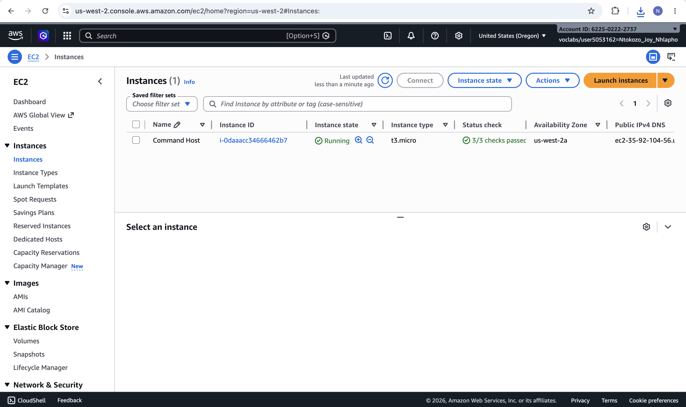

The EC2 Launch Instance wizard is open. The instance is named `test instance` to replicate the scenario from Bob's support case.

---

### 2. AMI and Instance Type Selection
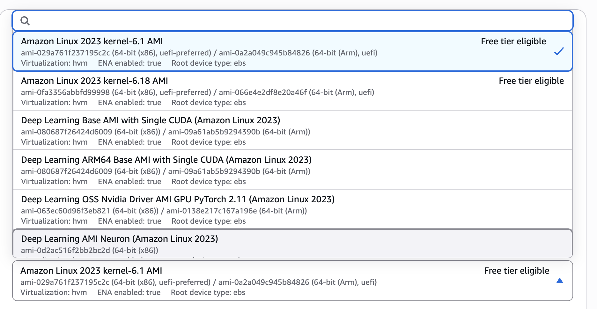

Amazon Linux 2023 (kernel-6.1) is selected as the AMI. The instance type is set to `t3.micro` (Free Tier eligible). The summary panel on the right confirms the selections before launch.

---

### 3. Network Settings — VPC, Subnet, Auto-Assign Public IP, and Security Group
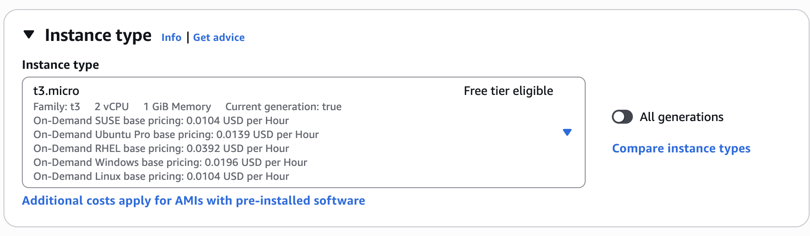

The instance is placed in the **Lab VPC**, **Public Subnet 1**, with **Auto-assign public IP set to Enable**. This is what causes Bob's problem — AWS assigns an ephemeral public IP at launch, but it is not persistent. The Linux Instance security group is selected.

---

### 4. Instance Successfully Launched
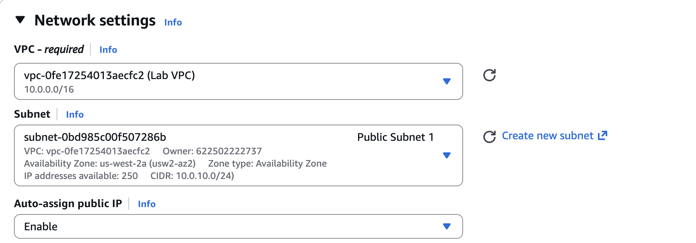

The AWS console confirms the instance was successfully launched with instance ID `i-00d31102c0f51a91b`. This is the instance used throughout the rest of the lab.

---

### 5. Networking Tab — Initial Public IP (Running)
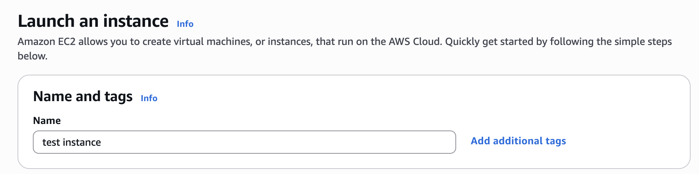

With the instance running, the Networking tab shows the first assigned public IP: **16.144.75.127**. The private IP is `10.0.10.193` and remains constant. This is the baseline IP before stopping the instance.

---

### 6. Instance Stopped — Public IP Disappeared
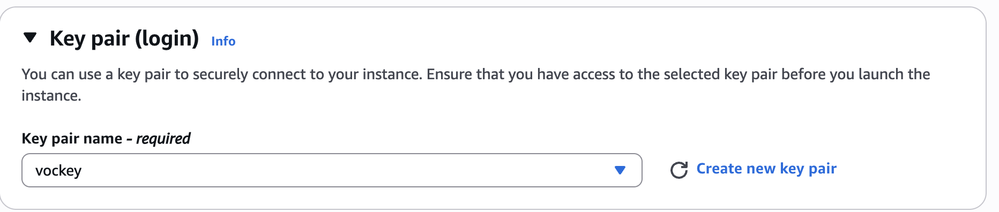

After stopping the instance, the Public IPv4 address field in the Networking tab is now blank. The public IP has been released back to AWS's pool. This is the core of Bob's problem — stopping the instance loses the public IP entirely.

---

### 7. Instance Restarted — New Public IP Assigned (IP Changed!)
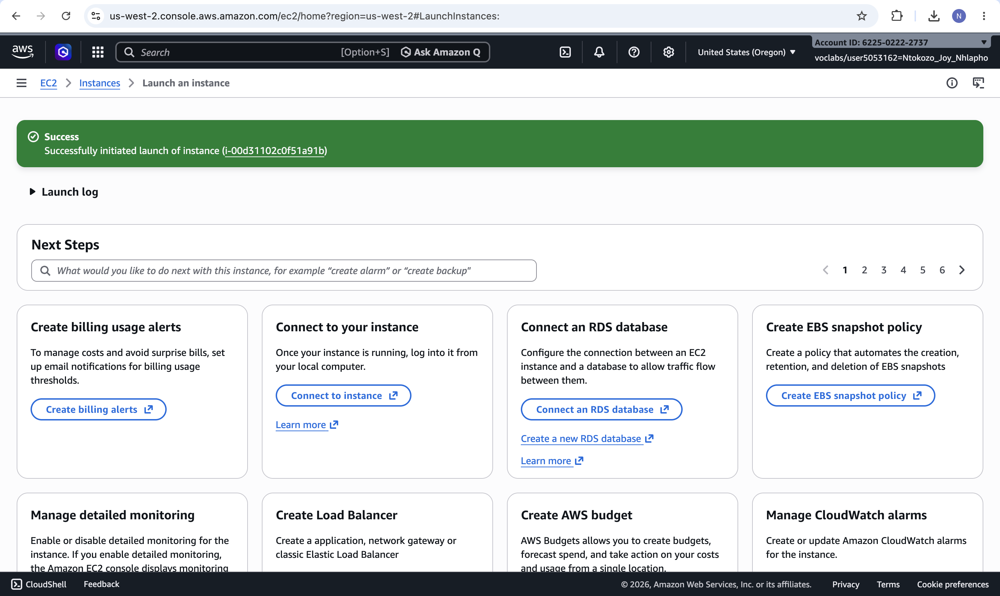

After starting the instance again, a completely different public IP — **54.203.133.17** — has been assigned. The original IP `16.144.75.127` is gone. This confirms that AWS public IPs are **ephemeral by default**: they change on every stop/start cycle, which is exactly the issue Bob was experiencing.

---

### 8. Elastic IP Allocated Successfully
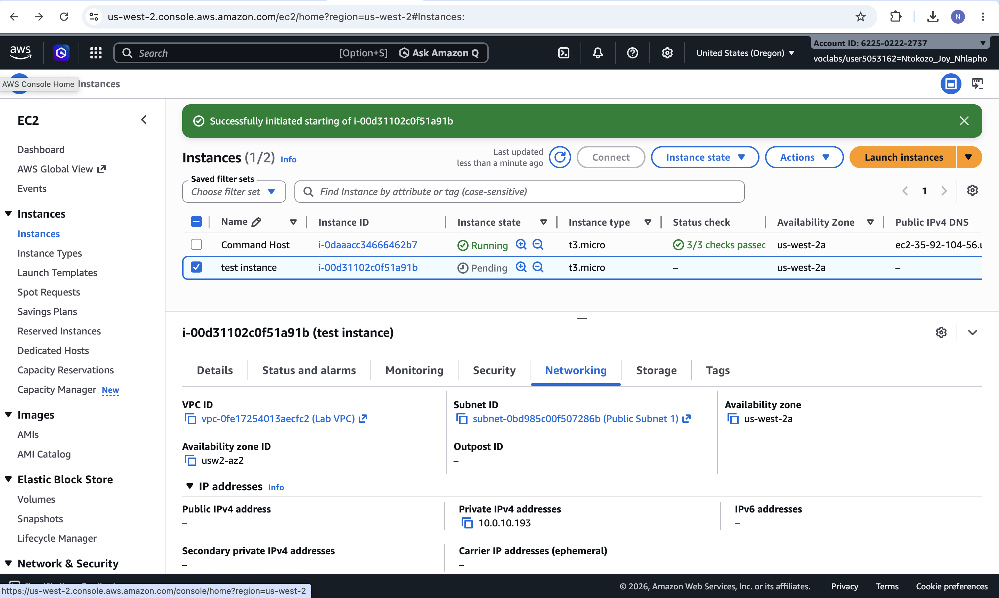

A new Elastic IP address — **52.89.218.178** — has been allocated from Amazon's public IPv4 pool. The green success banner confirms allocation. An EIP is a static public IP that belongs to the AWS account until explicitly released, regardless of instance state.

---

### 9. Associating the Elastic IP with the Test Instance
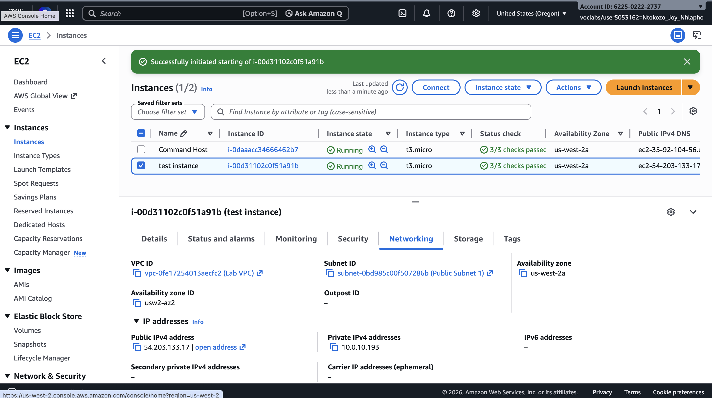

The Associate Elastic IP address dialog shows EIP `52.89.218.178` being associated with instance `i-00d31102c0f51a91b` (test instance). The resource type is set to **Instance**.

---

### 10. EIP Association Confirmed
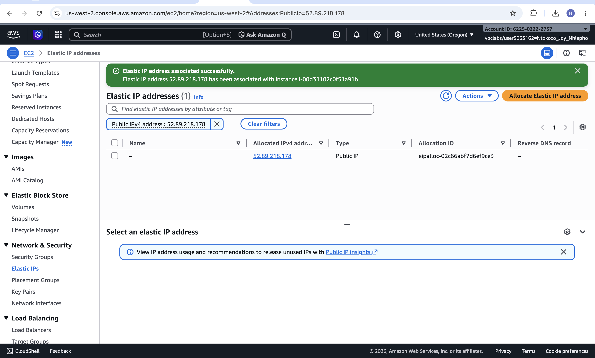

The green banner confirms that Elastic IP address 52.89.218.178 has been associated with instance i-00d31102c0f51a91b. The EIP now appears in the Elastic IP addresses list as associated.

---

### 11. Instance Stopped Again — EIP Still Visible
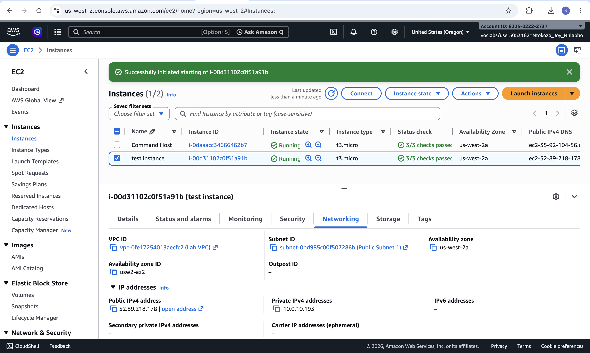

After stopping the instance with the EIP attached, the Public IPv4 DNS column still shows `ec2-52-89-218-178` — the EIP address. Unlike the default ephemeral IP, the Elastic IP **persists even when the instance is stopped**.

---

### 12. Instance Restarted — EIP Unchanged
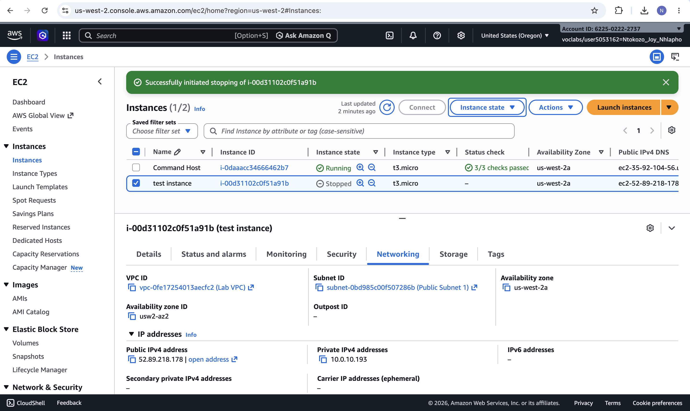

After starting the instance again, the Networking tab confirms the Public IPv4 address is still **52.89.218.178** — exactly the same as before. The private IP `10.0.10.193` is also unchanged. Bob's problem is solved: with an Elastic IP, the public address is now static and predictable across stop/start cycles.

---

## Key Concepts

| Concept | Description |
|---|---|
| **Ephemeral/Dynamic Public IP** | A public IP automatically assigned by AWS when an instance with auto-assign enabled starts. Released when the instance stops — a different IP is given on restart |
| **Elastic IP (EIP)** | A static public IPv4 address allocated to your AWS account. Persists across instance stop/start cycles and can be reassociated with different instances |
| **Private IP** | An IP address within the VPC's CIDR range (e.g. `10.0.10.193`). Always remains the same for the lifetime of the instance, regardless of stop/start |
| **Auto-assign Public IP** | A setting on the subnet or instance level that controls whether AWS automatically assigns an ephemeral public IP at launch |
| **EIP Association** | The process of binding an Elastic IP to a specific EC2 instance or network interface |
| **EIP Cost** | AWS charges for Elastic IPs that are allocated but **not** associated with a running instance — best practice is to release unneeded EIPs |

---

## AWS Services Used

| Service | Purpose |
|---|---|
| **Amazon EC2** | Launched and managed the `test instance` virtual machine |
| **Elastic IP (EIP)** | Allocated and associated a static public IP to fix the dynamic IP problem |
| **VPC / Subnets** | Provided the network environment (Lab VPC, Public Subnet 1) |
