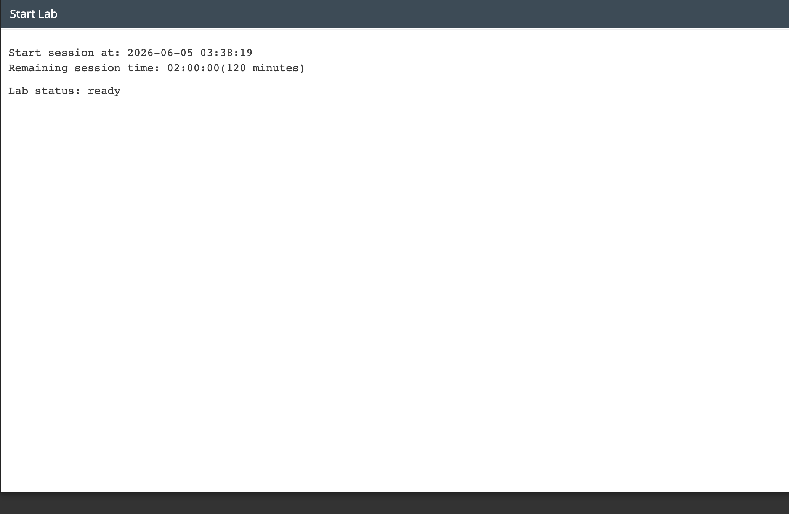
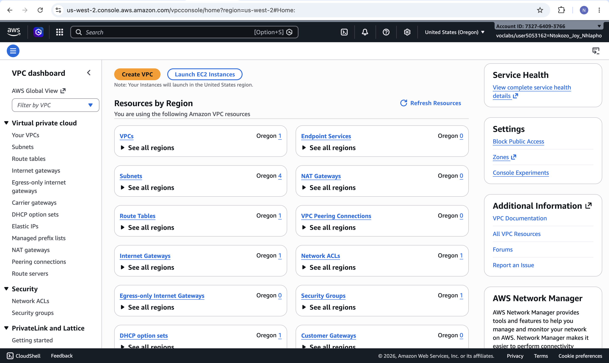
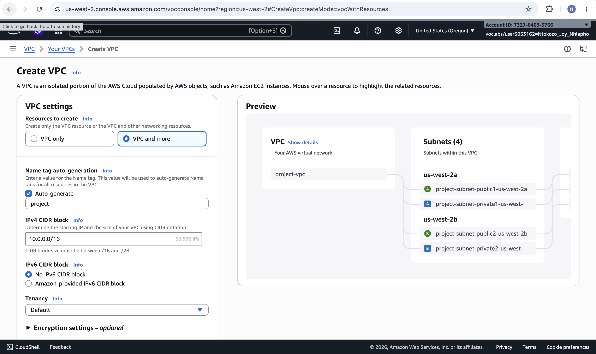
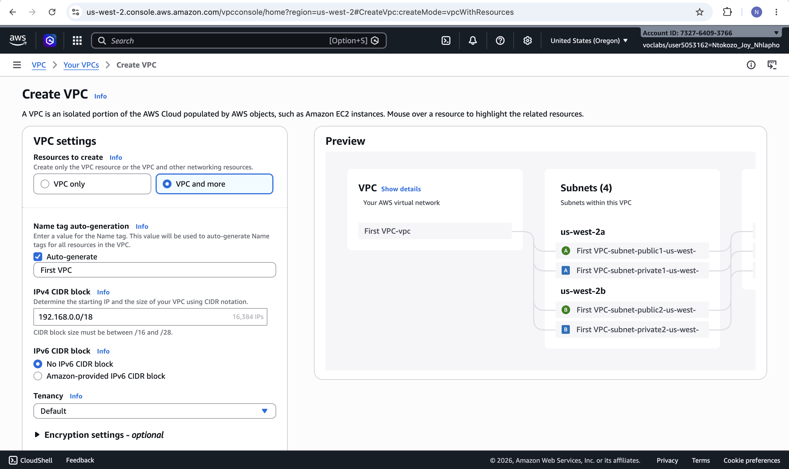
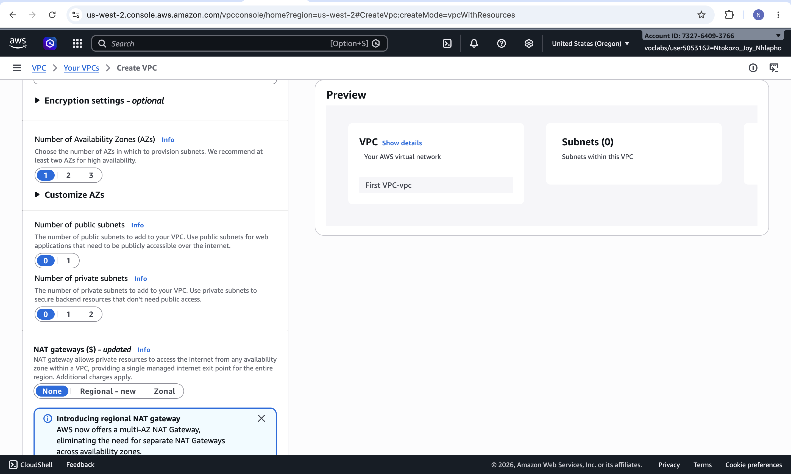
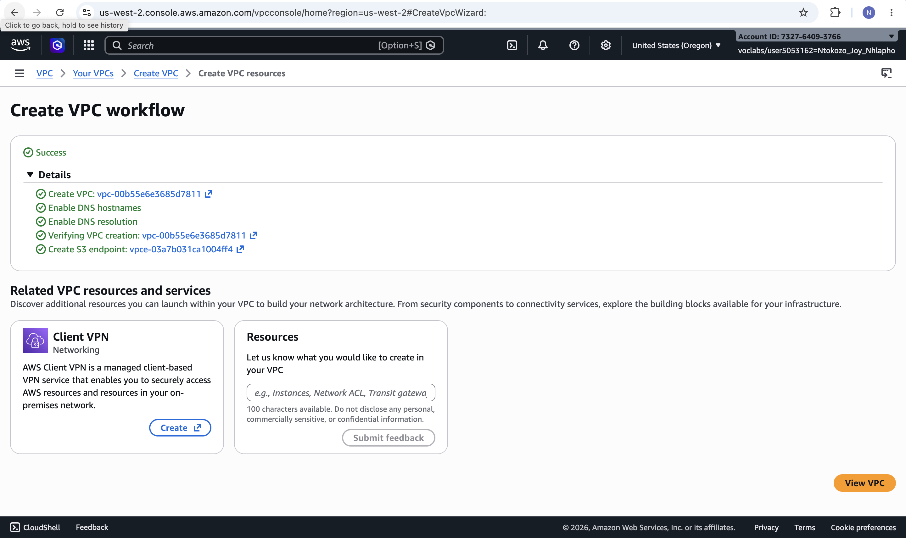
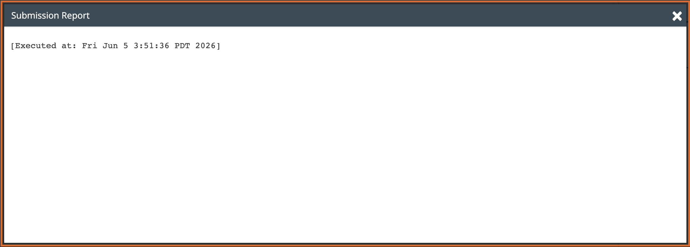

# Lab 19 — Create Subnets and Allocate IP Addresses in an Amazon VPC

| | |
|---|---|
| **Programme** | Praesignis AWS re/Start |
| **Date Completed** | 2026-06-05 |
| **Lab Topic** | Creating a VPC with a Public Subnet using CIDR notation |

---

## ✏️ What This Lab Covered

This lab was based on a customer support scenario. A customer named Paulo Santos, a startup owner new to AWS, requested help setting up his first VPC. He needed approximately 15,000 private IP addresses in his VPC using a 192.x.x.x address range, and at least 50 IP addresses allocated to a public subnet.

Key activities completed:

- Navigated to the Amazon VPC service and opened the Create VPC wizard
- Selected **VPC and more** to create the VPC along with its networking resources
- Determined the correct private IP range from RFC 1918 — confirming `192.168.0.0/18` as a valid 192.x.x.x private range providing 16,384 IP addresses (satisfying the 15,000 requirement)
- Named the VPC `First VPC` with auto-generate tags enabled
- Configured 1 Availability Zone, 1 public subnet, and 0 private subnets to match the customer's architecture
- Set the public subnet CIDR to `192.168.1.0/26` — providing 64 IP addresses (satisfying the minimum 50 requirement)
- Successfully created the VPC and verified it appeared as **Available** in the Your VPCs list

---

## 📸 Screenshots and Explanations

### 1. Lab Status: Ready

The lab environment started successfully with 120 minutes on the session timer. Region is us-west-2 (Oregon).

---

### 2. VPC Dashboard

The Amazon VPC dashboard showing existing resources by region. From here, the **Create VPC** button is used to begin building Paulo's VPC. The dashboard shows VPCs, Subnets, Route Tables, Internet Gateways, and other networking resources available in the region.

---

### 3. Create VPC — VPC Settings (Name and CIDR)

The Create VPC form is configured with:
- **Resources to create:** VPC and more
- **Name tag:** `First VPC`
- **IPv4 CIDR block:** `192.168.0.0/18` — a private 192.x.x.x range from RFC 1918, providing 16,384 IP addresses which satisfies Paulo's requirement of ~15,000
- **IPv6 CIDR block:** None
- **Tenancy:** Default

The preview panel on the right shows the VPC diagram updating in real time.

---

### 4. Create VPC — Subnet Configuration

The subnet section is configured with:
- **Number of Availability Zones:** 1
- **Number of public subnets:** 1
- **Number of private subnets:** 0
- **NAT gateways:** None

This matches Paulo's architecture diagram which only requires a single public subnet. The preview panel shows Subnets (0) as the public subnet CIDR is entered separately below.

---

### 5. VPC Successfully Created

The Create VPC workflow completed successfully. All resources were created and verified:
- VPC `vpc-00b55e6e3685d7811` created
- DNS hostnames enabled
- DNS resolution enabled
- VPC creation verified
- S3 endpoint created

---

### 6. Your VPCs — First VPC Listed as Available

The Your VPCs page confirms that **First VPC-vpc** is now listed with a status of **Available**. This is the completed VPC built for Paulo's startup. The second VPC listed is the default lab VPC.

---

### 7. Submission Report

The lab submission report confirms the lab was executed and completed successfully on Fri Jun 5 2026.

---

## Key Concepts

| Concept | Description |
|---|---|
| **Amazon VPC** | A logically isolated virtual network in the AWS Cloud where you launch your resources |
| **CIDR Notation** | Classless Inter-Domain Routing — defines the IP range and size of a network (e.g. `192.168.0.0/18`) |
| **RFC 1918 Private Ranges** | The three private IP ranges: `10.0.0.0/8`, `172.16.0.0/12`, and `192.168.0.0/16` — not routable over the internet |
| **Public Subnet** | A subnet whose instances can communicate with the internet via an Internet Gateway and public IP addresses |
| **Private Subnet** | A subnet whose instances cannot be directly reached from the internet — requires a NAT Gateway for outbound internet access |
| **/18 CIDR Block** | Provides 16,384 IP addresses — the closest block above Paulo's requirement of 15,000 |
| **/26 CIDR Block** | Provides 64 IP addresses for the public subnet — satisfying the minimum requirement of 50 |
| **Internet Gateway** | A horizontally scaled VPC component that allows communication between the VPC and the internet |

---

## AWS Services Used

| Service | Purpose |
|---|---|
| **Amazon VPC** | Created the isolated virtual network (`First VPC`) for Paulo's startup |
| **Subnets** | Configured one public subnet with CIDR `192.168.1.0/26` within the VPC |
| **Internet Gateway** | Automatically created with the VPC to allow public subnet internet access |
| **Route Tables** | Automatically created to manage traffic routing within the VPC |
