# Lab 21 — Internet Protocol Troubleshooting Commands

| | |
|---|---|
| **Programme** | Praesignis AWS re/Start |
| **Date Completed** | 2026-06-09 |
| **Lab Topic** | Network troubleshooting commands — ping, traceroute, netstat, telnet, curl |

---

## ✏️ What This Lab Covered

In this lab, the role was that of a new network administrator troubleshooting customer issues. The lab covered practical use of five key network troubleshooting commands mapped to the OSI model layers, run from inside an EC2 instance connected via SSH.

Key activities completed:

- Connected to an Amazon Linux 2 EC2 instance via SSH
- **Layer 3 (Network):** Ran `ping 8.8.8.8 -c 5` to test IP connectivity with 5 ICMP echo requests — confirmed 0% packet loss
- **Layer 3 (Network):** Ran `traceroute 8.8.8.8` to map the network path and latency through each hop to Google's DNS server
- **Layer 4 (Transport):** Ran `netstat -tp` to view active established TCP connections on the instance
- **Layer 4 (Transport):** Installed and ran `telnet www.google.com 80` to verify TCP connectivity to port 80
- **Layer 7 (Application):** Ran `curl -vLo /dev/null https://aws.com` to test HTTP/HTTPS connectivity and confirm a 200 OK response from the AWS web server

---

## 📸 Screenshots and Explanations

### 1. Lab Status: Ready
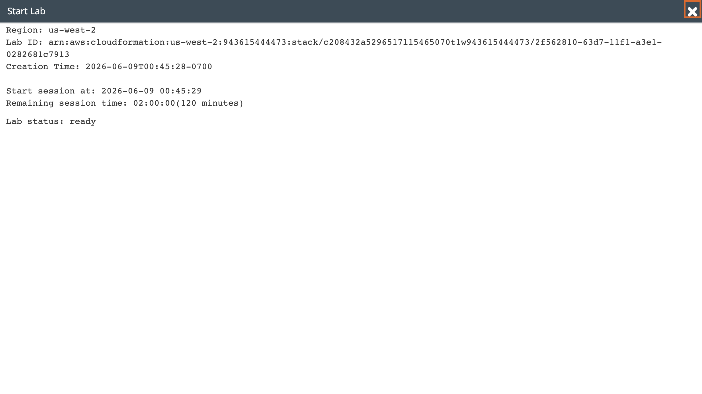

The lab environment started successfully with 120 minutes on the session timer. Region is us-west-2 (Oregon).

---

### 2. SSH Connected to EC2 Instance
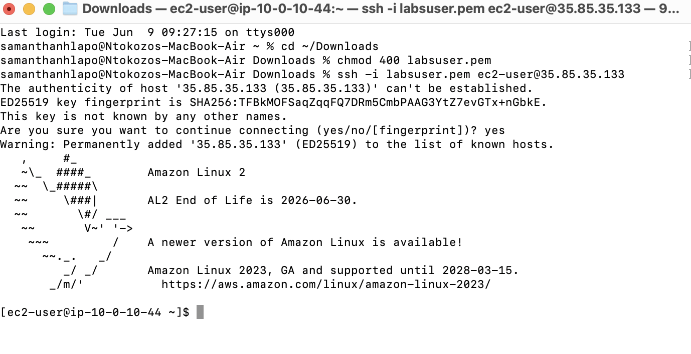

Successfully connected to the EC2 instance via SSH using `labsuser.pem` at public IP `35.85.35.133`. The Amazon Linux 2 banner is shown along with the `ec2-user@ip-10-0-10-44` prompt confirming the connection.

---

### 3. ping 8.8.8.8 -c 5 — Layer 3 Connectivity Test
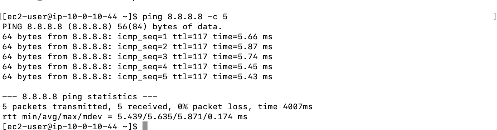

The `ping 8.8.8.8 -c 5` command sends 5 ICMP echo requests to Google's public DNS server. All 5 packets were received with **0% packet loss** and an average round-trip time of 5.635ms — confirming full Layer 3 (Network) connectivity from the EC2 instance to the internet.

---

### 4. traceroute 8.8.8.8 — Path and Latency Mapping
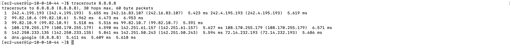

The `traceroute 8.8.8.8` command maps the path taken from the EC2 instance to Google's DNS server. 6 hops are shown, with the final hop reaching `dns.google (8.8.8.8)`. Each hop shows three round-trip times. No packet loss (***) is visible — the network path is clean with low latency throughout.

---

### 5. netstat -tp — Active TCP Connections
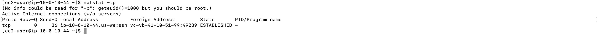

The `netstat -tp` command shows all active established TCP connections. One connection is shown — the current SSH session from `ip-10-0-10-44` to the remote host on port 49239, with state **ESTABLISHED**. This confirms Layer 4 (Transport) connectivity is active.

---

### 6. telnet Installation and Connection to google.com Port 80
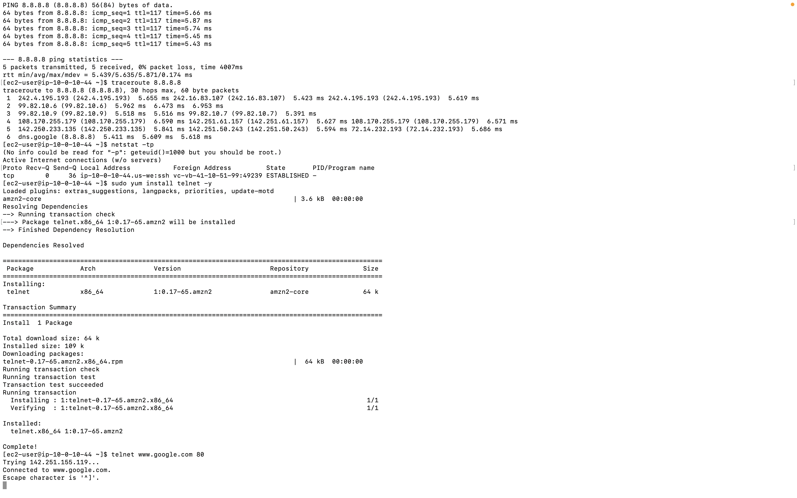

Telnet is installed using `sudo yum install telnet -y` and then `telnet www.google.com 80` is run. The output shows **Connected to www.google.com** — confirming that TCP port 80 is open and reachable. This validates Layer 4 connectivity and that no firewall is blocking port 80.

---

### 7. curl — TLS Handshake Initiated
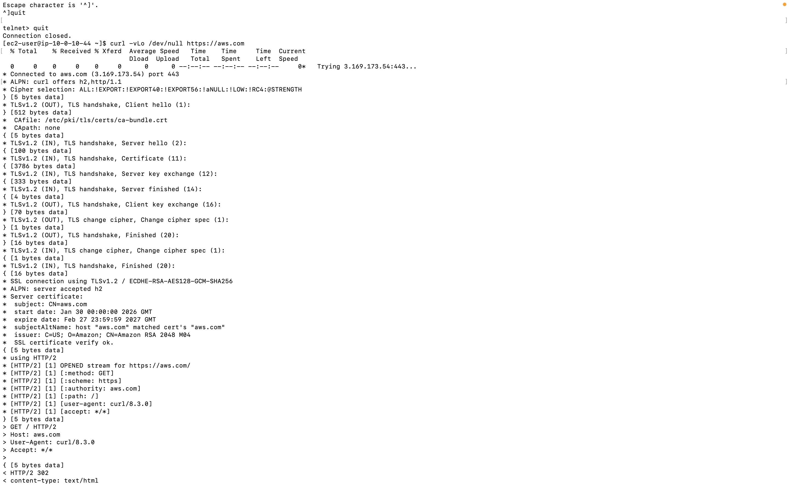

The `curl -vLo /dev/null https://aws.com` command begins. The verbose output shows the TLS 1.2 handshake process with `aws.com` — including the client hello, server hello, certificate exchange, and cipher negotiation using ECDHE-RSA-AES128-GCM-SHA256. The SSL certificate is verified successfully.

---

### 8. curl — HTTP/2 301 Redirect
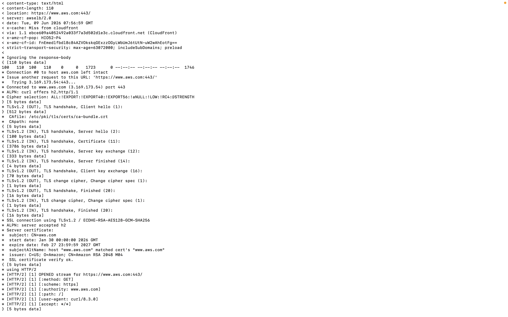

The curl command follows the redirect from `aws.com` to `www.aws.com:443/`. A **301 Moved Permanently** response is received, and curl automatically follows the redirect to the final destination.

---

### 9. curl — HTTP/2 200 OK Response
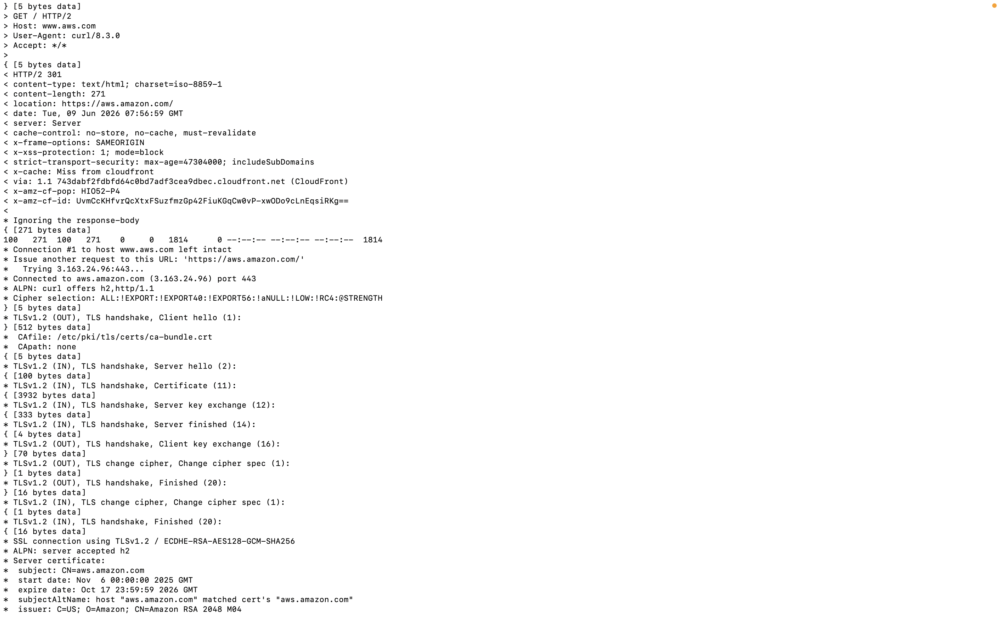

After following all redirects, the final response is **HTTP/2 200** from `aws.amazon.com` — confirming the web server is reachable and responding successfully. Response headers include content-type, cache settings, and CloudFront CDN details.

---

### 10. curl — Connection Complete
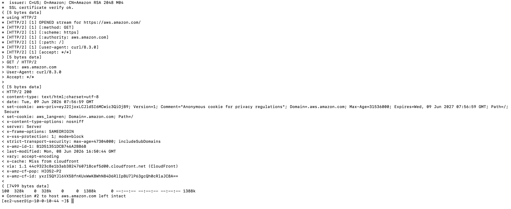

The curl command completes with the message **Connection left intact**. The full request-response cycle is confirmed — demonstrating successful Layer 7 (Application) connectivity from the EC2 instance to the AWS web server over HTTPS.

---

### 11. Submission Report
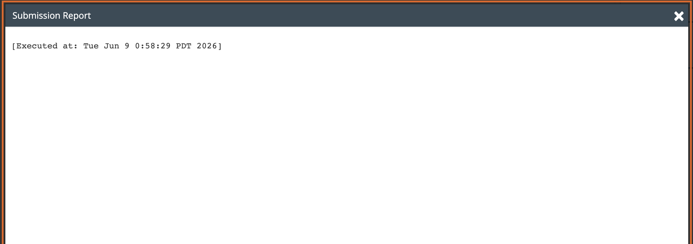

The lab submission report confirms the lab was executed and completed successfully on Tue Jun 9 2026.

---

## Key Concepts

| Concept | Description |
|---|---|
| **ping** | Layer 3 tool — sends ICMP echo requests to test IP connectivity and measure round-trip time |
| **traceroute** | Layer 3 tool — maps the network path (hops) and latency from source to destination. *** indicates a failed hop |
| **netstat** | Layer 4 tool — displays active TCP connections, listening ports, and network statistics |
| **telnet** | Layer 4 tool — tests TCP connectivity to a specific host and port. Connection refused = blocked; timed out = no route |
| **curl** | Layer 7 tool — transfers data using HTTP/HTTPS. Used to test web server connectivity and verify response codes |
| **0% packet loss** | Indicates no dropped packets — full network connectivity confirmed |
| **HTTP 200 OK** | Successful HTTP response — the web server is reachable and responding correctly |
| **HTTP 301** | Redirect response — the server is pointing to a different URL |
| **OSI Model** | A 7-layer framework for understanding network communication — troubleshooting commands map to specific layers |

---

## AWS Services Used

| Service | Purpose |
|---|---|
| **Amazon EC2** | Provided the Linux instance used to run all troubleshooting commands |
| **Security Groups** | Allowed SSH (port 22) inbound access to connect to the instance |
