# Lab 22 — Troubleshooting a Network Issue

| | |
|---|---|
| **Programme** | Praesignis AWS re/Start |
| **Date Completed** | 2026-06-09 |
| **Lab Topic** | VPC network troubleshooting — identifying and fixing a Security Group misconfiguration blocking Apache |

---

## ✏️ What This Lab Covered

This lab was based on a customer support scenario. A contractor named Ana reported that she could not ping her Apache server or load it in a browser, even though the server was installed and running. The task was to replicate the environment, investigate each VPC resource systematically, identify the root cause, and fix it.

Key activities completed:

- Connected to the EC2 instance via SSH and checked the httpd service status — found it inactive
- Started the httpd service and confirmed it was running
- Attempted to load the Apache server in a browser — confirmed the page failed to load (ERR_CONNECTION_TIMED_OUT)
- Investigated the VPC resources systematically:
  - Your VPCs — Lab VPC confirmed available
  - Internet Gateways — IGW confirmed attached to Lab VPC
  - Route Tables — Public Route Table confirmed with 0.0.0.0/0 to IGW route active
  - Security Groups — Root cause found: the Linux Instance SG only had SSH (port 22) as an inbound rule — HTTP (port 80) was missing
- Fixed the issue by adding an HTTP (port 80) inbound rule to the Linux Instance SG
- Confirmed the fix by reloading the browser — the Apache Test Page loaded successfully

---

## 📸 Screenshots and Explanations

### 1. Lab Status: Ready
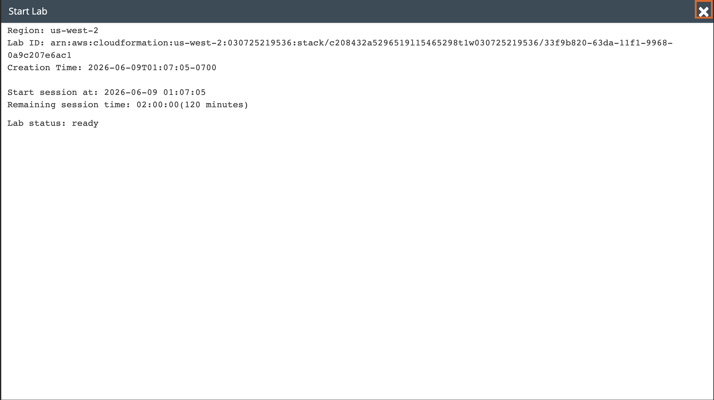

The lab environment started successfully with 120 minutes on the session timer. Region is us-west-2 (Oregon).

---

### 2. SSH Connected to EC2 Instance
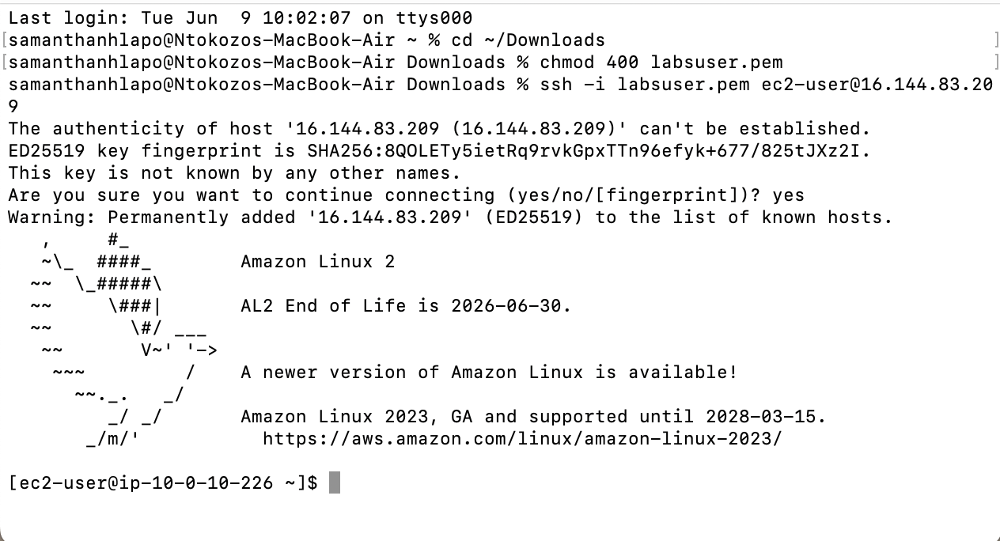

Successfully connected to the EC2 instance via SSH using labsuser.pem at public IP 16.144.83.209. The Amazon Linux 2 banner confirms the connection.

---

### 3. httpd Service — Inactive
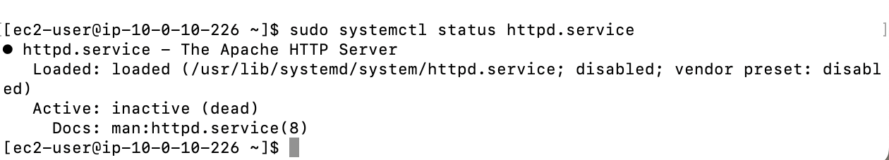

Running sudo systemctl status httpd.service shows the Apache HTTP Server is inactive (dead). The service is installed but has not been started yet.

---

### 4. httpd Service — Active (Running)
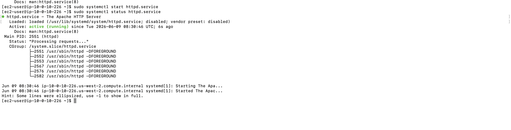

After running sudo systemctl start httpd.service, the status now shows active (running). The Apache server is now live on the instance — but the browser still cannot reach it due to a network issue.

---

### 5. Browser — Site Can't Be Reached (Before Fix)
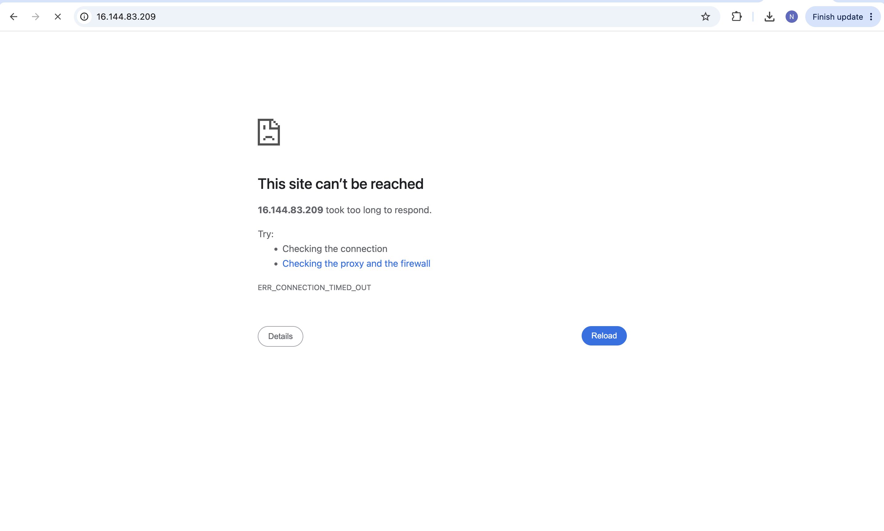

Navigating to http://16.144.83.209 in the browser returns ERR_CONNECTION_TIMED_OUT. The page times out — confirming that something is blocking the HTTP traffic before it reaches the instance.

---

### 6. Your VPCs — Lab VPC Available
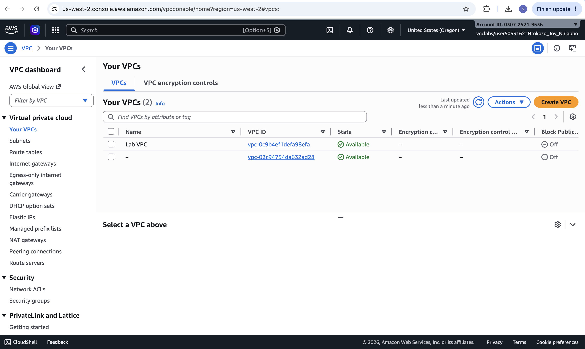

The VPC dashboard shows the Lab VPC is available. Nothing wrong here — VPC is up and running.

---

### 7. Internet Gateways — Both Attached
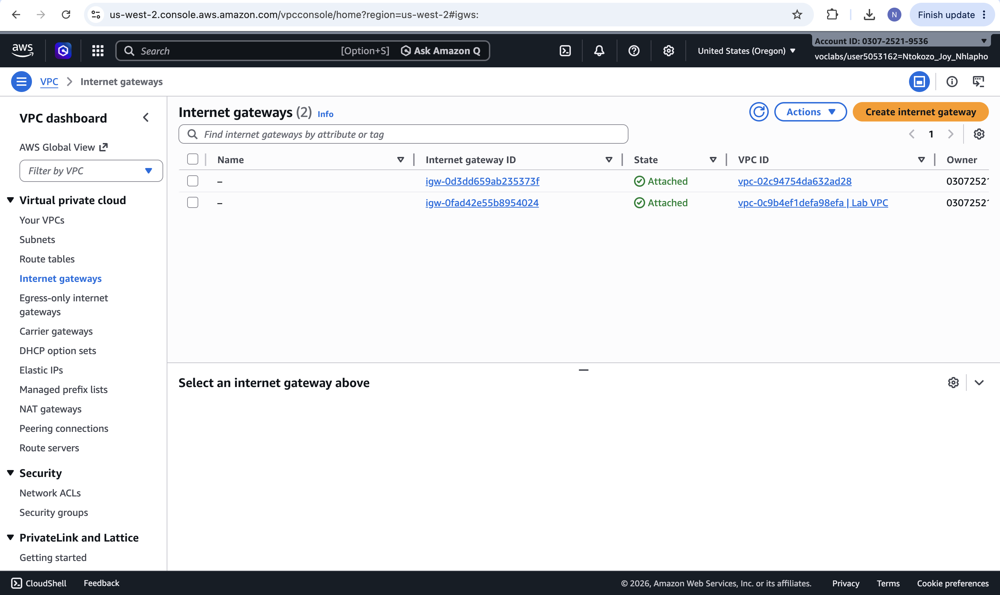

Both Internet Gateways show a state of Attached. The IGW for the Lab VPC is correctly attached — this is not the issue.

---

### 8. Route Tables — Public Route Table Listed
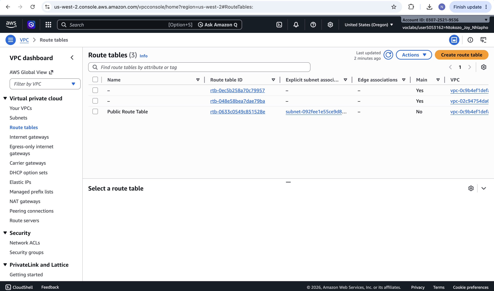

The Route Tables page shows the Public Route Table associated with a subnet in the Lab VPC. The route table is correctly configured and associated.

---

### 9. Route Table Routes — IGW Route Active
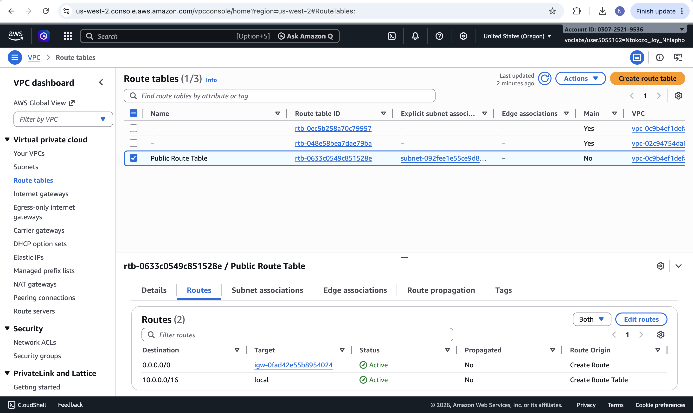

The Public Route Table has two active routes: 10.0.0.0/16 to local for internal traffic, and 0.0.0.0/0 to the IGW for internet traffic. Both are Active — the routing is correct and not the issue.

---

### 10. Security Groups — Linux Instance SG
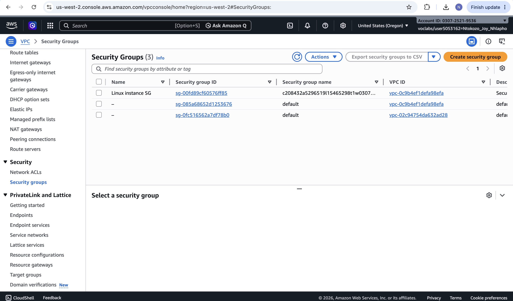

The Security Groups page shows the Linux Instance SG associated with the Lab VPC. This is the security group attached to Ana's EC2 instance.

---

### 11. Root Cause Found — Only SSH Inbound Rule
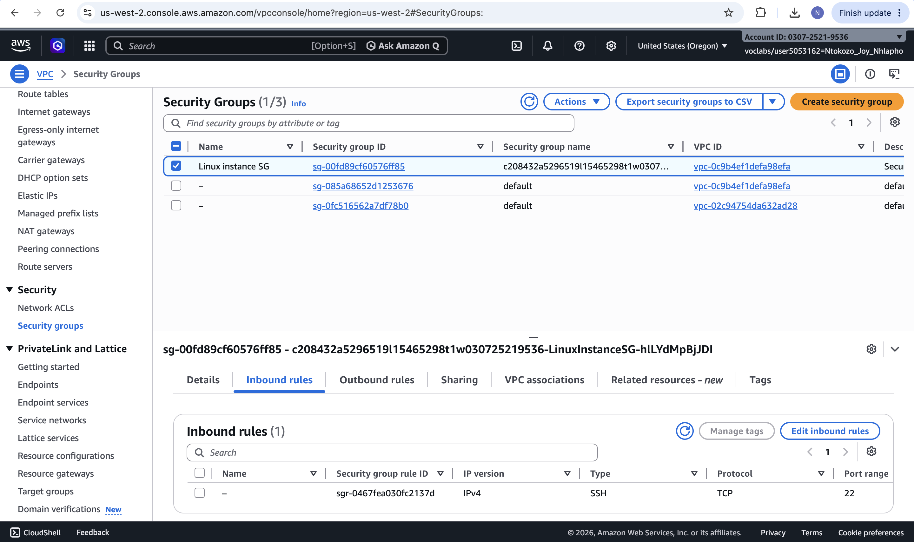

The Linux Instance SG inbound rules show only one rule: SSH (port 22). There is no HTTP (port 80) rule — this is the root cause of Ana's problem. The security group is blocking all HTTP traffic to the Apache server.

---

### 12. Fix — Adding HTTP Inbound Rule
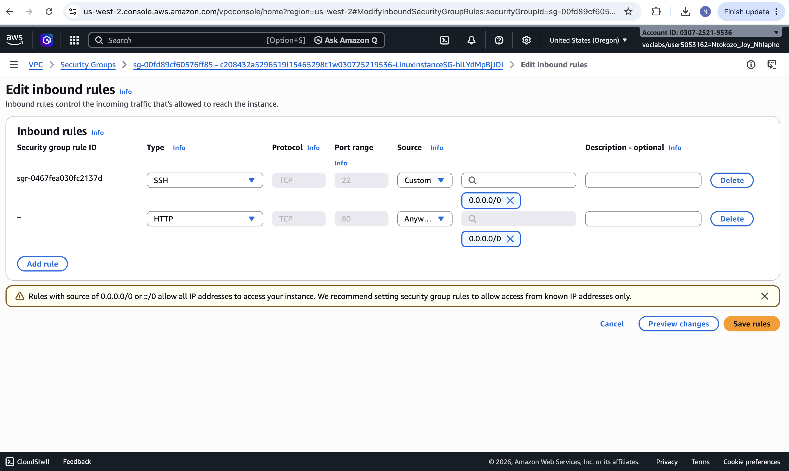

The Edit Inbound Rules page showing the new HTTP (port 80) rule being added with source 0.0.0.0/0 (Anywhere IPv4). This will allow HTTP traffic to reach the Apache server.

---

### 13. Security Group Updated — HTTP and SSH Both Showing
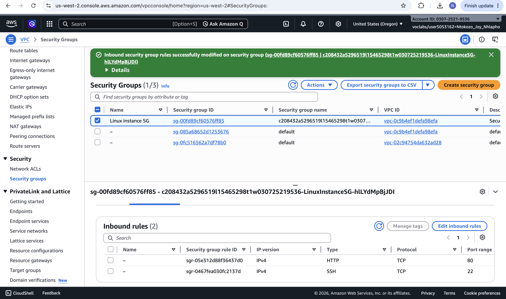

The green success banner confirms the inbound rules were successfully modified. The Linux Instance SG now shows 2 inbound rules: HTTP (port 80) and SSH (port 22) — both allowing traffic from anywhere.

---

### 14. Apache Test Page — Loading Successfully
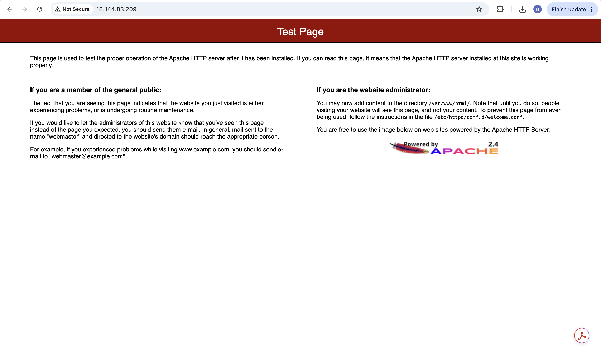

After adding the HTTP inbound rule, navigating to http://16.144.83.209 now loads the Apache HTTP Server Test Page successfully. Ana's problem is solved!

---

### 15. Submission Report
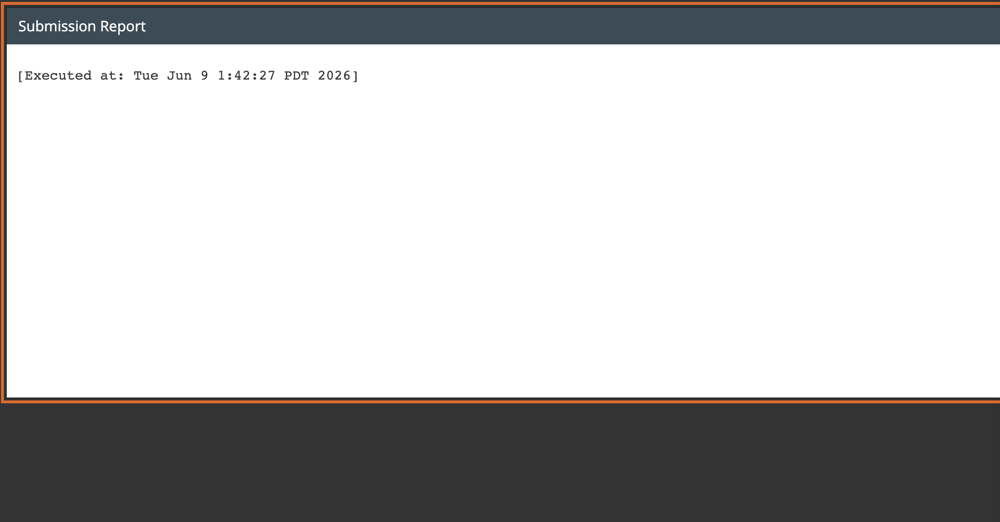

The lab submission report confirms the lab was executed and completed successfully on Tue Jun 9 2026.

---

## Key Concepts

| Concept | Description |
|---|---|
| **Security Group** | A stateful instance-level firewall. Blocks all inbound traffic by default — rules must explicitly allow traffic |
| **httpd (Apache)** | The Apache HTTP Server — a common web server that listens on port 80 (HTTP) and port 443 (HTTPS) |
| **ERR_CONNECTION_TIMED_OUT** | Browser error indicating a firewall or security group is blocking the connection — not a routing issue |
| **Inbound Rules** | Security group rules controlling traffic coming INTO the instance |
| **Port 80 (HTTP)** | The default port for unencrypted web traffic — must be explicitly allowed in the security group for Apache to be reachable |
| **Systematic Troubleshooting** | Working through each VPC resource (IGW, Route Table, Security Group) to isolate the root cause |

---

## AWS Services Used

| Service | Purpose |
|---|---|
| **Amazon EC2** | Hosted the Apache web server that Ana could not reach |
| **Amazon VPC** | Provided the network environment containing the EC2 instance |
| **Security Groups** | Root cause — missing HTTP inbound rule was blocking port 80 access |
| **Internet Gateway** | Confirmed attached and working correctly |
| **Route Tables** | Confirmed correct routing with IGW route active |
