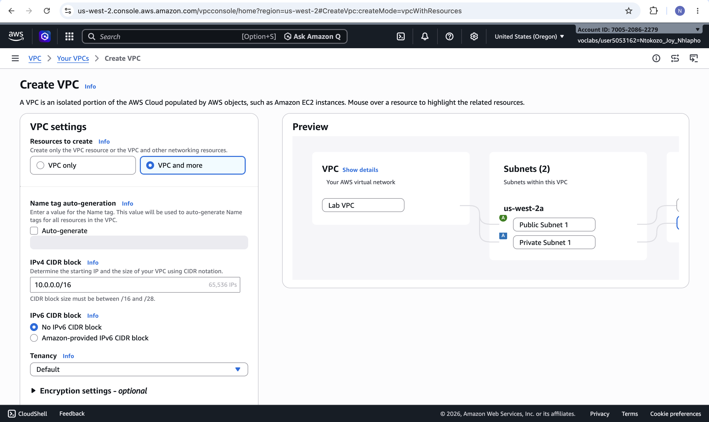
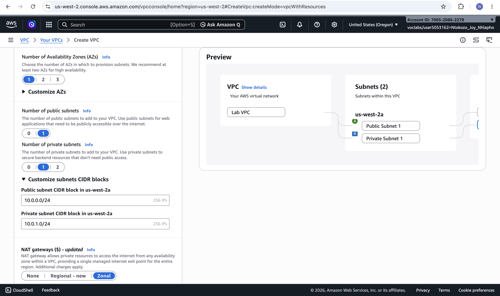
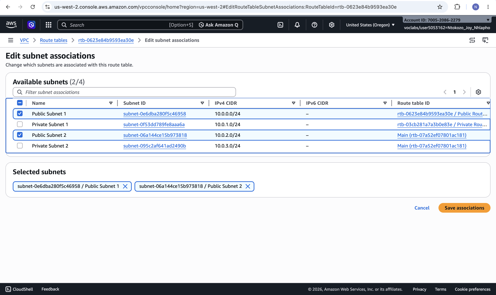
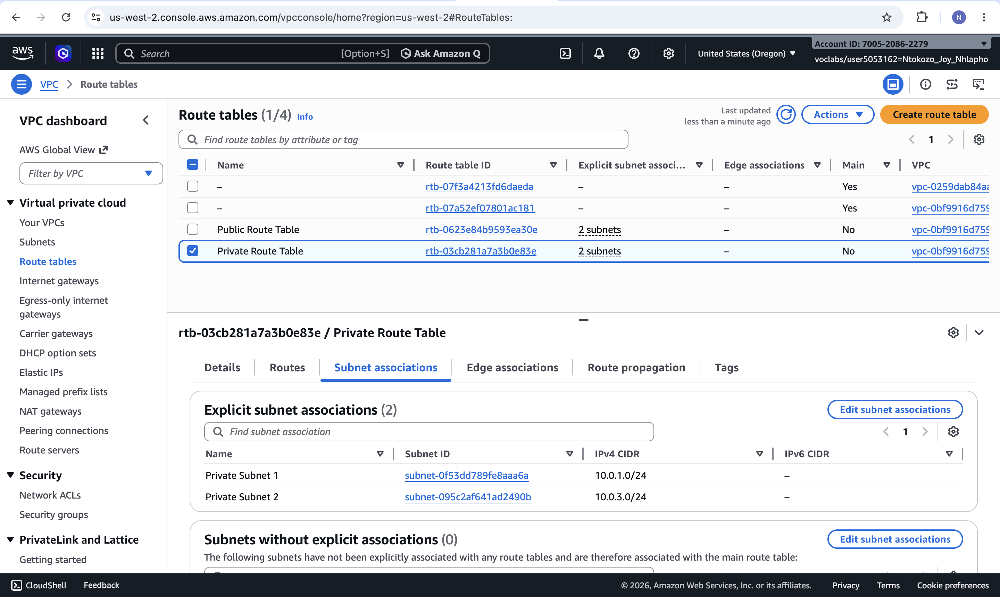
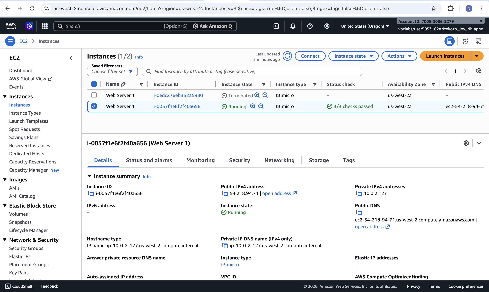
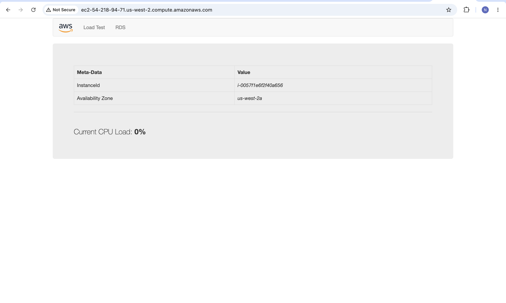
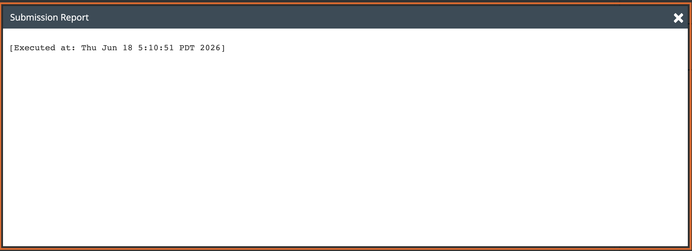

# Lab 23 – Build Your VPC and Launch a Web Server

| Field | Details |
|---|---|
| **Programme** | Praesignis AWS re/Start |
| **Date Completed** | 2026-06-18 |
| **Lab Topic** | VPC Creation, Subnets, Security Groups, EC2 Web Server |

---

## ✏️ What This Lab Covered

In this lab, I used Amazon VPC to build a custom virtual network for a Fortune 100 customer, configured networking components, and launched a web server on an EC2 instance inside the VPC.

- Created a VPC with IPv4 CIDR `10.0.0.0/16` using the VPC Wizard
- Configured public and private subnets across two Availability Zones
- Set up a NAT gateway to allow private subnet instances to reach the internet
- Created and associated route tables for public and private subnets
- Created a security group allowing inbound HTTP traffic
- Launched an EC2 instance with a User Data script to install and start Apache
- Verified the web server was accessible via the instance's Public IPv4 DNS

---

## 📸 Screenshots and Explanations

### 1. VPC Created Successfully

The VPC Wizard successfully created Lab VPC with CIDR `10.0.0.0/16`, along with an internet gateway, NAT gateway, two subnets, and two route tables.

### 2. Lab VPC Details

The VPC details page showing Lab VPC configuration, including the IPv4 CIDR block and associated resources.

### 3. All Four Subnets Listed

All four subnets are visible: Public Subnet 1 (`10.0.0.0/24`), Private Subnet 1 (`10.0.1.0/24`), Public Subnet 2 (`10.0.2.0/24`), and Private Subnet 2 (`10.0.3.0/24`) — spread across two Availability Zones for high availability.

### 4. Public Route Table Subnet Association

Public Subnet 2 has been associated with the Public Route Table, ensuring it has a route to the internet gateway.

### 5. Web Security Group Created

The Web Security Group was created with an inbound rule allowing HTTP traffic (port 80) from anywhere, enabling public access to the web server.

### 6. User Data Script for Web Server Setup

The User Data script entered during instance launch, which automatically installs and starts Apache so the web server is ready as soon as the instance boots.

### 7. EC2 Instance Running with Status Checks Passed

Web Server 1 is running with all status checks passed, confirming the instance is healthy inside the VPC with a public IPv4 address assigned.

### 8. Web Server Running in Browser

The web server is accessible via the instance's Public IPv4 DNS, displaying instance metadata and confirming the EC2 instance, VPC networking, and security group are all correctly configured.

---

## 🔑 Key Concepts

| Concept | Description |
|---|---|
| VPC | Isolated virtual network within AWS where you define IP ranges, subnets, and routing |
| Public Subnet | Subnet with a route to an internet gateway, allowing direct internet access |
| Private Subnet | Subnet without a direct route to the internet; uses a NAT gateway for outbound traffic |
| NAT Gateway | Allows instances in private subnets to initiate outbound internet connections |
| Route Table | Set of rules that determine where network traffic is directed |
| Internet Gateway | VPC component that enables communication between the VPC and the internet |
| Security Group | Virtual firewall controlling inbound and outbound traffic for EC2 instances |
| User Data | Bootstrap script that runs on instance launch to install and configure software |

---

## 🛠️ AWS Services Used

| Service | Purpose |
|---|---|
| Amazon VPC | Created the custom virtual network, subnets, and route tables |
| Amazon EC2 | Launched the web server instance |
| NAT Gateway | Provided outbound internet access for private subnet instances |
| Internet Gateway | Enabled public internet access for public subnet instances |
| Security Groups | Controlled HTTP access to the web server |

