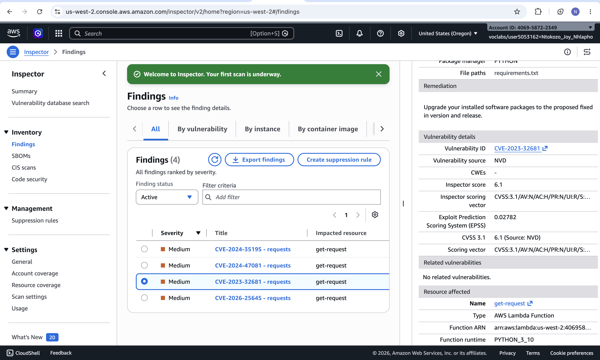
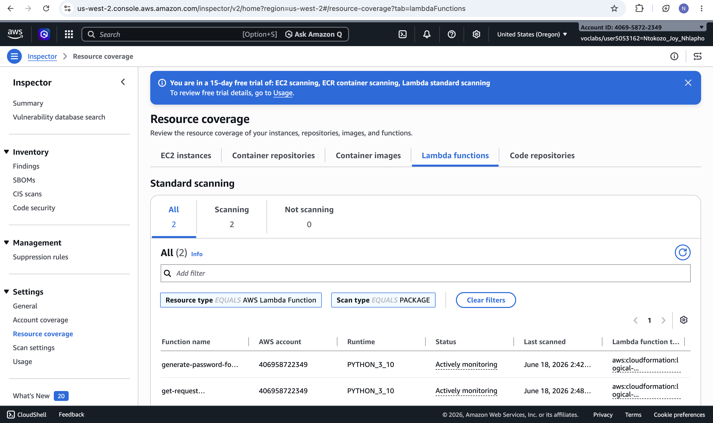
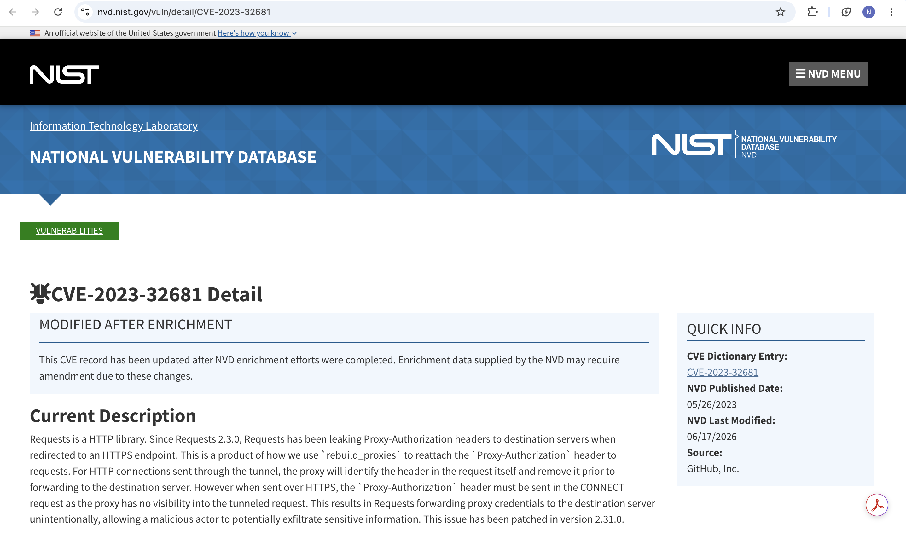
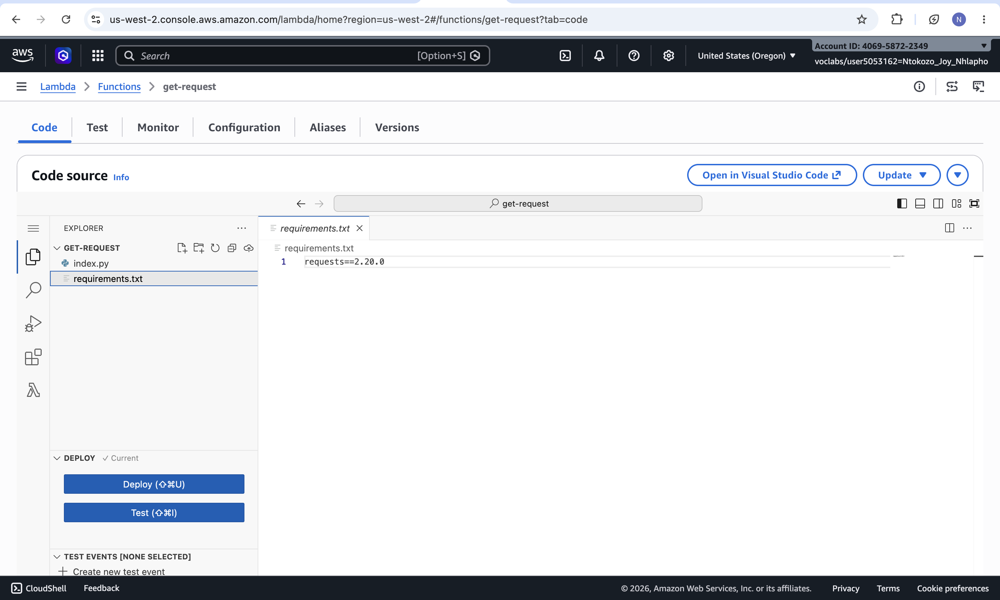
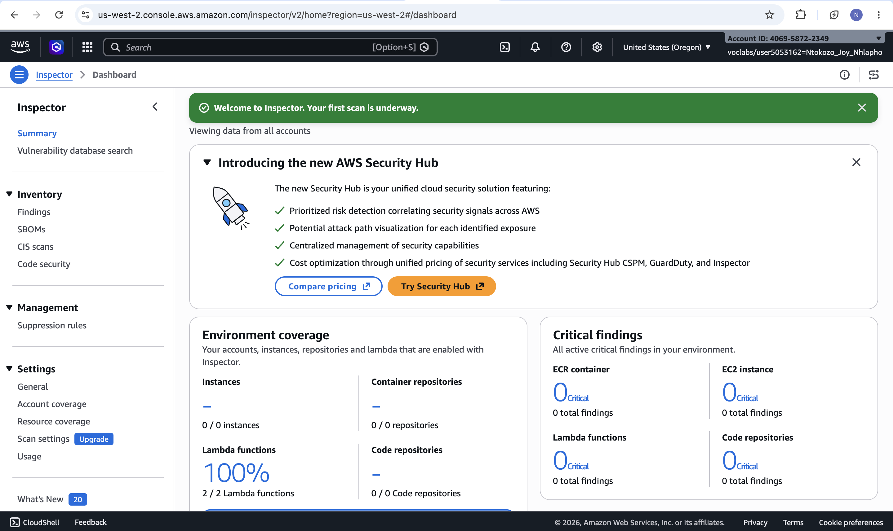
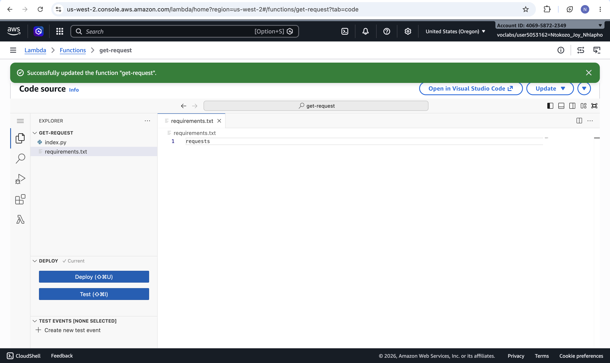
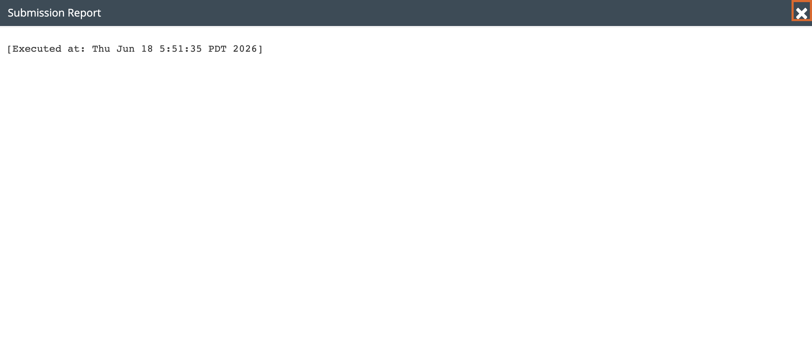

# Lab 24 – Using Amazon Inspector for Vulnerability Assessment and Remediation

| Field | Details |
|---|---|
| **Programme** | Praesignis AWS re/Start |
| **Date Completed** | 2026-06-18 |
| **Lab Topic** | Vulnerability Scanning and Remediation with Amazon Inspector |

---

## ✏️ What This Lab Covered

In this lab, I used Amazon Inspector to scan AWS Lambda functions for software vulnerabilities, interpreted the findings, and remediated a vulnerable package dependency.

- Activated Amazon Inspector to enable continuous scanning of Lambda functions, EC2 instances, and ECR repositories
- Reviewed vulnerability findings, including severity ratings and affected resources
- Investigated a specific finding (CVE-2023-32681 in the `requests` package) using the National Vulnerability Database
- Remediated the vulnerability by updating the Lambda function's `requirements.txt` to use the latest package version
- Verified the fix by confirming the finding moved from Active to Closed status after a re-scan

---

## 📸 Screenshots and Explanations

### 1. Inspector Dashboard – 100% Lambda Coverage

After activation, the Inspector dashboard shows the first scan underway, with Lambda functions at 100% environment coverage, confirming the service is actively scanning all functions in the account.

### 2. Active Findings – Vulnerabilities Detected

The findings list shows active vulnerabilities for the get-request Lambda function, each rated Medium severity, with CVE-2023-32681 among them.

### 3. CVE-2023-32681 on the National Vulnerability Database

The NVD detail page for CVE-2023-32681, reached via the external link in the finding's details pane, describing the vulnerability in the `requests` HTTP library.

### 4. Remediation Guidance in Finding Details

The finding details pane shows Amazon Inspector's remediation recommendation: upgrade the installed package to the proposed fixed version.

### 5. requirements.txt Before Remediation

The original `requirements.txt` file for the get-request Lambda function, pinning the vulnerable version `requests==2.20.0`.

### 6. Updated requirements.txt and Successful Deployment

The `requirements.txt` file updated to remove the version pin, with a confirmation banner showing the function was successfully redeployed.

### 7. Closed Finding Confirms Remediation

After the re-scan, CVE-2023-32681 now appears under Closed findings, confirming the vulnerability was successfully remediated.

---

## 🔑 Key Concepts

| Concept | Description |
|---|---|
| Amazon Inspector | Automated vulnerability management service that continuously scans AWS workloads |
| CVE | Common Vulnerabilities and Exposures — a standardized identifier for a known security flaw |
| NVD | National Vulnerability Database — NIST's repository of standardized vulnerability data |
| Severity Rating | Classification (e.g., Medium, High) indicating the risk level of a finding |
| Remediation | The process of fixing or mitigating an identified vulnerability |
| requirements.txt | A file listing the Python package dependencies for a Lambda function |
| Finding Status | Indicates whether a vulnerability is Active (unresolved) or Closed (remediated) |

---

## 🛠️ AWS Services Used

| Service | Purpose |
|---|---|
| Amazon Inspector | Scanned Lambda functions for software vulnerabilities and tracked remediation |
| AWS Lambda | Hosted the serverless function containing the vulnerable dependency |

