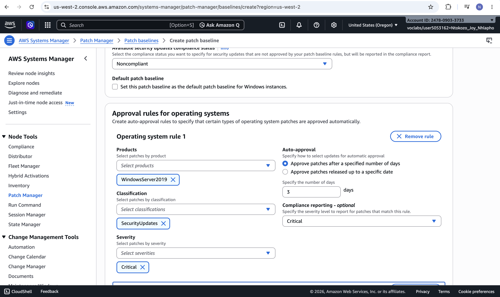
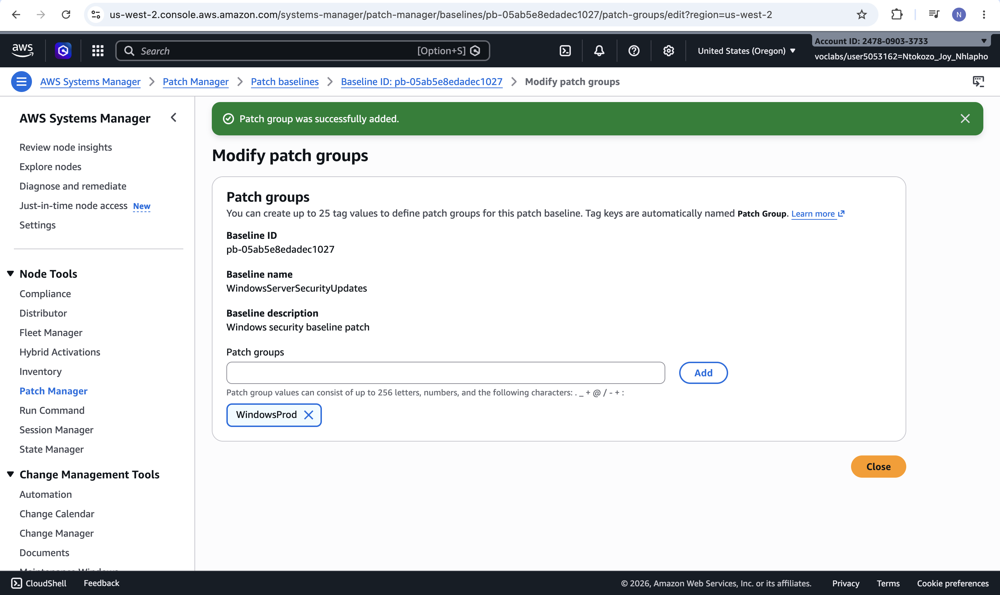
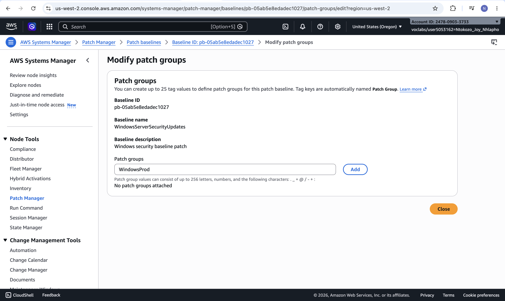
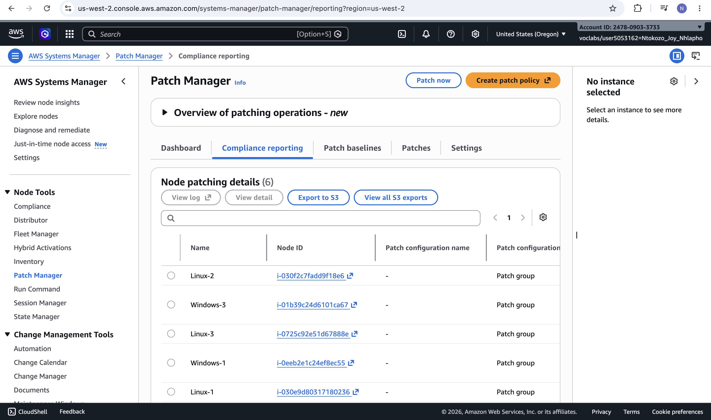
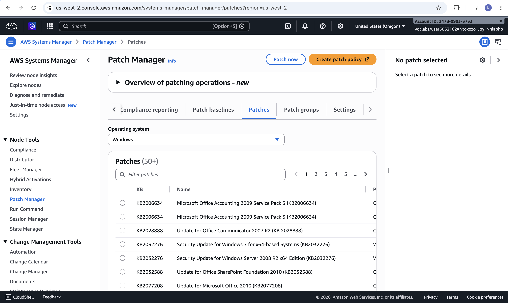
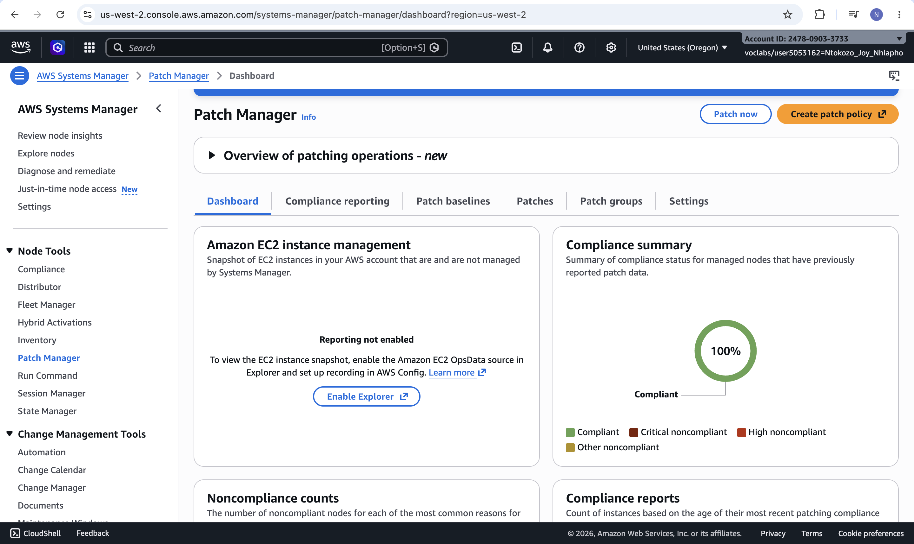
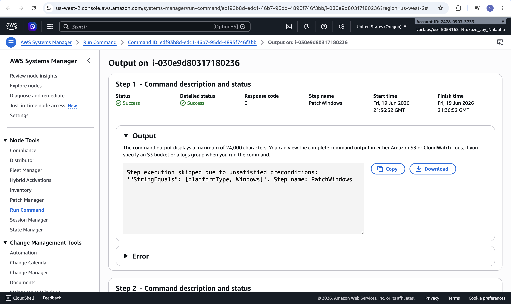
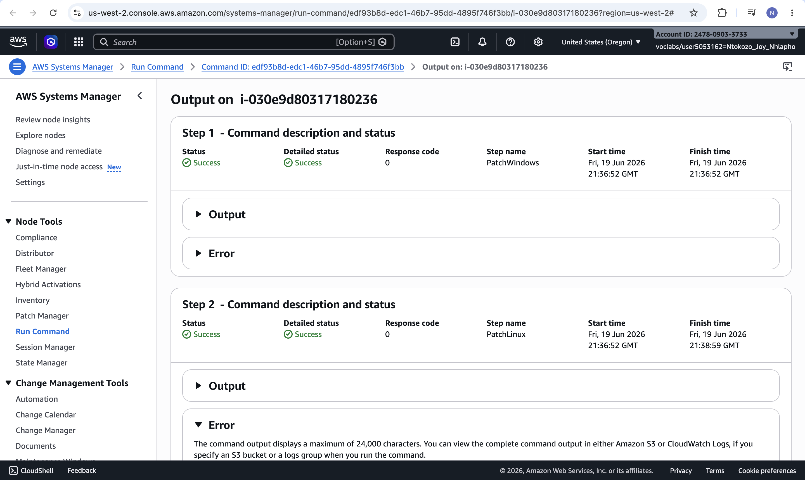

# Lab 25 – Systems Hardening with Patch Manager via AWS Systems Manager

| Field | Details |
|---|---|
| **Programme** | Praesignis AWS re/Start |
| **Date Completed** | 2026-06-19 |
| **Lab Topic** | Patch Management for Linux and Windows EC2 Instances using AWS Systems Manager |

---

## ✏️ What This Lab Covered

In this lab, I used Patch Manager, a capability of AWS Systems Manager, to patch a mixed fleet of Linux and Windows EC2 instances and verify compliance across the environment.

- Patched Linux EC2 instances using the AWS default patch baseline, targeted by the `LinuxProd` patch group tag
- Created a custom patch baseline (`WindowsServerSecurityUpdates`) for Windows Server 2019 with two approval rules — Critical and Important severity SecurityUpdates, each with a 3-day auto-approval delay
- Associated the custom baseline with a `WindowsProd` patch group
- Tagged all three Windows instances with `Patch Group: WindowsProd` so they would be targeted by the custom baseline
- Ran Patch Manager's "Patch now" feature to scan and install patches on the Windows instances
- Verified patching operations through Run Command output, confirming each instance was processed under the correct patch group
- Verified compliance across all six instances (three Linux, three Windows) through the Patch Manager Compliance reporting dashboard

---

## 📸 Screenshots and Explanations

### 1. Custom Windows Patch Baseline – Approval Rule

The second approval rule for the WindowsServerSecurityUpdates baseline, targeting WindowsServer2019 Important-severity SecurityUpdates with a 3-day auto-approval delay.

### 2. Windows Patch Baseline Details

The completed custom patch baseline showing both approval rules — Critical and Important severity SecurityUpdates — each with auto-approval after 3 days.

### 3. Patch Group Successfully Associated

The WindowsProd patch group was successfully associated with the custom WindowsServerSecurityUpdates baseline, linking the baseline to the tagged Windows instances.

### 4. Windows Instance Tagged for Patching

A Windows EC2 instance tagged with Patch Group: WindowsProd, ensuring it is targeted by the custom patch baseline during patching operations.

### 5. Patch Now Configuration for Windows Instances

The Patch now configuration set to Scan and install, targeting only instances tagged with Patch Group: WindowsProd.

### 6. Successful Patch Association Execution

The association execution summary confirming the patch operation completed successfully, targeting the WindowsProd patch group.

### 7. Run Command Output Confirms Patch Group

The Run Command output for a Linux instance showing the PatchLinux step completed successfully, confirming Patch Manager correctly executed the patch baseline operation.

### 8. Compliance Reporting – All Six Nodes

The Compliance reporting tab listing all six managed nodes (three Linux, three Windows) with their patch group configuration.

### 9. Compliance Summary – 100% Compliant

The Patch Manager dashboard showing a 100% compliance summary, confirming every instance in the environment is fully patched and compliant with its assigned baseline.

---

## 🔑 Key Concepts

| Concept | Description |
|---|---|
| Patch Manager | AWS Systems Manager capability that automates the process of patching managed instances |
| Patch Baseline | A set of rules that defines which patches are approved or rejected for an instance group |
| Patch Group | A tag-based mechanism for associating instances with a specific patch baseline |
| Approval Rule | A rule within a baseline specifying product, severity, classification, and auto-approval timing |
| Auto-Approval Delay | The number of days Patch Manager waits before automatically approving a matching patch |
| Compliance Reporting | A view showing whether managed instances meet the patch requirements of their baseline |
| Run Command | The underlying mechanism Patch Manager uses to execute patching operations on instances |

---

## 🛠️ AWS Services Used

| Service | Purpose |
|---|---|
| AWS Systems Manager – Patch Manager | Created baselines, patch groups, and executed patch operations |
| AWS Systems Manager – Run Command | Executed the underlying patch baseline operations on managed instances |
| AWS Systems Manager – Fleet Manager | Viewed and managed the Linux and Windows EC2 instances |
| Amazon EC2 | Hosted the Linux and Windows instances that were patched |

